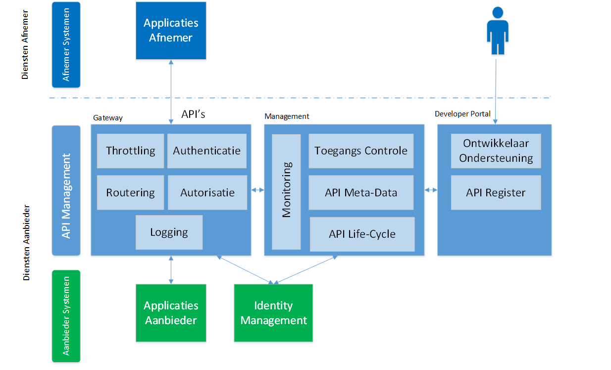

# Architectuur

>   *Dit hoofdstuk gaat in op de vraag: Hoe kan je je applicatie landschap
>   inrichten zodat je APIs kan aanbieden. Welke componenten zijn hiervoor
>   nodig. Hoe ga je om met opschalen, beschikbaarheid. Wat zijn afwegingen om
>   beveiliging al dan niet toe te passen.*

## Inleiding

Doel van dit hoofdstuk is om een hoog niveau overzicht te geven van relevante onderdelen en concepten en hun samenhang in een op
(REST of RESTfull) API gebaseerde architectuur waarbij gebruik gemaakt wordt van REST API's als interface voor de aangeboden (gegevens)diensten. 
Specifiek voor REST API's is dat deze 'Resource' gericht zijn en een uniforme manier bieden om resources te lezen, wijzigen, toevoegen
of verwijderen.

Figuur 1: De plaats van API's bij aanbod en gebruik van (gegevens)diensten;

Figuur 1 toont de plaats van API's in de gegevensuitwisseling en relevante onderwerpen in deze context. Bij de Dienst afnemer speelt 
het gebruik van API's,  bij de Dienst aanbieder speelt het aanbieden van API's.

In dit hoofdstuk wordt specifiek ingegaan op de 'aanbod kant': het onderdeel 'Diensten toegang' in het schema.

## Typologie van API's

Een organisatie heeft verschillende soorten API's:

Extern:
- Open API's: voor ontsluiten van diensten zonder toegangsbeperking bv open data.
- Gesloten API's: voor ontsluiten van diensten met toegangsbeperking bv persoonsgegevens en vertrouwelijke gegevens of diensten voor specifieke partijen.

Intern:
- Interne API's : voor ontsluiten van diensten binnen de organisatie

Een overheidsorganisatie ontsluit zijn diensten naar andere overheidsorganisaties, naar bedrijven/private organsaties en naar burgers.

In onderstaande figuur wordt dit visueel weergegeven.

Figuur 2 : Soorten API's

***Afkortingen***:
- G2C : Government 2 Citizen (Overheid naar Burger)
- G2B : Government 2 Business (Overheid naar Bedrijf)
- G2G : Government 2 Government (Overheid naar Overheid)

Onderstaande figuur geeft deze verschillende soorten dienstverlening middels API's grafisch weer

Figuur 3: API Diensten voor Burgers, Bedrijven en Overheden

- (A) : API Contactoppervlak Overheid naar Burgers en Bedrijven
- (B) : API Contactoppervlak Overheid naar Overheid (bv onderdelen GDI)

In deze figuur wordt ook het belang van standaardisatie van API's zichtbaar:

Burgers, Bedrijven (en ook Overheidsorganiaties zelf) gebruiken (doorgaans) de API's van meerdere Overheidsorganisaties. Wanneer de verschillende 'API contactoppervlakken' uniform zijn (ook over organisaties heen) kunnen dienstafnemers gemakkelijker (en dus sneller en met minder kosten) gebruik maken van 'Overheids API's'  

In de volgende paragrafen worden enkele andere indelingen voor API's behandeld. Deze indelingen helpen om in de API architectuur van een organisatie verschillende soorten API's te benoemen.

### Systeem, Proces, Convenience ###

Deze indeling maakt onderscheid in Systeem, Proces, Convenience API's:
- System API (werkt op het niveau van de databron);

- Process  API (doet aan orchestration door één of meerdere System API's aan te roepen);

- Convenience of Experience API (beantwoord één specifieke gebruikersvraag);

### Business / Exposure ###

Deze indeling maakt onderscheid in Business en Exposure API's:

**Business API definitie:**

Een API die beschreven is in business termen , gebruik maakt van generieke modellen en welke bedrijfsprocessen ondersteund. (Hierbij wordt vermeden om terminology en payloads te gebruiken die specifiek zijn voor 3rd party software om afhankelijkheid van specifieke infrastructuur te voorkomen en te focussen op bedrijfsdoelstellingen;

(Bijvoorbeeld API’s gebaseerd op de Generieke Functies (capabilities) van de Nederlandse Overheid, zie https://www.noraonline.nl/wiki/Generieke_functies, en op de capabilities van de eigen organisatie). 

**Exposure API**

Een API die toegang geeft tot de (basis)functionaliteit en data van een (specifiek) systeem

### Philosophy, Protocol, Encoding

Deze indeling gaat uit van de technische aspecten van de API:
- Design Philosophy 
(eg RESTful, GraphQL)
- Communications Protocol
(eg HTTP, Websockets)
- Encoding
(eg JSON, Protobuf (binary))

### API Virtualisatie

Een andere mogelijke indeling is op basis van de 'virtuele' varianten van een API:
Een en dezelfde API kan in verschillende smaken worden aangeboden.
In onderstaand voorbeeld is dit:
- Open zonder garantie
- Open met garanties
- Met toegangsbeperking
- Met doelbinding

### API Language styles

Onderstaande indeling gaat uit van de bij de API toegepaste 'language' style.

- Tunnel Style: XML-RPC, SOAP, gRPC, Avro
- Resource Style: OpenAPI/Swagger, RAML, API Blueprint
- Hypermedia Style: HAL, Siren, Atom, HATEOAS
- Query Style: GraphQL, OData, SPARQL
- Event-based Style: MQ, WebSub, MQTT, XMPP, AMQP, Kafka, AsyncAPI

## API Management Functionaliteit

### Inleiding

In dit hoofdstuk wordt aandacht besteed aan de positionering van API-Management binnen de informatie architectuur van een overheidsorganisatie. Daarbij wordt stilgestaan bij de generieke specificaties waaraan dit soort tooling moet voldoen om API-Management goed op te kunnen zetten. De kaders en richtlijnen die in dit hoofdstuk worden benoemd zijn in lijn met landelijke geldende architectuurrichtlijnen (zoals NORA, GEMMA en Common Ground), hiermee kan dit document worden gezien als een referentiearchitectuur op het gebied van API-Management.

### Informatie architectuur

Alle overheden hebben een uitdaging op het gebied van data integratie[[1]](#_ftn1). Hoe faciliteer je gegevensuitwisseling tussen bronnen en afnemers op een efficiënte en beheersbare manier die voldoet aan de eisen van wet- en regelgeving?

Een overheidsinstantie geeft hier het beste invulling aan door organisatiebreed een zogenaamde 'integratielaag' binnen de infrastructuur te positioneren. Dit kan je beschouwen als de gereedschapskist waarbinnen verschillende tools beschikbaar zijn voor data-integratie. Gezien de wereldwijde ontwikkelingen in het gebruik van API's, kan API-Management tooling hierbinnen niet ontbreken. Het is voor overheden essentiële functionaliteit om in lijn met de NORA te kunnen opereren (of specifieker in lijn met Common Ground).

<!--
In figuur 2 is dit gevisualiseerd.

Figuur 1: Visualisatie 'Positionering API-Management binnen de integratielaag'
-->

**Rol van servicebus**

Bij middelgrote en grote overheidsorganisaties opereert in de integratielaag veelal ook een organisatiebrede servicebus, vaak is er veel energie gestoken in het faciliteren van gegevensstromen via de servicebus (met name op basis van StUF[[3]](#_ftn3)). Het is voor overheden geen doel op zich om bestaande verbindingen te elimineren of de servicebus uit te faseren. De API-Management tooling komt naast de servicebus te staan en kan zo aanvullende functionaliteit bieden binnen de integratielaag.

Wel lijkt gezien de wereldwijde ontwikkelingen de aandacht van integratievraagstukken te gaan verschuiven van de inzet van een organisatiebrede servicebus naar een landschap waarin lightweight API-Management tooling een belangrijke rol speelt. Nieuwe verbindingen (met name voor het ophalen van data) zullen vaker gelegd gaan worden via enkel een API Gateway en de inzet van de servicebus wordt teruggedrongen. Enkel op het gebied waar de huidige servicebus specifieke toegevoegde waarde levert, wordt deze voor overheden nog ingezet voor nieuwe verbindingen (eventueel in combinatie met een API Gateway. Dit zal naar verwachting voor overheden de meest voor de hand liggende oplossing zijn, gezien het huidige applicatielandschap. 

Toegevoegde waarde servicebus i.r.t. API-Gateway:

- StUF-koppelvlakken

- Complexe transformaties

- Orkestratie/logica

- Gegevensautorisatie op doelbinding (bij gemeentelijke servicebussen vaak geïntegreerd)

**Referentiecomponenten**

API-Management tooling omvat de referentiecomponenten API-Gateway, API-Manager en een API-Portal. Hieronder is beknopt beschreven wat overheidsorganisaties hieronder kunnen verstaan:

- API-Gateway: hiermee worden gegevensverbindingen technisch gefaciliteerd, beveiligd en gemonitord. Alleen de applicaties (afnemers en aanbieders van API's) gebruiken de gateway.

- API-Manager: zorgt voor de configuratie van de gateway en het beheer van de API's, op basis van patronen en zogenaamde policies.

- API-Portal: een portaal waarin de aangeboden API's aan het brede publiek worden gepresenteerd. Gebruikers zijn medewerkers geïnteresseerd in de ontwikkeling en het gebruik van API's. Dit kunnen zowel medewerkers van de overheid zijn, als ook externen (bijvoorbeeld van software leveranciers of ketenpartners).

In de volgende paragrafen zijn per component de generieke functionaliteiten in detail beschreven.

Figuur 3: Functionaliteit binnen API-Management

### Functionaliteit API-Gateway

Een API-Gateway wordt ingezet als poort tot het achterliggende datalandschap.

In cloud-native implementaties zie je steeds vaker een meer gedistribueerd model met behulp van micro gateways (als ingang voor iedere Cloud-omgeving) in plaats van een corporate API-Gateway die alles regelt, eventueel in combinatie met een service mesh[[4]](#_ftn4). Een hybride opstelling is ook mogelijk.

**Routering**

- **Inrichting van routering**

Het moet mogelijk zijn om (light weight) routering te definiëren binnen de API-Management tooling. Een routering kan ingericht worden op basis van verschillende criteria, zoals bijvoorbeeld afzender of inhoud.

- **Gegevensuitwisseling protocollen en formaten**

Binnen het gegevensuitwisselingsdomein worden verschillende uitwisselprotocollen- en formaten toegepast, zoals: SOAP, REST, WFS3.0, JSON, GeoJSON, XML. Waarbij ook de transformatie tussen de verschillende protocollen en formaten voor de meest voorkomende gevallen wordt ondersteund door de API-Gateway~~.~~

- **Integratie met landelijke integratiefunctionaliteit**

Het moet mogelijk zijn om makkelijk verbinding te kunnen opzetten met een integratieoplossing voor system-2-system communicatie (bijvoorbeeld NLX[[2]](#_ftn2)).

- **Rate limiting**

Rate limiting (throttling) op de API Gateway biedt bescherming tegen een bovenmatig aantal verzoeken die worden afgevuurd op de omgeving van de overheidsorganisatie, waardoor er storingen op de backend systemen kunnen optreden. Dit kan bij reguliere bedrijfsuren het 'spitsuur' zijn waardoor deze beveiliging moet worden ingeschakeld. Rate limiting is ook een manier om een SLA af te dwingen op basis van een contract.

Er kunnen verschillende profielen of plannen worden aangemaakt waarin deze quota worden geconfigureerd. Of het toekennen van voorrang op de afhandeling van bepaalde verzoeken (requests) is mogelijk, bijvoorbeeld door bulk-processen voor een korte periode voorrang te verlenen boven andere verzoeken. Hierdoor is gecontroleerd traffic management mogelijk, waardoor eventuele verstoringen op een later moment door piekbelasting juist kunnen worden voorkomen.. Een profiel of plan is te koppelen aan een specifieke API.

**Beveiliging**

- **Hardening**

Zorgt ervoor dat de tooling is opgewassen tegen bedreigingen (o.a. hacking) van buitenaf.

- **Validatie**

Het valideren van inkomende en uitgaande API-calls tegen geldende semantische definities (onderdeel van API Policies).

- **Geoptimaliseerd voor laagdrempelige en meest gebruikte protocollen/standaarden.**

Voorbeelden:

o Application Level Security (OSI level 7): Een verbinding over een internet moet veilig zijn, de standaard voor het veilig uitwisselen van gegevens tussen twee of meerdere devices is het HTTPS Protocol. Bij gebruik van HTTPS worden de gegevens versleuteld, waardoor het voor een buitenstaander, bijvoorbeeld iemand die afluistert, onmogelijk zou moeten zijn om te weten welke gegevens er worden verstuurd.

o Transport Level Security (OSI level 4): Voor het beveiligen van de transportlaag binnen het netwerk wordt gebruik gemaakt van TLS (Transport Layer Security-protocol). Het is het meest gebruikte protocol voor het opzetten en gebruiken van een cryptografisch beveiligde verbinding tussen twee computersystemen (client en server), waarbij TLS versie 1.2 de minimale standaard is. Er wordt hierbij gebruik gemaakt van beveiligingscertificaten die zorgen voor de cryptografische versleuteling.

**Autorisatie**

De API Gateway zal op runtime de ingestelde autorisatie afhandelen.

Per profiel (overeenkomstig met een rol, raakvlak met Role Based Access Control (RBAC)) is het grofmazig instelbaar welke data opgevraagd mag worden door een gebruiker via de API (in dit geval een applicatie in combinatie met de aanduiding van de gebruiker op persoonsniveau). Dit geeft mede invulling aan de eisen die worden gesteld vanuit wet- en regelgeving, namelijk dat autorisatie is ingericht conform doelbinding.

Fijnmazige (domein specifieke) autorisatie wordt idealiter afgehandeld door de domein applicatie. Echter ondersteunen verschillende gebruikers niet de correcte manier van API's aanroepen en doelbindingsregisters ontbreken veelal nog (en soms bieden de bronhouders nog niet de benodigde API's). Ook is IAM in veel overheidsorganisaties niet in die mate op orde dat hierin volledig sturing aan gegeven kan worden. Fijnmazige autorisatie kan hierdoor eventueel nog niet door de backend worden afgehandeld, een alternatief hiervoor is dat er per doelbinding een andere API wordt aangeboden vanuit de API Gateway of dat de integratielaag functionaliteit biedt om aan de fijnmazige autorisatie invulling te geven.

**Logging**

De API Gateway moet het mogelijk maken om op runtime functionele en technische logging op te bouwen. De logging van de gebruikte API's is noodzakelijk voor audit doeleinden (i.h.k.v. privacy, beveiliging en transparantie). Om deze achteraf te kunnen inzien:

- Wie heeft data geraadpleegd?

- Welke data is geraadpleegd? Enkel de metadata ervan is zichtbaar.

- Waarom de data is geraadpleegd? Doelbinding wordt vastgelegd.

- Wanneer de data is geraadpleegd

- Hoe de data is geraadpleegd?

De technische logging over het afgelopen jaar is op een efficiënte wijze raadpleegbaar en doorzoekbaar. Voor technische logging is de API-gateway in staat om deze weg te schrijven en te exporteren naar een externe logging of monitoring tool. Voor de functionele logging is het vanuit de API Gateway mogelijk via de standaard API's de betreffende provider-oplossing voor Verwerking&Logging aan te roepen. 

**Authenticatie**

De API-Gateway zal op runtime de ingestelde authenticatie afhandelen. Zie voor authenticatie op basis van OAuth2.0 [API Designrules Extensions (Nederlandse API Strategie IIb) (geonovum.github.io)](https://geonovum.github.io/KP-APIs/API-strategie-extensies/#api-security)

**Caching**

In bepaalde gevallen kan het van meerwaarde zijn dat een bron niet opnieuw bevraagd hoeft te worden, maar dat de laatst opgehaalde gegevens in een zogenaamde 'cache' voor korte tijd bewaard blijven. Caching kan worden ingevuld door de API Gateway. De caching van de API-Gateway is instelbaar.

### Functionaliteit API-Manager

**Life cycle management**

Life cycle management is essentieel onderdeel in een applicatielandschap dat continu verandert en een onzekere toekomst kent. Life cycle management omvat bijvoorbeeld de volgende functionaliteit:

- het beschikbaar stellen van API's, door het importeren van externe API configuraties/definities of door het creëren van een eigen API. Een eigen API maakt het mogelijk om voor een organisatie specifieke verbindingen op te zetten, zoals voorbeeld:

    - specifieke convenience API's[[5]](#_ftn5) te creëren op landelijke system API's (voorbeeld 1 convenience API die 3 system API's aanroept).

    - Organisatie specifieke bronnen te ontsluiten (zoals kernregistraties)

    - JSON API's te creëren boven op interne SOAP API's.

Het volgende kan per API worden vastgelegd:

    - Het definiëren van de URL waarmee de API aangeroepen kan worden door gebruikers.

    - Het definiëren van het endpoint (voor informatie-ontsluiting of mutatie- en of gebeurtenisverstrekking).

    - Het inrichten van policies (zie beveiliging).

- het aanbieden van nieuwe versies (eventueel via oplossingen zoals GIT)

- het uitfaseren van oude versies.

**Policy beheer**

Voor iedere verbinding is het instelbaar welke inperkingen er gelden en welke maatregelen er genomen moeten worden om de API zo specifiek mogelijk open te zetten voor afnemers.

**Monitoring & Alerts**

Het versturen van een (RCS, SMS en/of mail) notificatie aan beheerders indien er een bepaalde gebeurtenis optreedt. (bijvoorbeeld wanneer een bepaalde gegevensverbinding uit de lucht is of een certificaat op korte termijn zal verlopen).

**API Billing (Monetizing)**

Op basis van inzicht in rapportages en dashboards over het gebruik van API's, is het mogelijk om het gebruik hiervan door te belasten aan de afnemers. Dit is voor overheden interessant om zo eventuele kosten door te belasten op de afzonderlijke organisaties, maar ook richting ketenpartners.

**Import/Export tussen overheidsorganisaties**

Overheden kunnen grote efficiency voordelen behalen door de API-serviceregistratie met elkaar uit te wisselen via de Open API Specificatie versie 3.0 (OAS3.0[[6]](#_ftn6)). Het is ook mogelijk om (delen van) de API-serviceregistratie van een overheid te exporteren (incl. policies), zodat andere overheden die ook kunnen gebruiken. Daarnaast is het mogelijk om (delen van) de configuratie van een andere overheid / departement te importeren.

**Dashboarding & Analytics**

- **API use dashboards/Analytics**

Voor ontwikkelaars, beheerders en management is het interessant om inzicht te hebben in welke API's wanneer en hoe vaak worden gebruikt en wat de performance is. Op basis van deze informatie kan bijvoorbeeld gesleuteld worden aan de inrichting om het applicatielandschap efficiënter te laten functioneren. Deze dashboarding/analyse kan vanuit verzamelde data (o.a. logging) worden opgebouwd.

- **Auditing**

Voor audit-doeleinden is het mogelijk om logs weg te schrijven naar een logging voorziening. Voor de privacy-logging hierbij gebruikmakend van de gestandaardiseerde API's Verwerkingsregister&Logging. 

### Functionaliteit API-Portaal 

**Serviceregistratie** (ook wel aangeduid als API-Explorer of API-Gallery)

Voor medewerkers die betrokken zijn bij de software ontwikkeling is het interessant te weten welke API's beschikbaar zijn, welke data (of functionaliteit) ermee kan worden opgehaald en hoe de API moet worden aangeroepen (zie ook API docs).

De serviceregistratie is eenvoudig doorzoekbaar. Daarnaast is registratie/publicatie via de Open API Specificatie versie 3.0 (OAS3.0) wenselijk, zodat API-definities van andere (externe) bronnen op basis van de (OAS3.0) makkelijk beschikbaar gesteld kunnen worden.

**API Docs**

Alle documentatie gerelateerd aan API's is via het portaal eenvoudig te beheren en terug te vinden. Bijvoorbeeld voorbeeldcode: Ontwikkelaars die software maken die ook een API-call kunnen versturen zijn gebaat bij het verkrijgen van de voorbeeldcode. Hierdoor kan de ontwikkeltijd aan afnemer zijde nog verder worden teruggebracht.

**Support**

Het is de voorkeur van overheden dat vanuit de tooling helder op te maken is waar je terecht kan voor ondersteuning.

*Note: Landelijke ontwikkelingen op dit vlak i.r.t. developer.overheid.nl kunnen er voor zorgen dat deze functionaliteit op termijn centraal landelijk beschikbaar is.\
*

[[1]](#_ftnref1) Verder aangeduid als 'integratie', van ook bijvoorbeeld informatie.

[[2]](#_ftnref2) Voor meer informatie zie www.nlx.io

[[3]](#_ftnref3) Zie [StUF Berichtenstandaard - GEMMA Online](https://www.gemmaonline.nl/index.php/StUF_Berichtenstandaard)

[[4]](#_ftnref4) [Service mesh - Wikipedia](https://en.wikipedia.org/wiki/Service_mesh)

[[5]](#_ftnref5) Zie 3.4.2 in de [landelijke API-standaard](https://geonovum.github.io/KP-APIs/API-strategie-algemeen/#aanbeveling-2-analyseer-welke-api-s-je-aan-moet-bieden-welke-informatievragen-wil-je-beantwoorden)

[[6]](#_ftnref6) https://swagger.io/specification/

[[7]](#_ftnref7) Het effect hiervan op OAuth2.0 NL GOV is momenteel onduidelijk, zie voor meer informatie over de actuele status: [NL GOV Assurance profile for OpenID Connect 1.0 (logius.gitlab.io)](https://logius.gitlab.io/oidc/)

## Informatiemodel & API
In dit hoofdstuk wordt ingegaan op de relatie tussen informatiemodel en API

### Informatiemodellen

Een informatiemodel beschrijft een werkelijkheid. We onderscheiden vier niveaus in variërend van een zo getrouw mogelijke beschrijving van die werkelijkheid tot een specificatie van de wijze van vastlegging van die werkelijkheid in een database of uitwisselformaat [MIM](https://www.geonovum.nl/geo-standaarden/metamodel-informatiemodellering-mim) [NEN3610](https://www.geonovum.nl/geo-standaarden/nen-3610-basismodel-voor-informatiemodellen) :

**Niveau 1 - Model van begrippen:** een model van begrippen waarin de werkelijkheid wordt beschreven door middel van de daarin gehanteerde begrippen en de relaties tot elkaar.

**Niveau 2 - Conceptueel informatiemodel:** een conceptueel informatiemodel waarin de werkelijkheid wordt beschreven door middel van de informatie die voor dit domein relevant is, onafhankelijk van het ontwerp en de implementatie in systemen. Het geeft een zo getrouw mogelijke beschrijving van die werkelijkheid en is in natuurlijke taal geformuleerd.

**Niveau 3: - Logisch informatie- of gegevensmodel:** een logisch informatie- of gegevensmodel waarin de werkelijkheid wordt beschreven door middel van de representatie van de informatie in de systemen en de uitwisseling tussen systemen en gebruikers. Een logisch informatiemodel is implementatie onafhankelijk en kan in meerdere technische modellen worden geïmplementeerd.

**Niveau 4: - Fysiek of technisch gegevens- of datamodel:** een fysiek of technisch gegevens- of datamodel waarin de werkelijkheid wordt beschreven door middel van de structuur en eigenschappen van de technologie die wordt gebruikt bij de opslag of uitwisseling. Een fysiek of technisch datamodel is afhankelijk van de gekozen techniek of tooling die wordt gebruikt en kan daarvoor geoptimaliseerd zijn.

(Zie ook [NORA Informatielaag](https://www.noraonline.nl/wiki/Vijflaagsmodel#Laag_3:_Informatielaag))

### Definities

De volgende begrippen worden gehanteerd in dit hoofdstuk:

* *Informatiemodel* : Niveau 3 - Logisch gegevensmodel / datamodel 
* *Resource model* :  Niveau 4 - Fysiek / technisch datamodel (directe datamodel van een API)
* *Applicatie data model* : Niveau 4 - Fysiek / technisch datamodel (datamodel van een achterliggend systeem)

### API, Informatiemodel en Resource model.

Via een API ontsluit een applicatie data en functionaliteit. Hierbij helpt het om onderscheid te maken tussen het 'interne' Applicatie Data Model en het Resource Model dat via de API wordt aangeboden.

Het Resource Model is als het ware een logische view op het achterliggende Data Model.

Wanneer het Resource Model 1 op 1 gelijk is aan het achterliggende Data Model is de vertaling/mapping eenvoudig en kan dit ook geautomatiseerd worden : het Resource Model en de API kunnen bijvoorbeeld worden gegenereerd vanuit het Applicatie Data Model.

**Ontkoppeling**

Door Applicatie Data Model en Resource Model te ontkoppelen kunnen deze apart van elkaar evolueren. Dit heeft een aantal voordelen:

*Breaking changes*

Liefst wil je voorkomen dat een aanpassing aan het Applicatie Data Model welke verder geen waarde heeft voor de afnemers / clients van de data leidt tot verplichte aanpassingen/updates. Door te ontkoppelen kunnen breaking changes worden voorkomen voor bestaande clients;

*Verbergen complexiteit*

Voor complexe Domeinen of gecombineerde Diensten waarbij meerdere bronnen worden gecombineeerd is het waardevol om het Resource Model zo eenvoudig en duidelijk mogelijk te houden. In het Resource Model kan de achterliggende complexiteit verborgen blijven en kan de interface gebruikersvriendelijk worden gemaakt. Het Resource mode is hier dan een abstraherende laag die alleen die zaken aanbiedt die de gebruiker nodig heeft en die aansluiten op de belevingswereld van de gebruiker.

*Integreren & Innoveren*

Het Resource Model als logische view op achterliggende datamodellen heeft ook als voordeel dat op de laag van het Resource Model al integratie van data modellen kan plaatsvinden nog voordat de achterliggende modellen zijn aangepast of volledig geïntegreerd. Een (nieuw) geïntegreerd Resource model over meerdere achterliggende datamodellen heen kan zo databronnen integreren en aanbieden. Met behulp van een geïntegreerd resourcemodel op het niveau van API's kan sneller gestandaardiseerd worden en kan men ook sneller innoveren.

### Aanbevelingen

**Verbindt het Resource Model met een  Informatiemodel**

Bij het aanbieden van data via een API is het van groot belang om de verbinding met een informatiemodel te hebben en deze verbinding ook te beschrijven en te publiceren bij de API documentatie.
* Dit bevordert begrip bij afnemers, zodat zij de ruwe data goed kunnen interpreteren.
* Dit houdt de API beheersbaar en zorgt dat de API gemakkelijker kan mee-evolueren met het informatielandschap (immers wijzigingen in het informatiemodel kunnen dan gerelateerd worden aan wijzigingen in de API).
* Wanneer een API informatie uit een stelsel van gegevensbronnen ontsluit bevordert dit interoperabiliteit in het stelsel.

Het Resource Model van een API is een (of mogelijk meerdere, afhankelijk van uitwisselformaat) Niveau 4 - Fysiek / technisch datamodel(len). Het is namelijk een model van de uitwisseling van gegevens in een concreet uitwisselformaat. Bijvoorbeeld gespecificeerd in een OAS document. [OAS](https://www.openapis.org/).
Het is echter belangrijk om de verbinding met een Niveau 3: - Logisch informatie- of gegevensmodel uit te drukken, omdat dit een implementatie-onafhankelijk model is, wat begrip, maar ook interoperabiliteit, bevordert. Het bevordert interoperabiliteit met andere Niveau 3 informatiemodellen in een stelsel, maar biedt ook één overkoepelend informatiemodel wanneer er sprake is van gegevensuitwisseling conform verschillende Niveau 4 informatiemodellen gebaseerd op hetzelfde Niveau 3 informatiemodel.

## Event Driven Processen & Notificaties

__[In ontwikkeling]__

## API Security Architectuur

ICT beveiliging is over het algemeen gebaseerd op de aspecten *beschikbaarheid*, *integriteit* en *vertrouwelijkheid*. Dit hoofdstuk gaat allereerst in op deze drie aspecten en hun relaties met API beveiliging, waarna een aantal aan API beveiliging gerelateerde architectuurprincipes en architectuurpatronen zullen worden beschreven.

### Beschikbaarheid
Beschikbaarheid gaat erover om te allen tijde bij informatie en informatiebronnen te kunnen en dat de beschikbaarheid van diensten voldoen aan gemaakte continuïteitsafspraken. Beschikbaarheid van gegevens en systeemfuncties wordt over het algemeen gegarandeerd door vermeerdering van systeemfuncties, door herstelbaarheid en beheersing van verwerkingen, door voorspelling van discontinuïteit en handhaving van de functionaliteit. Binnen de NORA is beschikbaarheid opgenomen als afgeleid principe [AP41](https://www.noraonline.nl/wiki/Beschikbaarheid).

In de context van API's gaat beschikbaarheid erover dat consumenten van aangeboden API's juist worden geinformeerd over de afspraken omtrent (on)beschikbaarheid van de API's, dat de beschikbare capaciteit wordt verdeeld over de aangesloten API Clients en dat onvoorziene onbeschikbaarheid voor zowel aanbieders als consumenten van API's inzichtelijk wordt gemaakt, zodat daar juist op ingespeeld kan worden.

Aan beschikbaarheid gerelateerde API capabilities zijn *Caching*, *Rate limiting / Throttling*, *SLA Management*, *API Monitoring / Alerting* en *Foutafhandeling*. De onderstaande sectie *Componenten* beschrijft deze in meer detail en geeft aan waar deze worden toegepast in een API architectuur.

### Integriteit
Integriteit gaat over het waarborgen van de integriteit van gegevens en systeemfuncties. Dit wordt over het algemeen bereikt door validatie en beheersing van gegevensverwerking en geautoriseerde toegang tot gegevens en systeemfuncties, door scheiding van systeemfuncties, door controle op communicatiegedrag en gegevensuitwisseling en door beperking van functionaliteit. Binnen de NORA is integriteit opgenomen als afgeleid principe [AP42](https://www.noraonline.nl/wiki/Integriteit).

In de context van API's gaat integriteit over het versleutelen en ondertekenen van berichten en gegevens, het valideren van API verzoeken en de vastlegging van de gegevensuitwisseling tussen API aanbieders en consumenten.

Aan integriteit gerelateerde API capabilities zijn *Logging / Audit Trail*, *Policy Enforcement*, *Identificatie / Authenticatie / Autorisatie* en *Sleutelbeheer*. De onderstaande sectie *Componenten* beschrijft deze in meer detail en geeft aan waar deze worden toegepast in een API architectuur.

### Vertrouwelijkheid
Vertrouwelijkheid gaat over het geheimhouden van gegevens en gegevensbronnen. Dit wordt gegarandeerd door scheiding van systeemfuncties, door controle op communicatiegedrag en gegevensuitwisseling, door validatie op toegang tot gegevens en systeemfuncties en door versleuteling van gegevens. Binnen de NORA is vertrouwelijkheid opgenomen als afgeleid principe [AP43](https://www.noraonline.nl/wiki/Vertrouwelijkheid_%28principe%29).

In de context van API's gaat vertrouwelijkheid over het ervoor te zorgen dat tussen API aanbieder en consument uitgewisselde gegevens niet door onbevoegden kunnen worden ingezien en misbruikt.

Aan vertrouwelijkheid gerelateerde API capabilities zijn *Caching*, *Analytics*, *Logging / Audit Trail*, *Identificatie / Authenticatie / Autorisatie*, *Sleutelbeheer* en *Gebruiker / Rol beheer*. De onderstaande sectie *Componenten* beschrijft deze in meer detail en geeft aan waar deze worden toegepast in een API architectuur.

### Componenten
Onderstaande afbeelding geeft een overzicht van standaard componenten in een API architectuur. Deze sectie beschrijft de aan API beveiliging gerelateerde componenten in dit diagram.

#### Actors en Clients
Onderstaand overzicht beschrijft de actoren en API Clients welke een rol spelen bij API beveiliging uit bovenstaand diagram. 

- **Eindgebruikers:** Eindgebruikers welke door middel van devices en client apps gebruik maken van API's.
- **Client ontwikkelaars:** Ontwikkelaars van client API gebruikende client apps voor verschillende devices.
- **Web Applicatie:** een API client die op een server draait, welke door eindgebruikers wordt gebruikt middels een web interface.
- **System-to-System (S2S) Applicatie:** een API client die op een server draait, welke namens zichzelf (in plaats van namens een eindgebruiker) API's benadert middels een system-to-system koppeling, in plaats van namens een eindgebruiker.
- **Native App:** een API client die als native applicatie op het device van de eindgebruiker draait en zelfstandig API's benadert.
- **Browser-based App:** een API client die volledig in de browser draait en zelfstandig API's benadert, bijvoorbeeld op basis van JavaScript.

#### Componenten
Onderstaand overzicht beschrijft de componenten welke een rol spelen bij API beveiliging uit bovenstaand diagram.

- **Identity Provider:** Biedt de mogelijkheid aan eindgebruikers en Client applicaties om zichzelf te identificeren en Authentiseert deze. Geeft een authenticatie token af aan de Client applicatie waarmee deze API endpoints kan benaderen.
- **API Gateway:** De toegangspoort tot het achterliggende applicatie landschap. Alle API interactie verloopt via de API Gateway, waardoor de API Gateway een centrale rol heeft in de API beveiliging. Over het algemeen bevat de API Gateway een aantal traffic policies (zie volgend punt) welke bij elk API verzoek worden gevalideerd en voert de API Gateway initiële autorisatie van API verzoeken uit. Deze autorisatie omvat minimaal een controle of de ontvangen verzoeken van correcte Access Tokens zijn voorzien en kan eventueel role-based autorisaties toepassen. De API Gateway kan een verbinding met de Identity Provider hebben voor het geval door de Identity Provider afgegeven tokens onvoldoende informatie bevatten om autorisaties toe te passen.
- **Traffic Policies:** Een verzameling policies welke worden toegepast op al het API verkeer, of een specifiek deel daarvan. Voorbeelden zijn *Rate Limiting / Throttling*, *SLA Management* en *Input validatie*. Over het algemeen bieden API Gateways de mogelijkheden om traffic policies direct in te bouwen.
- **Gebruiker / client / rol beheer:** Het beheren van gebruikers van de API tooling, zoals beheerders, API developers en client developers, geregistreerde Client applicaties en een mapping van eindgebruikers identiteiten en rollen naar specifieke autorisaties. Dit is *niet* de identity store welke credentials van eindgebruikers bevat; dat gedeelte is de verantwoordelijkheid van de Identity Provider.
- **Sleutel beheer:** Beheert het sleutelmateriaal dat wordt gebruikt voor versleuteling en ondertekening van berichten welke worden uitgewisseld tussen API Gateway, Identity Provider en Client applicaties.
- **Logging, Monitoring, Analytics, Caching:** Cross-cutting functionaliteiten welke op verschillende en/of meerdere plekken in het landschap geïmplementeerd kunnen worden. Voor al deze functionaliteiten is het van belang dat deze in lijn met AVG richtlijnen worden opgezet. Bij caching is het daarnaast belangrijk cache invalidaties te implementeren om te voorkomen dat verouderde cache data kan worden teruggehaald, zeker als daar privacy gevoelige informatie in kan staan.
- **Back-end Services:** Applicaties die de daadwerkelijke resources implementeren. 

### Principes
De volgende basisprincipes voor API beveiliging moeten worden toegepast bij het aanbieden van API dienstverlening:
- Beschouw elke API alsof deze potentieel als externe API aangeboden wordt, zelfs als daar momenteel nog geen plannen voor zijn.
- Zero-trust networking: elk applicatie-component gedraagt zich alsof deze aan het publieke netwerk zit.
- Gebruik generieke methoden voor authenticatie en authorisatie over alle API's, bij voorkeur op basis van bestaande componenten. Voorkom specifieke oplossingen voor individuele API's.
- Versleutel alle data in opslag (at rest) en in uitwisseling (in transit).
- Least privilege: API clients krijgen alleen de toegang die zij minimaal nodig hebben om hun functie uit te oefenen.

Verder moeten de aanbevelingen in de volgende externe documenten worden overwogen bij API ontwikkeling:
- [OWASP Top Ten Cheat Sheet](https://www.owasp.org/index.php/OWASP_Top_Ten_Cheat_Sheet)
- [OWASP REST Security Cheat Sheet](https://www.owasp.org/index.php/REST_Security_Cheat_Sheet)
- [OWASP API Security Project](https://www.owasp.org/index.php/OWASP_API_Security_Project)

### Architectuurpatronen

#### Gedelegeerde Identificatie en Authenticatie
Authenticatie beschrijft het met een bepaalde zekerheid vaststellen of een persoon of systeem echt degene is die deze zegt te zijn. 

In de context van API's is authenticatie van toepassing op de API Client, oftewel de applicatie die de API resources benadert, en de eindgebruiker, oftewel de persoon namens wie de API Client de API resources benadert.

Waar authenticatie van de API Client bij de API resources plaats kan vinden, bijvoorbeeld door middel van asymmetrische versleuteling of gedeelde geheimen, wordt authenticatie van eindgebruikers over het algemeen gedelegeerd aan een externe Identity Provider, bijvoorbeeld door middel van OAuth2 of OpenID Connect.

Bij gedelegeerde Authenticatie identificeren de API Client en eindgebruiker zichzelf en ontvangt de API Client, na succesvolle authenticatie, een token waarmee de API resources kunnen worden bevraagd.

#### Token-based Autorisatie
Autorisatie beschrijft het vaststellen wat een geauthenticeerd persoon of systeem mag, of juist niet mag.

Door de toepassing van gedelegeerde identificatie en authenticatie in combinatie met tokens, wordt het ingewikkelder om applicatie-specifieke autorisatie toe te passen. De API aanbieder moet bijvoorbeeld autorisatie beslissingen nemen op basis van de beperkte set aan data in het ontvangen token.

Voor gevallen dat het token onvoldoende informatie biedt om een autorisatie beslissing op te baseren, kan het benodigd zijn om token introspection toe te passen. In dit geval vraagt de API aanbieder op basis van het ontvangen token meer informatie over de geauthenticeerde gebruiker bij de Identity Provider.

Een belangrijk component bij autorisaties in de context van API's is de API Gateway. Op basis van een door de Identity Provider afgegeven access token kan de API Gateway beslissen of API aanroepen zijn toegestaan of niet. Hierbij kan de API Gateway *role-based access control (RBAC)* toepassen; *domein-specifieke autorisaties* worden over het algemeen toegepast door de back-ends om implementatie van business logica in de API Gateway te voorkomen.

Voor de implementatie van *domein-specifieke autorisaties* in de back-ends kunnen tevens microgateways of een service mesh oplossing worden gekozen. Bijkomend voordeel van het gebruik van een service mesh is dat deze standaard werken op basis van zero-trust networking.

<!--
#### Multi-level Authentication

TBD: input van Eelco. -->

### Referenties
- [OWASP Top Ten Cheat Sheet](https://www.owasp.org/index.php/OWASP_Top_Ten_Cheat_Sheet)
- [OWASP REST Security Cheat Sheet](https://www.owasp.org/index.php/REST_Security_Cheat_Sheet)
- [OWASP - API Security Project](https://owasp.org/www-project-api-security)
- [NORA - Beschikbaarheid principe](https://www.noraonline.nl/wiki/Beschikbaarheid)
- [NORA - Integriteit principe](https://www.noraonline.nl/wiki/Integriteit)
- [NORA - Vertrouwelijkheid principe](https://www.noraonline.nl/wiki/Vertrouwelijkheid_%28principe%29)

## API Capability Model
Om als organisatie API's aan te bieden aan andere partijen op een gecontroleerde beheersbare manier moet je bepaalde functionaliteit bieden, processen inregelen en ondersteuning aanbieden. Het onderstaande API Capability model geeft weer aan welke onderwerpen men aandacht moet schenken bij het inrichten van dienstverlening via API's

### API Gebruik
API gebruik gaat over het ondersteunen van ontwikkelaars in het gebruiken van de aangeboden API's, zodat zij eenvoudig aan de slag kunnen met het ontwikkelen van API Clients en kennis kunnen opdoen en uitwisselen bij het gebruik van de API's.

Over het algemeen biedt een API leverancier capabilities ten behoeve van API gebruik in een ontwikkelaarsportaal.

#### Ontwikkelaar onboarding
Voordat een ontwikkelaar applicaties kan ontwikkelen die gebruik maken van aangeboden API's, moet deze ontwikkelaar zich registreren bij de API aanbieder. Hierbij is het belangrijk dat een goede balans wordt gezocht tussen het bieden van een zo eenvoudig en snel mogelijk onboarding proces (bij voorkeur self-service) en het borgen van afspraken voor het gebruik van de API's door de ontwikkelaar, bijvoorbeeld door het ondertekenen van gebruikersvoorwaarden en het valideren van de rechtmatigheid van de ontwikkelaar.

Bij ontwikkelaar onboarding moet ook worden gedacht aan het zich kunnen afmelden van ontwikkelaars, of het afsluiten van ontwikkelaars in het geval gebruikersvoorwaarden worden overschreden.

#### Applicatie & Sleutel beheer
Clients/applicaties die gebruik maken van API's moeten over het algemeen worden geregistreerd bij de aanbieder van deze API's.

Applicatie & sleutel beheer houdt zich bezig met het kunnen beheren van geregistreerde API Clients en daarbij behorende credentials en sleutels. 

Hierbij kan worden gedacht aan het toekennen of afnemen van privileges door de API aanbieder en het kunnen inzien van informatie over de API Client, zoals bijvoorbeeld credentials of certificaten waarmee de API Client zich bij de API aanbieder kan authenticeren, door ontwikkelaars van de API Client.
#### API Discovery
Aangeboden API's moeten vindbaar zijn voor partijen die er gebruik van willen maken. API Discovery richt zich op deze vindbaarheid van API's.

API Discovery kan op verschillende manieren toegepast worden. Allereerst kan API Discovery worden toegepast door een API aan te bieden welke referenties biedt naar de verschillende API's of kan de lijst met aangeboden API's in developer documentatie worden opgenomen. De op de ‘Pas toe of leg uit-lijst’ van het Forum Standaardisatie opgenomen OpenAPI (OAS) specificatie voorziet in deze beide manieren.

Ook bestaan er zoekmachines die aangeboden API's op een centrale locatie toegankelijk maken, waardoor de vindbaarheid van API's nog meer wordt vergroot. De zoekmachine daarvoor binnen de overheid is [developer.overheid.nl](https://developer.overheid.nl).

#### Dynamische documentatie
Traditioneel worden webservice endpoints beschreven middels statische documentatie welke (bijvoorbeeld als PDF document) beschikbaar wordt gesteld aan aansluitende partijen. Door de dynamische aard van API's en de mogelijkheden die door tools worden geboden, is het bij API's gebruikelijk documentatie dynamisch aan te bieden. Hierbij is het mogelijk om direct vanuit de documentatie API verzoeken op te stellen en uit te voeren.

API specificaties op basis van OpenAPI 3 bieden de mogelijkheid om dynamische documentatie te genereren.

#### Sandbox
Traditioneel worden webservice client implementaties op basis van documentatie en wsdl definities ontwikkeld, waarbij een volledig ontwikkelde client applicatie toegang krijgt tot een preproductie omgeving om de implementatie te toetsen.

Bij API Client ontwikkeling is het gebruikerlijk om, naast het gebruik van dynamische documentatie, gebruik te maken van sandbox API's. Dit zijn API's welke al vanaf de start van de app ontwikkeling (of zelfs daarvoor, vanuit de dynamische documentatie) natuurgetrouwe API verzoeken kunnen worden uitgevoerd. Hierdoor krijgen app ontwikkelaars direct feedback over hoe hun applicaties aansluiten op de geboden API's.

Bij het aanbieden van sandbox API's, is het goed om na te gaan hoe natuurgetrouw deze sandbox moet zijn. Uitersten zijn enerzijds een stub met daarin een aantal basis Use Cases uitgewerkt en anderzijds een proefomgeving met een kleine subset aan productie-like geanonimiseerde data welke al dan niet per client gescheiden is en regelmatig wordt ververst indien data vanuit de sandbox aanpasbaar is.

#### SDK
Naast het aanbieden van dynamische documentatie en sandbox API's, kunnen ontwikkelaars erg geholpen zijn wanneer de API aanbieder referentie implementaties of SDK's aanbiedt in verschillende programmeertalen. Het gebruik van de OpenAPI 3 specificatie voor API documentatie heeft als voordeel dat er al veel tooling bestaat om SDK's te genereren op basis van de API specificatie.

#### Community Samenwerking
Naast het kunnen inzien van documentatie en het gebruik maken van sandbox API's, is het belangrijk dat ontwikkelaars van API Clients terecht kunnen met vragen of opmerkingen. Hierbij kan in het meest rudimentaire geval bijvoorbeeld worden gedacht aan een feedback formulier en een veelgestelde vragen pagina, maar ook aan een forum waarbij gebruikers elkaar kunnen helpen en de aanwezigheid van de API aanbieder op publieke fora (bijvoorbeeld Stack Overflow of Super User), social media (bijvoorbeeld Twitter) of invite-only discussie platformen (bijvoorbeeld Discord of Slack).

### API Ontwikkeling & Lifecycle Management
API Ontwikkeling & Lifecycle Management gaat over het (door)ontwikkelen van API's en het beheren van de API lifecycle van ideatie tot uitfasering.

#### API Ontwerp
Waar traditioneel webservices technisch werden ingestoken en veelal werden gebaseerd op de technische inrichting van het achterliggende IT landschap, is het bieden van een uitmuntende developer experience (DX) één van de belangrijkste doelen bij het aanbieden van API's.

Goed API ontwerp ligt daarbij aan de grondslag. Net als User Experience (UX) ontwerp zich richt op het bieden van de ultieme gebruikerservaring bij websites, worden API's ontworpen met de gebruikers (ontwikkelaars) centraal, in plaats van gebaseerd op de inrichting van back-ends. De API's fungeren daarbij als façade en maskeren de complexiteit van het achterlandschap voor gebruikers van de API's, zonder in te hoeven boeten op functionaliteit.

Aangezien het ontwerp van API's net als bij web-ontwerp een creatief proces is en er veel mogelijkheden zijn om dezelfde uitdagingen het hoofd te bieden, is er een lijst met API Design Rules opgenomen op de ‘Pas toe of leg uit-lijst’ van het Forum Standaardisatie opgenomen, welke API ontwerpers helpt goede ontwerpbeslissingen te maken op basis van best-practices in API ontwerp.

#### API Ontwikkeling
API ontwikkeling betreft het ontwikkelen van API endpoints op basis van API ontwerpen. Bij het inrichten van API ontwikkeling moeten een aantal keuzen worden gemaakt, waaronder waar API ontwikkeling plaatsvindt.

Een optie kan zijn dat API ontwikkeling in de API Gateway plaatsvindt; de meeste API Gateway producten bieden connectors om verschillende back-end systemen te ontsluiten, policies om protocollen te vertalen (bv SOAP <-> REST) en de mogelijkheid om API endpoints op basis van OAS 3 specificaties te genereren. Een nadeel van API ontwikkeling in de API Gateway is dat het vaak specifieke productkennis vergt en daardoor de afhankelijkheid van experts van de gekozen API Gateway vergroot.

Alternatieven zijn API ontwikkeling in microservices, waarbij microservices API's aanbieden waarvan een deel via de API Gateway as-is wordt ontsloten, of het gebruik van een middleware oplossing. Hierbij moet rekening worden gehouden dat het gebruik van middleware dezelfde nadelen heeft met betrekking tot specifieke productkennis als het ontwikkelen van API's in de API Gateway, maar kan het zijn dat deze kennis reeds in de teams aanwezig is.

Wanneer bij het API Ontwerp gebruik gemaakt wordt van de OAS 3 standaard, bieden zowel API Gateway oplossingen en programmeertalen vaak goede ondersteuning voor het automatisch genereren van code op basis van de API specificatie, wat de snelheid van ontwikkeling vergroot en de foutgevoeligheid verkleint.

#### API Analytics
Naast onder andere productvisie en input van afnemers is API Analytics een belangrijke aandrijver bij het bepalen van de richting van API doorontwikkeling. Op basis van actueel API gebruik kan het resultaat van Key Performance Indicators (KPI's) worden vastgesteld. Dit kan leiden tot inzicht in welke API functionaliteiten succesvol zijn en welke minder succesvol, en zodoende kan leiden tot aanscherping of aanpassing van de productvisie.

#### Ontwikkelaarsondersteuning
Ontwikkelaarsondersteuning bestaat uit alle processen die benodigd zijn om API ontwikkeling te ondersteunen. Deze processen zijn niet specifiek voor API ontwikkeling, maar moeten wel in [...]

- *Werkstroom management:* het beheren van de werkstroom van de doorontwikkeling van API's. In een Agile werkwijze kan hierbij worden gedacht aan het gebruik van Jira.
- *Configuratiebeheer:* volgens good practices op het gebied van continuous delivery is het belangrijk zo veel mogelijk code en configuratie in een versiebeheers-applicatie onder te brengen.
- *Team samenwerking:* communicatie, informatie uitwisseling, documentatie, etc. binnen en tussen teams.
- *Continuous Integration:* het proces dat ervoor zorgt dat configuratie- en ontwikkel artefacten zo snel mogelijk worden samengevoegd, zodat conflicten op het gebied van samenvoegen vroegtijdig worden opgespoord en tot een minimum worden beperkt.
- *Continuous Deployment:* het ervoor zorgen dat configuratie en code zich ten alle tijde in een staat bevinden dat deze naar de productie kunnen worden gedeployed. Een belangrijk onderdeel hiervan is het ontkoppelen van deployment en release, waardoor code snel naar productie kan worden gebracht, maar pas aan gebruikers wordt opgengesteld wanneer daarvoor wordt gekozen.
- *Issue Tracking:* het kunnen registreren en opvolgen van gevonden defects.
- *Release Management:* het proces rondom het releasen van API's naar de verschillende omgevingen, inclusief de productieomgeving.

#### API Versionering
Versionering van API's zorgt ervoor dat het voor afnemers van API's duidelijk is op welke API wordt aangesloten en welke eigenschappen daarbij horen. Voor aanbieders van API's zorgt het ervoor dat ze wendbaar kunnen zijn door nieuwe API versies te introduceren, zonder dat dit direct impact heeft op API clients.

Bij het toepassen van API versionering hoort ook het duidelijk inzichtelijk maken van hoe lang een specifieke API versie ondersteund wordt, wanneer een nieuwe versie wordt geintroduceerd en hoe de overgangsfase eruit ziet.

Vaak bestaat dit inzichtelijk maken van tijdslijnen uit het vooraf definieren van een deprecation en sunset datum voor de API en het communiceren van deze datums in API documentatie en/of API headers. In de periode tussen deprecation van een API worden veelal alleen essentiele updates doorgevoerd en worden nieuwe functionaliteiten alleen toegevoegd op nieuwe API versies.

De tendens bij API's op het gebied van versionering is om zeer terughoudend te zijn met het introduceren van nieuwe major versies door, welke nodig zijn bij het maken van braking changes. Om toch wendbaar te kunnen zijn, wordt veelal semantic versioning (semver) toegepast en worden API's aangepast middels niet-breaking minor changes en patches, totdat er een noodzaak is om breaking changes, en daarmee een major versie upgrade, uit te voeren.

### API & Gateway beheer
API & Gateway beheer gaat over het beheren van functionaliteiten die generiek voor meerdere (of alle) API's gelden en het beheren van de API Gateway. Dit zijn zaken die niet horen bij de ontwikkeling van specifieke API's, maar wel invloed hebben op de werking daarvan.

#### API Policy definitie
Dit betreft het definieren van generieke API policies, welke worden toegepast op alle API's of door een aantal API's kunnen worden uitgevoerd. Voorbeelden van API policies zijn:
- Validatie van API verzoeken tegen een API specificatie;
- het vertalen van JSON berichten naar een ander berichtformaat op basis van content negotiation;
- het filteren van headers in response berichten;
- het 'throttlen' van inkomende API verzoeken om back-ends te ontlasten;
- het afdwingen van gautoriseerde API verzoeken;
- etc.

#### Sleutel beheer
Voor een veilige uitwisseling van gegevens tussen API Gateway en client (en eventuele externe Authorisatie Servers) spelen ondertekening en versleuteling van berichten een belangrijke rol. Hiervoor is het belangrijk dat de API aanbieder het sleutelmateriaal dat hiervoor wordt gebruikt op een veilige manier kan opslaan en waar nodig kan distribueren naar aansluitende API clients.

#### Gebruiker & Rol beheer
Het registreren en beheren van API endpoints gebeurt zo veel mogelijk op basis van self-service door teams die API's ontwikkelen. Daarnaast worden centrale policies en API Gateway configuratie vaak centraal uitgevoerd.

Hiervoor is het belangrijk dat het API & Gateway beheer op basis van gebruikers en een autorisatie matrix verloopt.

#### Gateway beheer
Hieronder vallen alle werkzaamheden met betrekking tot het beheren van de API Gateway zelf. Hierbij kan worden gedacht aan de technische inrichting van het platform, het uitvoeren van upgrades, het beheren van gebruikers, rollen en autorisaties en het oplossen van problemen die volgen uit monitoring en alerting.

#### API Resource Registratie
Wanneer API's aan de buitenwereld worden opengesteld, moeten deze in de API Gateway worden geregistreerd. Hierbij worden zij voorzien van een URL welke kan worden gebruikt om de API aan te roepen en wordt de API opgenomen in het API portfolio, welke de basis vormt van de API documentatie in de Developer Portal.

#### API Monitoring & Alerting
API Monitoring & Alerting geeft inzicht in de technische staat van de API's en informeert betrokken groepen of personen in gevallen van onbeschikbaarheid.

#### Foutafhandeling
In het geval dat er fouten optreden in de API's, bijvoorbeeld door niet-functionerende back-end systemen, moeten API Clients worden voorzien van duidelijke foutmeldingen en moeten etrokkenen bij de API aanbieder voorzien worden van voldoende informatie om de oorzaak van de fouten op te kunnen lossen en te verhelpen, indien nodig.

#### Logging & Audit trail
Geeft inicht in de verkeersstromen tussen API Clients, API Gateway en het achterliggende applicatie landschap en zorgt ervoor dat alle handelingen herleidbaar zijn door inzicht te geven in historische verkeersstromen.

#### Resource health status
Zorgt ervoor dat eenvoudig kan worden vastgesteld of een API op het huidige moment beschikbaar is. Dit kan bijvoorbeeld door middel van een dashboard of door middel van een API.

### API Architectuur
API Architectuur gaat over keuzen die te maken hebben met het inrichten van het complete API landschap. 

#### API Mediatie
In het geval back-end systemen niet de mogelijkheden hebben te communiceren volgens de gespecificeerde API contracten of als een API betrekking heeft op meerdere back-end systemen, kan het noodzakelijk zijn data transformaties toe te passen om toch de gebruiksvriendelijke API's aan afnemers te kunnen bieden. In dit geval wordt API Mediatie, ook wel data transformatie of orkestratie, toegepast met als doel de API's die aan API Clients geboden worden zo gebruiksvriendelijk mogelijk te laten zijn, zonder afhankelijk te zijn van implementatiedetails en technologische beperkingen van back-end systemen. API Mediatie kan plaatsvinden in microservices, een integratielaag in de back-end of in de API Gateway.

#### SLA Management
Bij elke API moeten Service Level Agreements (SLA) worden opgesteld, zodat afnemers weten waar zij aan toe zijn bij het gebruiken van API's. Als onderdeel hiervan kunnen ook policies zoals doorbelasting en throttling worden ingesteld, om bijvoorbeeld verschilende gebruiks-tiers met bijbehorende service levels aan te kunnen bieden.

#### Caching
Een belangrijk onderdeel van developer experience bij API's is de performance ervan. Caching zorgt ervoor dat niet voor elke aanroep het achterlandschap geraadpleegd hoeft te worden. RESTful API's lenen zich zeer goed voor het toepassen van caching door toepassing van het Proxy architectuur patroon, echter dient zorg te worden gedragen dat gewijzigde broninformatie leidt tot invalidatie van de informatie in de cache, zodat API Clients geen achterhaalde informatie ophalen.

#### Routing
In het geval de back-end functionaliteit wordt ingevuld door meerdere back-end systemen of microservices, dienen inkomende API verzoeken te worden gerouteerd naar de juiste systemen. In het eenvoudigste geval kan dit betekenen dat verzoeken voor verschillende API endpoints naar verschillende back-end systemen worden gerouteerd, maar in ingewikkeldere situaties kan het ook noodzakelijk zijn te routeren op basis van informatie uit het verzoek.

#### Protocol conversie
Om operabiliteit te vergroten zodat meer API Clients aan kunnen sluiten, kan het nuttig zijn API's aan te bieden in andere protocollen en architectuurstijlen dan REST / JSON. Zonder specifieke code in back-end systemen kan bijvoorbeeld de API Gateway API's op basis van REST en JSON omvormen naar API's op basis van SOAP en XML. Hierdoor kunnen API Clients die geen JSON ondersteunen worden bediend, zonder dat dit leidt tot extra ontwikkel effort aan de back-end / microservices kant.

#### Doorbelasting
In sommige gevallen kan er voor gekozen worden om API gebruik door te belasten. Er bestaan verschillende doorbelastingsmodellen, welke vallen onder de volgende hoofdcategorieën:

- *Vrij:* de API is vrij te gebruiken zonder kosten.
- *Betaald:* gebruikers van de API moeten betalen voor het gebruik ervan. Onder deze categorie vallen verschillende subcategorieën, zoals Freemium, Tiered, Pay-as-you-go en doorbelasting op basis van een vaste prijs per tijdseenheid.
- *Indirect:* gebruikers van de API betalen niet direct voor het gebruik ervan, maar dragen indirect bij aan het business model van de API aanbieder, waardoor API gebruik geld oplevert voor de API aanbieder.
- *Affiliate:* vergelijkbaar met indirect, behalve dat de API aanbieder gebruikers van API's betaalt om het gebruik van de API's zoveel mogelijk te stimuleren.

#### API Policy handhaving
API Policy handhaving gaat over het toepassen van de ontwikkelde API policies op API endpoints. Hierbij kan onderscheid worden gemaakt tussen policies die altijd van toepassing zijn en policies die afhankelijk van de aangeroepen API of de afgesproken service levels worden toegepast.

#### Authenticatie / Autorisatie
Hieronder valt de identificatie van de API Client end eindgebruiker, authenticatie van de eindgebruiker bij de API aanbieder op basis hiervan en de autorisatie van API toegang op basis van de geidentificeerde API Client end eindgebruiker.

#### Verbinding / sessie beheer
RESTful API's zijn per definitie stateless, maar afhankelijk van bepaalde keuzen met betrekking tot bijvoorbeeld autorisatie kan het zijn dat de API aanbieder informatie over de sessie bijhoudt over API aanroepen heen. Hierbij kan bijvoorbeeld worden gedacht aan het ingelogd zijn van een gebruiker. Het bijhouden van sessies door de API aanbieder moet echter tot een minimum worden beperkt, om complexe situaties met sticky sessions in het geval van meervoudig uitgevoerde API Gateways te voorkomen.

#### Rate limiting / throttling
Om back-end systemen te beschermen tegen grote aantallen API aanroepen worden rate limiting en throttling toegepast met als doel het aantal toegestane API aanroepen per API Client te beperken. Rate limits kunnen worden ingesteld op verschillende tijdseenheden, bijvoorbeeld het aantal toegestane verzoeken per uur of per maand.

>Opmerking: Zie ook huidige vulling op : https://geonovum.github.io/KP-APIs/API-strategie-algemeen/#diensten-toegang-api-management 
(De capabilities kunnen mogelijk gebruikt worden om dit model uit te breiden)

## Bijlage Overzicht van componenten API-Management

