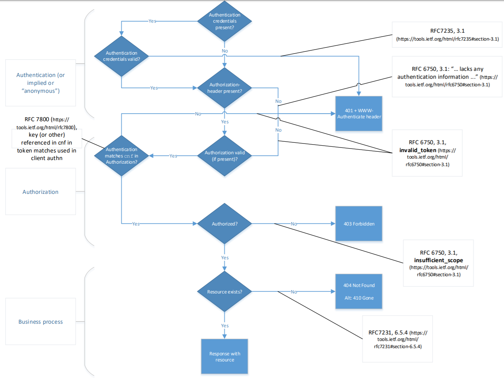

## API Security

This extension is in development and may be modified at any time.

APIs can be accessed from any location on the internet. Information is only exchanged over TLS-based encrypted connections. No exceptions, so everywhere and always. One should follow [the latest NCSC huidelines for TLS](https://www.ncsc.nl/documenten/publicaties/2019/mei/01/ict-beveiligingsrichtlijnen-voor-transport-layer-security-tls)

> [API principle: Encrypt connections using TLS following the latest NCSC guidelines](#api-11)

### Identification

For Identification of individual users always use a pseudonym to avoid exposing sensitive information about a user. 
This pseudonym can optionally be translatable to actual personal information in a separate service, but access to this service should be tightly controlled and limited only to cases where there is a legal need to use this information.

Use of a Burgerservice nummer(BSN) is only allowed when the organization has the right to do this. Even when an orgnization has the right to do this it is still reccomended to use a pseudonym that is only translatable to a BSN for a limited number of services/users within the organization. 
An example of this can be found in the [architecture of the "digitaalstelsel omgevingswet"](https://aandeslagmetdeomgevingswet.nl/publish/library/219/dso_-_gas_-_knooppunt_toegang_iam.pdf)

For identifying government organizations use the "organisatie-identificatienummer" (OIN)
For identifying non-government organizations (companies, associations, foundations etc...) use the Handelsregisternummer (HRN)
These are used in the PKIOverheid and e-Herkenning context. See https://www.logius.nl/diensten/oin for more information on these identifiers.
OINs can be queried using the COR API https://portaal.digikoppeling.nl/registers/corApi/index 
HRNs are derived from the RSIN which can be queried in the "Handels register" https://developers.kvk.nl/documentation/search-v2

In the EU context use the eIDAS legal identifier. for more information see https://ec.europa.eu/digital-single-market/en/trust-services-and-eid

### Authentication
Authentication determines whether someone accessing an API is really who they say they are. In the context of APIs, authentication is applicable to the End-User, i.e. the individual on behalf of whom API resources are being accessed, and to the Client, i.e. the application that accesses the API resources on behalf of the end-user.

#### End-User authentication
The following methods can be used for End-User authentication.

Note that End-User authentication is not required in situations where the API Client is solely accessing API resources on behalf of itself, without requiring an End-User context, but may be used nevertheless.

**SAML**
SAML is a standard for securely communicating assertions about an authenticated End-User from the Identity Provider to the Service Provider. Although it existed before APIs became mainstream and is not aimed at communicating Access Tokens that can be used to access API resources, including those in the exchanged assertions is possible.

SAML 2.0 is included on the list of required standards by Forum Standaardisatie. It is expected, however, that the following standards will become recommended in Use Cases that involve access to API resources.

**OAuth**
Although technically an authorization method, OAuth is  used for End-Users authenticating themselves and providing the Client with an Access Token upon succesful End-User (and Client) authentication. This Access Token can be used to make authorised API requests. Using OAuth is appropriate when the Client does not necessary need to know the identity of the authenticated End-User.

A Dutch OAuth Assurance profile is included on the list of required standards by Forum Standaardisatie. The latest version of the profile can be found at https://docs.geostandaarden.nl/api/oauth/.

**OpenID Connect**
OpenID Connect adds an identity layer on top of OAuth, making it into an actual authentication method. It enables API Clients to verify the identity of authenticated End-Users and to obtain profile information about the End-User.

A Dutch OpenID Connect Assurance profile is currently being drafted. It is expected to be added to the list of required standards by Forum Standaardisatie. The latest version of the profile can be found at https://logius.gitlab.io/oidc/.

**Out of band**
For some Use Cases it may be appropriate to distribute Access Tokens using an Out of band authentication method. A commonly used method is an API web portal to which an End-User authenticates and is able to acquire an API Access Token.

Depending on the implementation of the Out of band method, this option may not provide optimal End-User experience.

#### Client authentication
The following methods can be used for Client authentication.

Note that, although listed separately, the abovementioned methods for End-User authentication also require Client authentication.

Also note that Client authentication using HTTP Basic authentication or communicating client credentials in the request body are prone to credential theft and therefore not recommended and not listed as options below.

**Mutual TLS authentication (mTLS)**
Mutual TLS authentication is a feature of TLS with which the Client authenticates itself to the Server using its X.509 certificate. mTLS provides a strong Client authentication for server-based Clients and cannot be used with Native or User-Agent-based Clients that are not backed with a server.

In contexts where Dutch (semi) governmental organisations are involved, the X.509 certificate used for Client authentication must be a PKIOverheid certificate. These are x509 certificates derived from a root certificate owned by the Dutch Government. for more information on PKIOverheid see https://www.logius.nl/diensten/pkioverheid.

In the API context, only Server or Services certificates should be used as these include an OIN/HRN for identification; Extended Validation certificates (as used for websites) do not include this identifier and are therefore not suitable to use with APIs.

**Private key JWT**
With Private key JWT authentication, the Client registers a public key with the Server and accompanies every API request with a JWT signed using this key. This Client Authentication method is part of the OAuth 2.0 and OpenID Connect standards for Clients authenticating to the token endpoint, but the use of Private key JWT Client authentication is not limited to these Use Cases.

This authentication method may be used with Clients that are able to securely store private keys and sign JWTs with this key.

In contexts where Dutch (semi) governmental organisations are involved, the certificate used for signing the Private key JWTs must be a PKIOverheid certificate.

**Client Credentials using OAuth 2.0**
In Use Cases where the Client is solely accessing API resources on behalf of itself, without requiring an End-User context, Client authentication using the OAuth 2.0 Client Credentials grant type can be appropriate. In such cases, the Server securely communicates Client credentials to the Client upon registration (e.g. via an API Developer portal) and the Client uses these credentials to obtain an Access Token from the Identity provider.

**Client authentication and Public clients**
In Use Cases that involve Native and User-Agent based Clients, strong Client authentication is generally not possible. Whereas it may be possible for individual Clients to implement a decent means of Client authentication (e.g. by using the Web Crypto API in User-Agent based Clients), the Server cannot make any assumptions about the confidentiality of credentials exchanged with such Clients.

When dealing with Use Cases involving Native and User-Agent based Clients, the policies and standards described in [Section 4.4](#security-for-webbrowser-api-clients) should be followed, as well as best practices [[OAuth2.Browser-Based-Apps]] and [[RFC8252]], which are defined for use with OAuth but may be applicable for API communication in general.

### Authorisation
A RESTful API should not maintain the state at the server. The authentication and authorisation of a request cannot depend on sessions. Instead, a token has to be sent for each request. Token based authorization is recommended.

> [API principle: Accept tokens as HTTP headers only](#api-13)

Using tokens a distinction is made between authorised and non-authorised services and related headers:

|||
|-|-|
|Authorised|`Authorization: Bearer <token>`|
|Non-authorised|`X-Api-Key: <api-key>`|

In case the proper headers are not sent, then there are no authentication details available and the a status error code `403 Forbidden` is returned.

> [API principle: Use OAuth 2.0 for authorisation with rights delegation](#api-52)

See also [The Dutch profile OAuth in the chapter Security](#api-security) for further explanation of the applicaton of OAuth.

> [API principle: Use PKIoverheid certificates for access-restricted or purpose-limited API authentication](#api-15)

#### Authorisation errors

In a production environment as little information as possible is to be disclosed. Apply the following rules for returning the status error code `401 Unauthorized`, `403 Forbidden`, and `404 Not Found`.

**Implicit authentication**
When authentication is implicit or when just the presense of an Authorization header (API-Key) is enough for authentication: use the flow chart in figure 1 to determine the correct error code.

Figure 1: authentication is implicit 

Links from flow chart in figure 1:

https://tools.ietf.org/html/rfc6750#section-3.1

https://tools.ietf.org/html/rfc7231#section-6.5.4

**Explicit authentication**
When authentication is explicit, that is the authentication credentials are actively verfied when present use the flow chart in figure 2 to determine the correct error codes. 

Figure 2: authentication is explicit

Links from flow chart in figure 2:

https://tools.ietf.org/html/rfc7235#section-3.1

https://tools.ietf.org/html/rfc6750#section-3.1

https://tools.ietf.org/html/rfc7231#section-6.5.4

**Explicit authentication while matching client authorization CNF**

When authentication is explicit and there is a check wether the provided authorization confirmation claim (CNF) matches the credentials provided for authentication use the flow chart in figure 3 to esteblish the correct error codes.

Figure 3: authentication is explicit, and client authorization confirmation claim matches authentication

Links from flow chart in figure 3:

https://tools.ietf.org/html/rfc7235#section-3.1

https://tools.ietf.org/html/rfc6750#section-3.1

https://tools.ietf.org/html/rfc7800

https://tools.ietf.org/html/rfc7231#section-6.5.4

<!--First, it is established whether the requester (principal) has a valid authorisation(i.e. token is valid) then it is established whether this authorisation is valid for a requested resource. In case the requester is not authorised or the authorisation cannot be established, for example, the resource is required to establish authorisation and the resource does not exist, then a status error code `403 Forbidden` is returned. In this way, no information is returned about the existence of a resource to a non-authorised principal.

An additional advantage of the stategy that establishes whether there is authorisation is the opportunity to separate access control logic from business logic.-->

#### Public identifiers

Publicly visible identifiers (IDs), that are frequently part of URLs a RESTful APIs shouldn't expose the underlying mechanisms (like number generations) and should certainly not have business logic.

> **UUID**
>
> Preferrably use UUIDs (Universally-Unique IDentifier) for confidential resources. This is a 16-bytes (128-bits) binary representation, a sequence of 32 hexadecimal digits, in five groups separated by hyphens and consists of 36 characters (32 alphanumerical characters and 4 hyphens]):
>
> `550e8400-e29b-41d4-a716-446655440000`
> 
> To ensure UUIDs are shorter and guaranteed *web-safe*, be advised to only use the base64-url-encoded variant consisting of 22 characters. The above UUID looks like this:
>
> `VQ6EAOKbQdSnFkRmVUQAAA`
>
> The following linux commands shows an example of how the hex string is transformed to bytes and then to the base64-url-encoded required format:
>
> `echo -n '550e8400-e29b-41d4-a716-446655440000' | sed 's/-//g' | xxd -r -p|base64 -w 0 | sed 's/+/-/g'|sed 's/\//_/g'|sed 's/=//g'`
>

### security for webbrowser API clients
When webbrowsers can be clients for an API these APIs should be compatible with the following policies and standards.

#### CORS-policy

Web browsers implement a so-called "same origin policy", an important security conect to prevent requests go to another domain than where they are provided. While this policy is effective to prevent requests in different domains, it prevents ligitimate interaction between an API and clients from a known and trusted origin. 

> [API principle: Use CORS to control access](#api-50)

#### CSP-policy
Content Security Policy is a standard that allows API (and website) providers to define approved origins of contents that are accesable through an API but are not provided from the same origin as the API itself. When multiple origins are needed this standard can be use as a mechanism to explicitly provide exceptions to the CORS-policy.

#### Subresource integrity
Subresource integrity (SRI) is a standard that can be used to validate content delivered by a third party. It defines trusted location and a hash of external content. This allows a client to verify the integrity and trustworthyness of external content accessed through an API.
