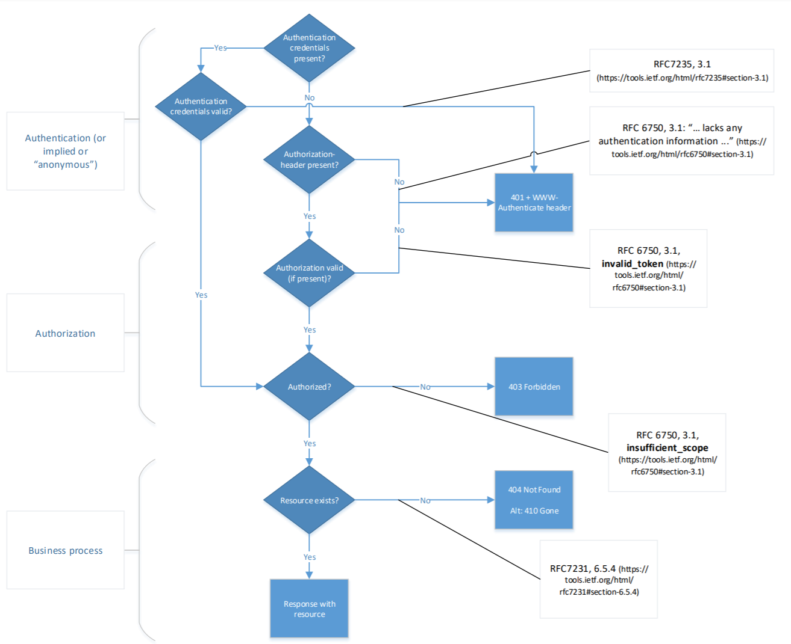

## API Security

This extension is in development and may be modified at any time.

APIs can be accessed from any location on the internet. Information is only exchanged over TLS-based encrypted connections. No exceptions, so everywhere and always. One should follow the latest NCSC huidelines for TLS https://www.ncsc.nl/documenten/publicaties/2019/mei/01/ict-beveiligingsrichtlijnen-voor-transport-layer-security-tls

> [API principle: Encrypt connections using according to latest NCSC guidelines](api-11)

### Identification

For Identification of individual users always use a pseudonym to avoid exposing sensitive information about a user. 
This pseudonym can optionally be translatable to actual personal information in a separate service, but access to this service should be tightly controlled and limited only to cases where there is a legal need to use this information.
Use of a Burgerservice nummer(BSN) is only allowed when the organization has the right to do this. Even when an orgnization has the right to do this it is still reccomended to use a pseudonym that is only translatable to a BSN for a limited number of services/users within the organization. 
An example of this can be found in the [architecture of the "digitaalstelsel omgevingswet"](https://aandeslagmetdeomgevingswet.nl/publish/library/219/dso_-_gas_-_knooppunt_toegang_iam.pdf)

For identifying government organizations use the "organisatie-identificatienummer" (OIN)
For identifying non-government organizations (companies, associations, foundations etc...) use the Handelsregisternummer (HRN)
These are used in the PKIOverheid and e-Herkenning context. See https://www.logius.nl/diensten/oin for more information on these identifiers.
OINs can be queried using the COR API https://portaal.digikoppeling.nl/registers/corApi/index 
HRNs are derived from the RSIN which can be queried in the "Handels register" https://developers.kvk.nl/documentation/search-v2

In the EU context use the eIDAS legal identifier. for more information see https://ec.europa.eu/digital-single-market/en/trust-services-and-eid

### Authentication
We distinguish end user authentication methods and system authentication methods.

#### End user authentication
The following authentication methods can be used end user authentication:
**Out of band** 
When distributing API tokens to users an out of band authentication method can be used. Common methods include an API store where a user logs in and is able to acquire an API key. In this case the login method is the out-of-band authentication method used for accesing an API.

**Openidconnect**
A Dutch profile for OpenIDConnect is currently being drafted. The first version will be for web usecases, later on it will be extended to cover mobile. When this profile is complete it is expected its use will be mandated by the "pas toe of leg uit lijst" of Forum standaardisatie. 

**SAML**
The underlying current Authentication method for DigiD & eHerkenning. It can be the basis as the out-of band method mentioned earlier. other usecases are.... (further elaboration needed)

#### System authentication
The following authentication methods can be used for system authentication:

**PKIOverheid**
These are x509 certificates derived from a root certificate owned by the Dutch Government. for more information on PKIOverheid see https://www.logius.nl/diensten/pkioverheid
In the API context use only server or services certificates that include an OIN/HRN for identification. Extended validation certificates (as used for websites) do not include this identifier and are therefor not suitable for use with APIs. 

**Out of band** 
When distributing API tokens to users an out of band authentication method can be used. Common methods include an API store where a user logs in and is able to acquire an API key. In this case the login method is the out-of-band authentication method used for accesing an API.

**OAuth**
This is a standard for authorisation not authentication yet in some cases its use for machine to machine authentication can be appropriate. The client credentials authorization grant to be specific ...... (further elaboration needed)

### Authorisation
A RESTful API should not maintain the state at the server. The authentication and authorisation of a request cannot depend on cookies or sessions. Instead, a token has to be sent for each request. Token based authorization is reccomended. 

> [API principle: Accept tokens as HTTP headers only](#api-13)

Using tokens a distinction is made between authorised and non-authorised services and related headers:

|||
|-|-|
|Authorised|`Authorization: Bearer <token>`|
|Non-authorised|`X-Api-Key: <api-key>`|

In case the proper headers are not sent, then there are no authentication details available and the a status error code `403 Forbidden` is returned.

> [API principle: Use OAuth 2.0 for authorisation with rights delegation](#api-52)

See also [The Dutch profile OAuth in the chapter Security](#Security) for further explanation of the applicaton of OAuth.

> [API principle: Use PKIoverheid certificates for access-restricted or purpose-limited API authentication](#api-15)

#### Authorisation errors

In a production environment as little information as possible is to be disclosed. Apply the following rules for returned the status error code `401 Unauthorized`, `403 Forbidden`, and `404 Not Found`:

Figure 1: authentication implicit 

When authentication is implicit or when just the precense of an Authorization header (API-Key) is enough for authentication use the flow chart in figure 1 to determine the correct error code.

Links from flow chart in figure 1:
https://tools.ietf.org/html/rfc6750#section-3.1
https://tools.ietf.org/html/rfc7231#section-6.5.4

Figure 2: authentication explicit

When authentication is explicit, that is the authentication credentials are actively verfied when present use the flow chart in figure 2 to determine the correct error codes. 

Links from flow chart in figure 2:
https://tools.ietf.org/html/rfc7235#section-3.1
https://tools.ietf.org/html/rfc6750#section-3.1
https://tools.ietf.org/html/rfc7231#section-6.5.4

Figure 3: authentication explicit, and client authorization confirmation claim matches authentication

When authentication is explicit and there is a check wether the provided authorization confirmation claim (CNF) matches the credentials provided for authentication use the flow chart in figure 3 to esteblish the correct error codes.

Links from flow chart in figure 3:
https://tools.ietf.org/html/rfc7235#section-3.1
https://tools.ietf.org/html/rfc6750#section-3.1
https://tools.ietf.org/html/rfc7800
https://tools.ietf.org/html/rfc7231#section-6.5.4

In all three cases access control logic is seperated from business logic.

<!--First, it is established whether the requester (principal) has a valid authorisation(i.e. token is valid) then it is established whether this authorisation is valid for a requested resource. In case the requester is not authorised or the authorisation cannot be established, for example, the resource is required to establish authorisation and the resource does not exist, then a status error code `403 Forbidden` is returned. In this way, no information is returned about the existence of a resource to a non-authorised principal.

An additional advantage of the stategy that establishes whether there is authorisation is the opportunity to separate access control logic from business logic.-->

#### Public identifiers

Publicly visible identifiers (IDs), that are frequently part of URLs a RESTful APIs shouldn't expose the underlying mechanisms (like number generations) and should certainly not have business logic.

> **UUID**
>
> Preferrably use UUIDs (Universally-Unique IDentifier) for confidential resources. This is a 16-bytes (128-bits) binary representation, a sequence of 32 hexadecimal digits, in five groups separated by hyphens and consists of 36 characters (32 alphanumerical characters and 4 hyphens]):
>
> `550e8400-e29b-41d4-a716-446655440000`
> 
> To ensure UUIDs are shorter and guaranteed *web-safe*, be advised to only use the base64-encoded variant consisting of 22 characters. The above UUID looks like this:
>
> `abcdEFh4520juieUKHWgJQ`

### security for webbrowser API clients
When webbrowsers can be clients for an API these APIs should be compatible with the following policies and standards.

#### CORS-policy

Web browsers implement a so-called "same origin policy", an important security conect to prevent requests go to another domain than where they are provided. While this policy is effective to prevent requests in different domains, it prevents ligitimate interaction between an API and clients from a known and trusted origin. 

> [API principle: Use CORS to control access](#api-50)

#### CSP-policy
Content Security Policy is a standard that allows API (and website) providers to define approved origins of contents that are accesable through an API but are not provided from the same origin as the API itself. When multiple origins are needed this standard can be use as a mechanism to explicitly provide exceptions to the CORS-policy.

#### Subresource integrity
Subresource integrity (SRI) is a standard that can be used to validate content delivered by a third party. It defines trusted location and a hash of external content. This allows a client to verify the integrity and trustworthyness of external content accessed through an API.