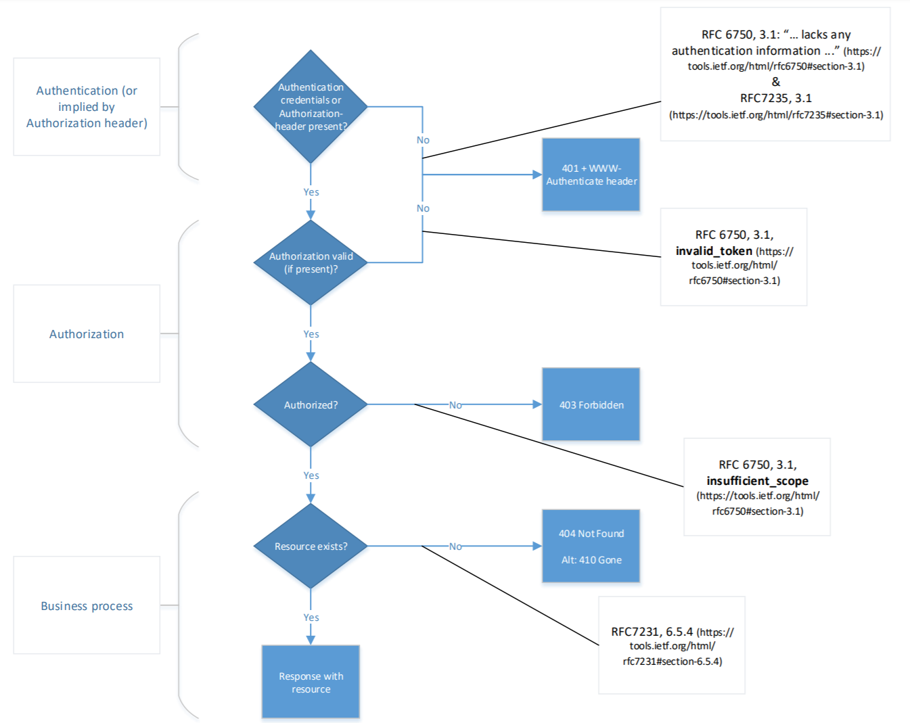

# Access Control

## Introduction
This section describes security principles, concepts and technologies to apply when working with APIs. Controls need to be applied for the security objectives of integrity, confidentiality and availability of the API and services and data provided thereby. The (new draft of the) [architecture section of the API strategy](https://docs.geostandaarden.nl/api/cv-hr-API-Strategie-20210628/#architectuur) contains architecture patterns for implementing API security. This module provides the details on the authentication & authorization capability of the API capability model detailed in the (new draft of the) [architecture section of the API strategy](https://geonovum.github.io/KP-APIs/API-strategie-algemeen/Architectuur/).

The scope of this section is limited to generic security controls that directly influence the visible parts of an API. Effectively, only security standards directly applicable to interactions are discussed here.
In order to meet the complete security objectives, every implementer MUST also apply a range of controls not mentioned in this section.

Note: security controls for signing and encrypting of application level messages will be part of a separate extension, Signing and Encryption.

## API access patterns
Because security is about compromises one should first be aware of what access patterns need to be supported. More information on API access patterns can be found in Dutch in [the architecture chapter of the Dutch API strategy](https://docs.geostandaarden.nl/api/API-Strategie/Architectuur/)

### Machine to machine
Two different machines negotiate a secure point to point connection. One side acts as the client, the other as the server. Both sides identify and authenticate the other party.
The server authorizes access to its resources by the client based on the established identity of the client. The authorizations for a client are determined by doing a lookup to an identity store based on the established identity of the client.
Note that in Dutch government we often only identify organizations and not individual machines or their users. Therefor the access rights or permissions associated with a given identity might be far greater than needed. This is breaking the principle of least privilege.

### Rights delegation
In the rights delegation pattern a system is granted access to a resource by and on behalf of the owner of that resource. The rights delegation access pattern can help solve the problem of machines having greater permissions/priviliges/access rights than necessary for the task at hand.
Retrieving a resource at run-time requires a resource owner, a client, an authorization server and a resource server. The resource owner (often the end user) grants permissions to the client to access resources on its behalf.
This grant is stored at the authorization server, after permissions are granted to the client to access resources on the resource server; with or without the presence of an end user.

When a resource owner provides a grant to the client, this grant SHOULD only contain the permissions the client needs to perform its intended tasks.
To deny the client access to these resources after initial permission is granted, the resource owner MUST revoke the grant at the authorization server or the grant might be revoked after a predefined expiration period.

### Session based API access pattern
While this method is considered legacy it is in common use for handling access control to APIs, even though it conflicts with best practices for APIs. Because this pattern is more a standard web application pattern we refer to [the latest NCSC guidelines on the subject of web application security](https://www.ncsc.nl/documenten/publicaties/2019/mei/01/ict-beveiligingsrichtlijnen-voor-webapplicaties) for security considerations.

We consider this method to be mostly outside the scope of this document and refer to the aforementioned NCSC document for security considerations. We do provide some additional considerations for web clients in the section on [transport Security](https://docs.geostandaarden.nl/api/API-Strategie-mod-transport-security/).

## Identification

**End Users and Organizations**
For identification of individual end users a pseudonym SHOULD be used when possible, to avoid exposing sensitive information about a user.
This pseudonym can optionally be translatable to actual personal information in a separate service, but access to this service should be tightly controlled and limited only to cases where there is a legal need to use this information. Furthermore using a seperate service for translation provides a moment to audit when certain information about users is requested.

Use of a Burger Service Number (BSN) is only allowed when the organization has a legal ground to do so. Even when an organization is eligible to use BSN's it is still RECOMMENDED to use a pseudonym that is only translatable to a BSN for a limited number of services/users within the organization.
An example of this can be found in the [architecture of the "digitaal stelsel omgevingswet (DSO)"](https://aandeslagmetdeomgevingswet.nl/publish/library/219/dso_-_gas_-_knooppunt_toegang_iam.pdf)

For identifying government organizations use the "organisatie-identificatienummer" (OIN).

For identifying non-government organizations (companies, associations, foundations etc...) use the KVK number. These numbers are used in the PKIOverheid and e-Herkenning context respectively. See https://publicatie.centrumvoorstandaarden.nl/dk/oin/ and https://www.kvk.nl/over-kvk/over-het-handelsregister/ for more information on these identifiers.

OIN's can be queried using the COR API https://portaal.digikoppeling.nl/registers/corApi/index or its webpage https://portaal.digikoppeling.nl/registers/. The API will also provide known mappings between OIN- and KVK numbers (some OIN's are not derived from the KVK number). KVK numbers are derived from the handelsregister, which can be queried see https://developers.kvk.nl/documentation/search-v2 for details.

In the EU context use the eIDAS legal identifier. For more information see https://ec.europa.eu/digital-single-market/en/trust-services-and-eid and https://afsprakenstelsel.etoegang.nl/ for details.

**Clients**
Identification of clients is different from identification of the end user or organisation using the service.
When using authorization servers, the authorization server issues the registered client a client identifier - a unique string representing the registration information provided by the client. The client identifier is not a secret; it is commonly public known and MUST NOT be relied upon for client authentication by itself. The client identifier is unique to the authorization server.

Authorization servers MUST NOT allow clients to choose or influence their `client_id` value.

## Authentication
Authentication determines whether individuals and applications accessing APIs are really who they say they are. In the context of APIs, authentication is applicable to the *End-User*, i.e. the individual on behalf of whom API resources are being accessed, _and_ to the *Client*, i.e. the application that accesses the API resources on behalf of the End-User.

Note that an End-User can be both a natural person as well as a legal person (organization). In case Client Authentication includes information about its governing organization, this may fulfill and obviate the need for End-User authentication. See the section "Client Credentials using OAuth 2.0" below.

### End-User authentication
In most Use Cases that involve API interaction, authenticating the End-User on behalf of whom the API resources are accessed is required. This is typically matches with the rights delegation API access pattern.
End-User authentication is not required in situations where the API Client is solely accessing API resources on behalf of itself or its governing organization, without requiring an End-User context, but may be used nevertheless. This happens in the machine to machine API access pattern.

The following methods can be used for End-User authentication:

**SAML**
SAML is a standard for securely communicating assertions about an authenticated End-User from the Identity Provider to the Service Provider. Although it existed before APIs became mainstream and is not aimed at API authentication specifically, communicating Access Tokens that can be used to access API resources in the exchanged assertions is possible.

[SAML 2.0 is included on the list of required standards by Forum Standaardisatie](https://forumstandaardisatie.nl/open-standaarden/saml). It is expected, however, that the following standards will become preferred over SAML in Use Cases that involve access to API resources.

**OAuth**
Although technically an authorization method, OAuth [[OAuth2]] is used as well for authenticating End-Users themselves and providing the Client with an Access Token upon successful End-User (and Client) authentication. This Access Token can be used to make authorized API requests. Using OAuth is appropriate when authorization is not dependent on an identifiable subject, the subject is different from the End-User or the Resource Server does not require authentication of the End-User itself.

The NL GOV Assurance profile for OAuth 2.0 is included on the list of required standards by Forum Standaardisatie. The latest version of the profile can be found at https://publicatie.centrumvoorstandaarden.nl/api/oauth/.

**OpenID Connect**
OpenID Connect [[OpenID.Core]] adds an identity layer on top of OAuth, making it into an actual authentication method. It enables API Clients to verify the identity of authenticated End-Users and to obtain profile information about the End-User.

A Dutch Assurance profile for OpenID Connect is currently being drafted. It is expected to be added to the list of required standards by Forum Standaardisatie. The latest version of the draft profile can be found at https://logius.gitlab.io/oidc/.

**Out of band**
For some Use Cases it may be appropriate to distribute Access Tokens using an Out of band method. Out of band authentication is generally appropriate when API resources are accessed via an application that already supports a client authentication method and the End-User is rather static. Based on an End-User authentication performed, the application subsequently is provided with an Access Token for API access via a secure method.

Depending on the technology used by the applications accessing the API the Access Token may technically be communicated using a secure cookie. This however limits the technologies used to create client applications.

Using sessions and secure cookies is outside the scope of this document. For security considerations please refer to [the latest NCSC guidelines on the subject of web application security](https://www.ncsc.nl/documenten/publicaties/2019/mei/01/ict-beveiligingsrichtlijnen-voor-webapplicaties).

### Client authentication
The Client application that accesses API resources SHOULD be authenticated, both in the machine to machine and in the rights delegation API access patterns. Also note that, although listed separately, the aforementioned methods for End-User authentication require Client authentication as well.

Note: Client Authentication is applicable to the Client accessing the API, the Client making request to the Authorization Server when applying OAuth/OpenID, or both. Client Authentication SHOULD be applied for both uses.

It is RECOMMENDED to use asymmetric (public-key based) methods for client authentication such as mTLS [RFC8705](https://www.rfc-editor.org/info/rfc8705) or "private_key_jwt" [OpenID](https://openid.net/specs/openid-connect-core-1_0.html#ClientAuthentication).

[The NL GOV Assurance profile for OAuth 2.0](https://gitdocumentatie.logius.nl/publicatie/api/oauth/) REQUIRES the use of private_key_jwt for full clients, native clients with dynamically registered keys, and direct access clients as mentioned in the profile.

The following methods can be used for Client authentication.

#### Mutual TLS authentication (mTLS)
Mutual TLS authentication, is a feature of TLS with which the Client authenticates itself to the Server using its X.509 certificate. Mutual TLS (mTLS) provides strong Client authentication for server-based Clients and cannot be used with Native or User-Agent-based Clients that are not backed with a server. Support for mTLS in combination with OAuth2 is specified in [RFC8705](https://www.rfc-editor.org/info/rfc8705).

In contexts where Dutch (semi) governmental organizations are involved, the X.509 certificate used for Client authentication MUST be a PKIOverheid certificate. These are x509 certificates derived from a root certificate owned by the Dutch Government. For more information on PKIOverheid see https://www.logius.nl/diensten/pkioverheid.

In the API context, only Server, Services certificates or extended Validation certificates (as used for websites) SHOULD be used. Please note that in the current standard of PKIO the TSPs are not obligated to fill the OIN / HRN in the Subject.Serialnumber field for the private services chain, as it is optional. See the [Programme of Requirements part 3h: CP Server certificaten – domein Private Services](https://www.logius.nl/sites/default/files/bestanden/website/PvE%20deel3h%20v4.8%20V1.0.pdf) for details. For the extended Validation certificates, the chamber of commerce number is given in the Serial.Subject field see [Programme of Requirements part 3f: Certificate Policy for Extended Validation certificates in EV (G1) Domain](https://www.logius.nl/sites/default/files/public/bestanden/diensten/PKIoverheid/PvE%20EN%20part3f%20v4.8%20DEF.pdf) or the [website of Logius](https://www.logius.nl/diensten/pkioverheid/aansluiten-als-tsp/pogramma-van-eisen) for details.
See also the NCSC factsheet regarding the phasing out of publicly trusted web server (SSL/TLS) certificates by PKIOverheid :
[Factsheet PKIoverheid stopt met webcertificaten](https://www.logius.nl/actueel/ncsc-maakt-factsheet-over-uitfasing-webcertificaten-van-pkioverheid).

#### Private key JWT
With Private key JWT authentication [OpenID](https://openid.net/specs/openid-connect-core-1_0.html#ClientAuthentication), the Client registers a public key with the Server and accompanies every API request with a JWT signed using this key. This Client Authentication method is part of the OpenID Connect standards for Clients authenticating to the OpenID Provider, but the use of Private key JWT Client authentication is not limited to this use case.

This authentication method may be used with Clients that are able to securely store asymmetric private keys and sign JWT's with this key.

In contexts where Dutch (semi) governmental organizations are involved, the certificate used for signing the Private key JWT's MUST be a PKIOverheid certificate. In case the certificate is included in the JWT header, it includes identification of the client and registration of the public key may not be necessary.

[The NL GOV Assurance profile for OAuth 2.0](https://publicatie.centrumvoorstandaarden.nl/api/oauth/) REQUIRES the use of private_key_jwt for full clients, native clients with dynamically registered keys, and direct access clients as mentioned in the profile.

#### Client secrets
Clients SHOULD NOT be authenticated using client secrets. Methods using asymmetric keys are RECOMMENDED instead of client secrets, as they are both more secure and key management is easier, in particular when deployed at scale.  Various methods exists for authenticating clients using secrets. Methods including Client authentication using HTTP Basic authentication or communicating client credentials in the request body are prone to credential theft.

#### Client authentication and Public clients
In Use Cases that involve Native and User-Agent based Clients, strong Client authentication is generally not possible. Whereas it may be possible for individual Clients to implement a decent means of Client authentication (e.g. by using the Web Crypto API in User-Agent based Clients), the Server cannot make any assumptions about the confidentiality of credentials exchanged with such Clients.

When dealing with Use Cases involving Native and User-Agent based Clients, the policies and standards described in [Section HTTP level security](https://geonovum.github.io/KP-APIs/API-strategie-modules/transport-security/#http-level-security) SHOULD be followed, as well as best practices [[OAuth2.Browser-Based-Apps]] and [[RFC8252]], which are defined for use with OAuth but may be applicable for API communication in general.

#### Other Authentication Methods
An API Server (Resource Server) or Authorization Server MAY support any suitable authentication scheme matching their security requirements. When using other authentication methods, the authorization server MUST define a mapping between the client identifier (registration record) and authentication scheme.

Some additional authentication methods are defined in the [OAuth Token Endpoint Authentication Methods](https://www.iana.org/assignments/oauth-parameters/oauth-parameters.xhtml#token-endpoint-auth-method) registry, and may be useful as generic client authentication methods beyond the specific use of protecting the token endpoint.

### Client Credentials using OAuth 2.0
In Use Cases where the Client is solely accessing API resources on behalf of itself or its governing organization, without requiring an End-User context, Client authentication using the OAuth 2.0 Client Credentials grant type can be appropriate. In such cases, the Authorization Server securely provides Client credentials to the Client upon registration (e.g. via an API Developer portal or out of bound process) and the Client uses these credentials to obtain an Access Token from the Authorization Server. The Access token than is used to access the API (Resource Server) using the Access Token.

Note that existing Client Credentials, such as a PKIoverheid X.509 certificate, MAY be used. This preempts the need for providing additional credentials. Any of the above mentioned Client Authentication methods can be applied with the Client Credential flow.

Usage of the Client Credential method with OAuth is RECOMMENDED over direct authorization by the API Server (Resource Server), even if the authorization decision can be based directly on Client Authentication. This externalizes the authorization decision from the API implementation, allowing for easier modifications and management of both the decision logic as well as client authentication methods.

## Authorization

It is RECOMMENDED to use token-based access to APIs. REST APIs SHOULD NOT maintain session state on the server. The authentication and authorization of a request SHOULD NOT depend on sessions. Instead, a token has to be sent with each request.

  
<strong>API-13</strong>: Accept tokens as HTTP headers only

  
There is an inherent security issue when passing tokens as a query parameter, because most Web servers store query parameters in the server logs.

Using tokens, a distinction is made between authorized and non-authorized services and related headers:

|||
|-|-|
|Authorized|`Authorization: Bearer <token>`|
|Non-authorized|`X-Api-Key: <api-key>`|

In case the proper headers are not sent, then there are no authentication details available and a status error code `403 Forbidden` is returned.

  
<strong>API-52</strong>: Use OAuth 2.0 for authorization with rights delegation

  
This is in line with the way the OAuth standard appears on the comply or explain list of Forum Standaardisatie.

See also [The NL GOV Assurance profile for OAuth 2.0](https://gitdocumentatie.logius.nl/publicatie/api/oauth/) for further explanation of the applicaton of OAuth.

The [Digikoppeling standard](https://publicatie.centrumvoorstandaarden.nl/dk/actueel/) currently has a [RESTful API profile in development](https://gitdocumentatie.logius.nl/publicatie/dk/restapi/) that specifies how to use PKIOverheid x.509 certificates for authorization.

### Authorization errors

In a production environment as little information as possible is to be disclosed. Apply the following rules for returning the status error code `401 Unauthorized`, `403 Forbidden`, and `404 Not Found`.

Note that authentication in the cases below is typically client authentication, and the Authorization header contains information on the End-User authorization and authentication, if applicable.

Note that usage of the Authorization header is part of the OAuth2 specifications.

**Implicit authentication**

When authentication is implicit or when just the presence of an Authorization header is enough for authentication and/or authorization: use the flow chart in figure 1 to determine the correct error code.

<figure>
    
    <figcaption>authentication is implicit</figcaption>
</figure>

Links from flow chart in figure above:

https://tools.ietf.org/html/rfc6750#section-3.1

https://tools.ietf.org/html/rfc7231#section-6.5.4

**Explicit authentication**

When authentication is explicit, that is the authentication credentials are actively verfied when present, use the flow chart in figure 2 to determine the correct error codes.

<figure>
    
    <figcaption>authentication is explicit</figcaption>
</figure>

Links from flow chart in figure above:

https://tools.ietf.org/html/rfc7235#section-3.1

https://tools.ietf.org/html/rfc6750#section-3.1

https://tools.ietf.org/html/rfc7231#section-6.5.4

**Explicit authentication while matching client authorization (`cnf`)**

When authentication is explicit and there is a check whether the provided authorization confirmation claim (`cnf`, see [[rfc7800]]) matches the credentials provided for authentication use the flow chart in figure 3 to esteblish the correct error codes.

<figure>
    
    <figcaption>authentication is explicit, and client authorization confirmation claim (`cnf`) matches authentication.</figcaption>
</figure>

Links from flow chart in figure above:

https://tools.ietf.org/html/rfc7235#section-3.1

https://tools.ietf.org/html/rfc6750#section-3.1

https://tools.ietf.org/html/rfc7800

https://tools.ietf.org/html/rfc7231#section-6.5.4

<!--First, it is established whether the requester (principal) has a valid authorisation(i.e. token is valid) then it is established whether this authorisation is valid for a requested resource. In case the requester is not authorised or the authorisation cannot be established, for example, the resource is required to establish authorisation and the resource does not exist, then a status error code `403 Forbidden` is returned. In this way, no information is returned about the existence of a resource to a non-authorised principal.

An additional advantage of the strategy that establishes whether there is authorisation is the opportunity to separate access control logic from business logic.-->
