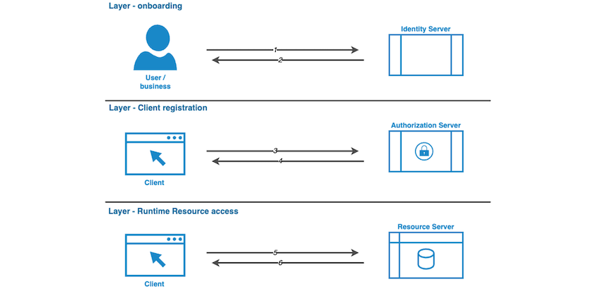

# API Access Control

API access control is a set of mechanisms and policies that regulate who or what can access an API and what operations they are allowed to perform. It ensures that only authorized users, clients, networks or systems can access specific endpoints or resources within the API.

## Introduction

This section describes security principles, concepts and technologies to apply when working with APIs. Controls need to be applied for the security objectives of integrity, confidentiality and availability of the API and services and data provided thereby. The [architecture section of the API strategy](https://docs.geostandaarden.nl/api/API-Strategie-architectuur/) contains architecture patterns for implementing API security. This module provides the details on the Identification, Authentication & Authorization capability of the [API capability model detailed in the architecture section of the API strategy](https://geonovum.github.io/KP-APIs/API-strategie-algemeen/Architectuur/#api-capability-model).

The scope of this section is limited to generic security controls that directly influence the visible parts of an API. Effectively, only security standards directly applicable to interactions are discussed here.
In order to meet the complete security objectives, every implementer MUST also apply a range of controls not mentioned in this section.

> Note: security controls for signing and encrypting of application level messages will be part of a separate extension, Signing and Encryption.

## API Access Layers

Access to api's shall always be restricted based on one or more layers. Functional layers consist of the onboarding of users, client registration and runtime resource access limitations.

### Onboarding

Onboarding is the process of guiding developers or users through the initial registration process, often including registration, KYC (or “Know Your Customer”) and obtaining authentication credentials of the user or the business the user is representing. Authentication credentials can be provided by the service provider or can be obtained from (Trust) Service providers [For example the TSP's that provide PKIO certificates](https://www.logius.nl/domeinen/toegang/pkioverheidcertificaat-aanvragen) or [the National eIDAS trust services](https://www.logius.nl/domeinen/toegang/eidas).

### Client registration

With the registration and onborading of organisations and users representing the organisations the second step is often the client registration. The process for this layer depends on the type of service and client software. Clients kan be unregisterd, dynamically registerd, pre listed or onboarded explicitly by users. The main means of registration is based on the OAuth [Client registration flow](https://gitdocumentatie.logius.nl/publicatie/api/oauth/v1.1.0-rc.1/#use-case-client-credentials-flow) or the [Authorization code flow](https://gitdocumentatie.logius.nl/publicatie/api/oauth/v1.1.0-rc.1/#use-case-authorization-code-flow).

### Runtime resource access

When a user issues a client requests to a resource via a REST API, access must be verified at runtime. An **API Gateway** acts as the gatekeeper, checking whether the provided **access token** is valid. These tokens are typically issued through standards like **OAuth 2.0 / OpenID Connect** or **SAML 2.0**. Only after successful validation will the request be forwarded to the backend service, ensuring secure and consistent runtime access to protected resources.

#### HTTPS (TLS) configuration

When a client communicates with a REST API, the connection itself must be protected. **HTTPS** provides this by encrypting all traffic between client and server using **PKI certificates**. These certificates, issued by trusted authorities, verify the server’s identity and ensure that data cannot be intercepted or modified in transit. By enforcing HTTPS, APIs guarantee both **confidentiality** and **integrity** of network communications, forming the foundation of secure runtime interactions.

The working of HTTPS is based on the TLS specification and is mandatory for all API's that conform to [the core set of API Design Rules](https://gitdocumentatie.logius.nl/publicatie/api/adr/2.1.0/#/core/transport/tls). One must also follow the latest [NCSC guidelines](https://www.ncsc.nl/documenten/publicaties/2025/juni/01/ict-beveiligingsrichtlijnen-voor-transport-layer-security-2025-05).

#### Network configuration

The baseline for API Access is the phisical network. Typically the network layer consists of the internet, however a national government will also provide api access via restricted networks. [For example the dutch diginetwork](https://www.logius.nl/domeinen/infrastructuur/diginetwerk).

## API access patterns

Because security is about compromises one should first be aware of what access patterns need to be supported. More information on API access patterns can be found in Dutch in [the architecture chapter of the Dutch API strategy](https://docs.geostandaarden.nl/api/API-Strategie/Architectuur/)

### Machine to machine

Two different machines negotiate a secure point to point connection. One side acts as the client, the other as the server. Both sides identify and authenticate the other party.
The server authorizes access to its resources by the client based on the established identity of the client. The authorizations for a client are determined by doing a lookup to an identity store based on the established identity of the client.
Note that in Dutch government we often only identify organizations and not individual machines or their users. Therefor the access rights or permissions associated with a given identity might be far greater than needed. This is breaking the principle of least privilege.

### Rights delegation

In the rights delegation pattern a system is granted access to a resource by and on behalf of the owner of that resource. The rights delegation access pattern can help solve the problem of machines having greater permissions/priviliges/access rights than necessary for the task at hand.
Retrieving a resource at run-time requires a resource owner, a client, an authorization server and a resource server. The resource owner (often the end user) grants permissions to the client to access resources on its behalf.
This grant is stored at the authorization server, after permissions are granted to the client to access resources on the resource server; with or without the presence of an end user.

When a resource owner provides a grant to the client, this grant SHOULD only contain the permissions the client needs to perform its intended tasks.
To deny the client access to these resources after initial permission is granted, the resource owner MUST revoke the grant at the authorization server or the grant might be revoked after a predefined expiration period.

> When combining the 'Machine to machine' and the 'Rights delegation' patterns it's advised to look into the FSC standard ad documented on [fsc-standaard.nl](https://fsc-standaard.nl/)

### Intermediaries

In some usecases an intermediary application is placed in between the client and server application. Orchestration of multiple APIs through an orchestration server is an example of this, see for instance [IMX](https://geonovum.github.io/imx-digilab/). Another example is an API gateway performing some centralized tasks in an environment with multiple resource servers operated by multiple organizations, for instance ["het Knooppunt" in DSO](https://iplo.nl/publish/library/219/dso_-_gas_-_knooppunt_gegevensuitwisseling_1.pdf) or [centraal aansluitpunt](https://www.logius.nl/onze-dienstverlening/infrastructuur/centraal-aansluitpunt). In these cases these intermediaries can act either transparantly or opaque.

#### Transparant intermediary

The identity of the client application and its user is passed through the intermediary to the resource server(s). The resource server(s) can perform (fine grained) access control based on this identity. Usually either client and intermediary or intermediary and resourcource server(s) belong to one organization. Optionally in a federated setting token exchange can be used to put the identity of the client application/end user in a format issued by an identity provider trusted by the resource server(s). There are limits to what the intermediary can achieve, when the functionality required of the intermediary becomes complex (i.e. filtering, aggeragation in combination with orchestration) it becomes more sensible to integrate this functionality either at the client application or resource server. When passing information through an intermediary trust on the authenticity of this information needs to be established. This can be done either through contracts with requirements and audits, or through technical measures such as [signing](https://geonovum.github.io/KP-APIs/API-strategie-modules/signing-jades/) & [encryption](https://geonovum.github.io/KP-APIs/API-strategie-modules/encryption/). With a transparant intermediary error handling deserves additional focus as the resource server(s) can deny requests and these denials have to be handled properly. The transparant intermediary is the reccomended approach when resource servers and intermediary server are controlled by multiple organizations and some form of closed/restricted data/funtionality is involved.

#### Opaque intermediary

There is a decoupling between client application and resource server(s). The resource server(s) only know the identity of the intermediary server. The intermediary server authorizes access of the client application and its user to the resource server. Any fine grained access control is principly performed at the intermediary server based on identity. The resource server may receive additional information with a request that grants certain rights but the access decision passing this additional information has already been made at the intermediary server. A strong level of trust is needed between user, client intermediary as well as between the intermediary and resource servers. This will likely translate into contracts with requirements on all parties and associated audits. There is a large burden on the intermediary to ensure proper access control, also the intermediary poses a high risk to security when it is compromised as it can act on behalf of all potential client applications and their users. We consider this pattern acceptable when all resource servers and the intermediary are withing the control of one organization, or when only open data/functionality is involved.

### Session based API access pattern

While this method is considered legacy it is in common use for handling access control to APIs, even though it conflicts with best practices for APIs. Because this pattern is more a standard web application pattern we refer to [the latest NCSC guidelines on the subject of web application security](https://www.ncsc.nl/documenten/publicaties/2019/mei/01/ict-beveiligingsrichtlijnen-voor-webapplicaties) for security considerations.

We consider this method to be mostly outside the scope of this document and refer to the aforementioned NCSC document for security considerations. We do provide some additional considerations for web clients in the section on [transport Security](https://docs.geostandaarden.nl/api/API-Strategie-mod-transport-security/).

### Orchestration

API orchestration coordinates multiple API calls to deliver a single, cohesive service or composite api. This is common in public sector chains where data must flow between different systems – for example, validating an energy subsidy request across municipal, tax authority, and energy providers.

Instead of exposing multiple complex backends to clients, orchestration allows a central component (like an API Gateway or orchestrator) to handle things like Request sequencing, error handling, retries, logging, audits and identity propagation. This leads to better user experience, improved system control, and clearer accountability in government service chains.

The [Arazzo specification](https://developer.overheid.nl/standaarden/arazzo) helps maintain context across chained API calls by introducing:

- A unique **chain ID**,
- Shared **context metadata** (auth, trace, audit),
- Mechanisms for linking related API transactions

This enables observability, traceability, and trust across loosely coupled systems.

In orchestrated flows, access tokens often need to be:

- **Forwarded** to downstream APIs,
- **Exchanged** for another token format (e.g., JWT to SAML),
- Or **delegated** (*on-behalf-of*) using [OAuth 2.0 Token Exchange (RFC 8693)](https://datatracker.ietf.org/doc/html/rfc8693).

This ensures that each API receives a valid and trusted identity token, even across organizational boundaries. When combining orchestration with an intermediary context, three possible scenarios will be elaborated.

#### **1. Implicit Identity reuse – token based**

**Rationale:**

- There is a decoupling between the Services and the client. This is not an issue with open data but is with confidential data.
- In practice this is how, for example, a general practitioner works and how many desks and government organizations operate.
- The token / OAuth flow outlined here can also be another form of authentication or identification in these situations.
- This situation is often used within a single organization, where all parts of the orchestration fall under the responsibility of one organization and the User is also employed by this organization.

**Identity:**

- Services A, B & C know the identity of Service Y, not of Client X or User U.
- Service Y knows the identity of User U and/or Client X.

**Authenticity:**

- The authenticity of Client X is guaranteed by Identity Service Provider Z.
- The authenticity of Client X is not directly known to Service A, B & C.
- The authenticity of User U is known only within Service Y.

**Integrity:**

- The integrity of the data is guaranteed by Service Y.
- Services A, B & C trust Service Y for the integrity of the data.

**Authorization:**

- The authorization is defined in and by Service Provider Y. Services A, B & C are not aware that their data is being shared with Client X and User U or any other client or user.
- Service Y must be authorized at Services A, B & C to request data on behalf of Client X and/or User U.
- Services A, B & C delegate access to their data to Service Y.

**Implications:**

- A strong trust relationship is required both between the Client & Service, as well as between the Service and the Services. This trust relationship will likely be translated into requirements, audits, and contracts.
- The provider of Service Y — for example, a municipality — must carefully ensure and document that the service they provide only requests data from the Services when there is an explicit request from User U. It must be prevented that, in this situation, a malicious actor gains access to the service and can thereby query all Services of all users.
- This solution is technically probably easier to implement and more commonly used, but it also carries much greater risks than transparent orchestration.

#### **2. Identity propagation – token based**

**Rationale:**

There is a direct relationship between the Services and the identity of the client/user. This makes it possible to also securely use privacy-sensitive data in the orchestration.

- In practice, this form of orchestration is often also performed client-side by calling multiple APIs directly from the client.
- In such cases, the orchestration service often does not perform filtering of data.
- It is then more about a bundling of multiple sources than actual orchestration.
- For queries it often resembles more the *composition* pattern than an *orchestration* pattern.

**Identity:**

- Services A, B & C know the identity of User U (because the resources are related to the User, or the User is authorized through their role to consult the Services).
- Service Y does not know the identity of User U.

**Authenticity:**

- The authenticity of Client X is guaranteed by Identity Service Provider Z.
- The authenticity of Service Y is verified by Services A, B & C.
- The authenticity of Service Y must be verified by Client X.
- The authenticity of Services A, B & C must be verified by Service Y.

**Authorization:**

- Authorization can be configured dynamically per Service.
- Service Y must be able to handle the fact that Services A, B & C can deny authorization.

#### **3. Federated Identity Propagation**

Identity Service Provider Z can also be the access point to a federated environment of Identity Providers, where Z retrieves the access tokens from the Identity Providers of the different Services via OAuth Token Exchange, and these tokens are then included by the client in the request.

**Implications of Identity propagation:**

- A strong trust relationship is required between both the Client & Service as well as between the composite Service and the system Services. This trust relationship will likely be translated into requirements, audits, and contracts to prevent Service Y from accessing the data that the resources return to the client.
- From an organizational perspective, X, Y, Z, A & B will practically not all belong to different organizations. It is more logical if A, B & Y are part of one organization, or if X & Y are part of one organization. Service Y is only developed when there is a demand and an advantage for the Services or the client.
- Depending on the situation, it is likely that Identity Provider Z is a general government service (such as DigiD or eHerkenning) or a service provided by one of the organizations in the orchestration.

### Signing & Encryption

Signing of the HTTP body and/or header can be used for **authentication**, to **verify the integrity** of request/response messages, and to provide **non-repudiation**.  (Non-repudiation in this context means: the sender of the request/response cannot deny having sent the message when it is digitally signed with their private key.)

Messages may also be stored along with their digital signatures so they can be used later for **auditing** or **legal evidence** purposes.

An HTTP request message consists of the following components:

- Header
  - HTTP operation (GET, POST, etc.)
  - Path / URL resource
  - Protocol
  - Header fields
- Body
  - Payload

By digitally signing not only the body data but also parts of the header, it is possible to verify that, for example, the HTTP method and resource path are indeed from the sender and have not been tampered with in transit. If signing of the HTTP body and/or header is applied, it is **mandatory** to follow the rules specified in the ADR module: [ADR-HTTP Message and Payload Signing with JAdES](https://geonovum.github.io/KP-APIs/API-strategie-modules/signing-jades/)

Encryption of HTTP request/response messages can be used to protect the **confidentiality** of the transmitted data. If encryption of HTTP request/response messages is applied, it is **mandatory** to follow the rules specified in the ADR module:  [ADR-HTTP Payload Encryption](https://geonovum.github.io/KP-APIs/API-strategie-modules/encryption/)

### Policy enforcement

In a typical situation, the API is protected by an API Gateway. The behavior of the API Gateway is defined in a policy. This policy can range from a simple script with a few rules to a sophisticated workflow consisting of multiple steps and external dependencies such as Identity Providers (IDP), Trust Service Providers (TSP), Authorization Servers (AS), and Policy Decision Points (PDP).

Delegating the policy enforcement decision follows the architectural pattern of **Externalized Authorization Management (EAM)**. In this approach, access rules are not embedded within the gateway or the application itself but are managed externally. This makes access management scalable, flexible, auditable, and vendor-independent.

More information on this subject is available at [VNG Realisatie – Federative Access Management](https://vng-realisatie.github.io/ftv/), an initiative based on the [AuthZen specification](https://openid.net/wg/authzen/specifications/).

## Identification

### End Users and Organizations

For identification of individual end users a pseudonym SHOULD be used when possible, to avoid exposing sensitive information about a user.
This pseudonym can optionally be translatable to actual personal information in a separate service, but access to this service should be tightly controlled and limited only to cases where there is a legal need to use this information. Furthermore using a seperate service for translation provides a moment to audit when certain information about users is requested.

Use of a Burger Service Number (BSN) is only allowed when the organization has a legal ground to do so. Even when an organization is eligible to use BSN's it is still RECOMMENDED to use a pseudonym that is only translatable to a BSN for a limited number of services/users within the organization.
An example of this can be found in the [architecture of the "digitaal stelsel omgevingswet (DSO)"](https://aandeslagmetdeomgevingswet.nl/publish/library/219/dso_-_gas_-_knooppunt_toegang_iam.pdf)

For identifying government organizations use the "organisatie-identificatienummer" (OIN).

For identifying non-government organizations (companies, associations, foundations etc...) use the KVK number. These numbers are used in the PKIOverheid and e-Herkenning context respectively. See https://publicatie.centrumvoorstandaarden.nl/dk/oin/ and https://www.kvk.nl/over-kvk/over-het-handelsregister/ for more information on these identifiers.

OIN's can be queried using the COR API https://portaal.digikoppeling.nl/registers/corApi/index or its webpage https://portaal.digikoppeling.nl/registers/. The API will also provide known mappings between OIN- and KVK numbers (some OIN's are not derived from the KVK number). KVK numbers are derived from the handelsregister, which can be queried see https://developers.kvk.nl/documentation/search-v2 for details.

In the EU context use the eIDAS legal identifier. For more information see https://ec.europa.eu/digital-single-market/en/trust-services-and-eid and https://afsprakenstelsel.etoegang.nl/ for details.

### Clients

Identification of clients is different from identification of the end user or organisation using the service.
When using authorization servers, the authorization server issues the registered client a client identifier - a unique string representing the registration information provided by the client. The client identifier is not a secret; it is commonly public known and MUST NOT be relied upon for client authentication by itself. The client identifier is unique to the authorization server.

Authorization servers MUST NOT allow clients to choose or influence their `client_id` value

### eIDAS

Willen we nog een verwijzing naar eIDAS opnemen?@@@
> verwijzing eidas opnemen : https://eidas.ec.europa.eu/efda/trust-services/browse/eidas/tls/tl/NL

## Authentication

Authentication determines whether individuals and applications accessing APIs are really who they say they are. In the context of APIs, authentication is applicable to the *End-User*, i.e. the individual on behalf of whom API resources are being accessed, _and_ to the *Client*, i.e. the application that accesses the API resources on behalf of the End-User.

Note that an End-User can be both a natural person as well as a legal person (organization). In case Client Authentication includes information about its governing organization, this may fulfill and obviate the need for End-User authentication. See the section "Client Credentials using OAuth 2.0" below.

### End-User authentication

In most Use Cases that involve API interaction, authenticating the End-User on behalf of whom the API resources are accessed is required. This is typically matches with the rights delegation API access pattern.
End-User authentication is not required in situations where the API Client is solely accessing API resources on behalf of itself or its governing organization, without requiring an End-User context, but may be used nevertheless. This happens in the machine to machine API access pattern.

The following methods can be used for End-User authentication:

**SAML**
SAML is a standard for securely communicating assertions about an authenticated End-User from the Identity Provider to the Service Provider. Although it existed before APIs became mainstream and is not aimed at API authentication specifically, communicating Access Tokens that can be used to access API resources in the exchanged assertions is possible.

[SAML 2.0 is included on the list of required standards by Forum Standaardisatie](https://forumstandaardisatie.nl/open-standaarden/saml). It is expected, however, that the following standards will become preferred over SAML in Use Cases that involve access to API resources.

**OAuth**
Although technically an authorization method, OAuth [[OAuth2]] is used as well for authenticating End-Users themselves and providing the Client with an Access Token upon successful End-User (and Client) authentication. This Access Token can be used to make authorized API requests. Using OAuth is appropriate when authorization is not dependent on an identifiable subject, the subject is different from the End-User or the Resource Server does not require authentication of the End-User itself.

The NL GOV Assurance profile for OAuth 2.0 is included on the list of required standards by Forum Standaardisatie. The latest version of the profile can be found at https://publicatie.centrumvoorstandaarden.nl/api/oauth/.

**OpenID Connect**
OpenID Connect [[OpenID.Core]] adds an identity layer on top of OAuth, making it into an actual authentication method. It enables API Clients to verify the identity of authenticated End-Users and to obtain profile information about the End-User.

A Dutch Assurance profile for OpenID Connect is currently being drafted. It is expected to be added to the list of required standards by Forum Standaardisatie. The latest version of the draft profile can be found at https://logius.gitlab.io/oidc/.

**Out of band**
For some Use Cases it may be appropriate to distribute Access Tokens using an Out of band method. Out of band authentication is generally appropriate when API resources are accessed via an application that already supports a client authentication method and the End-User is rather static. Based on an End-User authentication performed, the application subsequently is provided with an Access Token for API access via a secure method.

Depending on the technology used by the applications accessing the API the Access Token may technically be communicated using a secure cookie. This however limits the technologies used to create client applications.

Using sessions and secure cookies is outside the scope of this document. For security considerations please refer to [the latest NCSC guidelines on the subject of web application security](https://www.ncsc.nl/documenten/publicaties/2019/mei/01/ict-beveiligingsrichtlijnen-voor-webapplicaties).

### Client authentication

The Client application that accesses API resources SHOULD be authenticated, both in the machine to machine and in the rights delegation API access patterns. Also note that, although listed separately, the aforementioned methods for End-User authentication require Client authentication as well.

Note: Client Authentication is applicable to the Client accessing the API, the Client making request to the Authorization Server when applying OAuth/OpenID, or both. Client Authentication SHOULD be applied for both uses.

It is RECOMMENDED to use asymmetric (public-key based) methods for client authentication such as mTLS [RFC8705](https://www.rfc-editor.org/info/rfc8705) or "private_key_jwt" [OpenID](https://openid.net/specs/openid-connect-core-1_0.html#ClientAuthentication).

[The NL GOV Assurance profile for OAuth 2.0](https://gitdocumentatie.logius.nl/publicatie/api/oauth/) REQUIRES the use of private_key_jwt for full clients, native clients with dynamically registered keys, and direct access clients as mentioned in the profile.

The following methods can be used for Client authentication.

#### Mutual TLS authentication (mTLS)

Mutual TLS authentication, is a feature of TLS with which the Client authenticates itself to the Server using its X.509 certificate. Mutual TLS (mTLS) provides strong Client authentication for server-based Clients and cannot be used with Native or User-Agent-based Clients that are not backed with a server. Support for mTLS in combination with OAuth2 is specified in [RFC8705](https://www.rfc-editor.org/info/rfc8705).

In contexts where Dutch (semi) governmental organizations are involved, the X.509 certificate used for Client authentication MUST be a PKIOverheid certificate. These are x509 certificates derived from a root certificate owned by the Dutch Government. For more information on PKIOverheid see https://www.logius.nl/diensten/pkioverheid.

In the API context, only Server, Services certificates or extended Validation certificates (as used for websites) SHOULD be used. Please note that in the current standard of PKIO the TSPs are not obligated to fill the OIN / HRN in the Subject.Serialnumber field for the private services chain, as it is optional. See the [Programme of Requirements part 3h: CP Server certificaten – domein Private Services](https://www.logius.nl/sites/default/files/bestanden/website/PvE%20deel3h%20v4.8%20V1.0.pdf) for details. For the extended Validation certificates, the chamber of commerce number is given in the Serial.Subject field see [Programme of Requirements part 3f: Certificate Policy for Extended Validation certificates in EV (G1) Domain](https://www.logius.nl/sites/default/files/public/bestanden/diensten/PKIoverheid/PvE%20EN%20part3f%20v4.8%20DEF.pdf) or the [website of Logius](https://www.logius.nl/diensten/pkioverheid/aansluiten-als-tsp/pogramma-van-eisen) for details.
See also the NCSC factsheet regarding the phasing out of publicly trusted web server (SSL/TLS) certificates by PKIOverheid :
[Factsheet PKIoverheid stopt met webcertificaten](https://www.logius.nl/actueel/ncsc-maakt-factsheet-over-uitfasing-webcertificaten-van-pkioverheid).

@@@ eg PKIO or PKI config and DNS / CORS etc

#### Private key JWT

With Private key JWT authentication [OpenID](https://openid.net/specs/openid-connect-core-1_0.html#ClientAuthentication), the Client registers a public key with the Server and accompanies every API request with a JWT signed using this key. This Client Authentication method is part of the OpenID Connect standards for Clients authenticating to the OpenID Provider, but the use of Private key JWT Client authentication is not limited to this use case.

This authentication method may be used with Clients that are able to securely store asymmetric private keys and sign JWT's with this key.

In contexts where Dutch (semi) governmental organizations are involved, the certificate used for signing the Private key JWT's MUST be a PKIOverheid certificate. In case the certificate is included in the JWT header, it includes identification of the client and registration of the public key may not be necessary.

[The NL GOV Assurance profile for OAuth 2.0](https://publicatie.centrumvoorstandaarden.nl/api/oauth/) REQUIRES the use of private_key_jwt for full clients, native clients with dynamically registered keys, and direct access clients as mentioned in the profile.

#### Client secrets

Clients SHOULD NOT be authenticated using client secrets. Methods using asymmetric keys are RECOMMENDED instead of client secrets, as they are both more secure and key management is easier, in particular when deployed at scale.  Various methods exists for authenticating clients using secrets. Methods including Client authentication using HTTP Basic authentication or communicating client credentials in the request body are prone to credential theft.

#### Client authentication and Public clients

In Use Cases that involve Native and User-Agent based Clients, strong Client authentication is generally not possible. Whereas it may be possible for individual Clients to implement a decent means of Client authentication (e.g. by using the Web Crypto API in User-Agent based Clients), the Server cannot make any assumptions about the confidentiality of credentials exchanged with such Clients.

When dealing with Use Cases involving Native and User-Agent based Clients, the policies and standards described in [Section HTTP level security](https://geonovum.github.io/KP-APIs/API-strategie-modules/transport-security/#http-level-security) SHOULD be followed, as well as best practices [[OAuth2.Browser-Based-Apps]] and [[RFC8252]], which are defined for use with OAuth but may be applicable for API communication in general.

#### Other Authentication Methods

An API Server (Resource Server) or Authorization Server MAY support any suitable authentication scheme matching their security requirements. When using other authentication methods, the authorization server MUST define a mapping between the client identifier (registration record) and authentication scheme.

Some additional authentication methods are defined in the [OAuth Token Endpoint Authentication Methods](https://www.iana.org/assignments/oauth-parameters/oauth-parameters.xhtml#token-endpoint-auth-method) registry, and may be useful as generic client authentication methods beyond the specific use of protecting the token endpoint.

### Client Credentials using OAuth 2.0

In Use Cases where the Client is solely accessing API resources on behalf of itself or its governing organization, without requiring an End-User context, Client authentication using the OAuth 2.0 Client Credentials grant type can be appropriate. In such cases, the Authorization Server securely provides Client credentials to the Client upon registration (e.g. via an API Developer portal or out of bound process) and the Client uses these credentials to obtain an Access Token from the Authorization Server. The Access token than is used to access the API (Resource Server) using the Access Token.

Note that existing Client Credentials, such as a PKIoverheid X.509 certificate, MAY be used. This preempts the need for providing additional credentials. Any of the above mentioned Client Authentication methods can be applied with the Client Credential flow.

Usage of the Client Credential method with OAuth is RECOMMENDED over direct authorization by the API Server (Resource Server), even if the authorization decision can be based directly on Client Authentication. This externalizes the authorization decision from the API implementation, allowing for easier modifications and management of both the decision logic as well as client authentication methods.

## Authorization

It is RECOMMENDED to use token-based access to APIs. REST APIs SHOULD NOT maintain session state on the server. The authentication and authorization of a request SHOULD NOT depend on sessions. Instead, a token has to be sent with each request.

  
<strong>API-13</strong>: Accept tokens as HTTP headers only

  
There is an inherent security issue when passing tokens as a query parameter, because most Web servers store query parameters in the server logs.

Using tokens, a distinction is made between authorized and non-authorized services and related headers:

|||
|-|-|
|Authorized|`Authorization: Bearer <token>`|
|Non-authorized|`X-Api-Key: <api-key>`|

In case the proper headers are not sent, then there are no authentication details available and a status error code `403 Forbidden` is returned.

  
<strong>API-52</strong>: Use OAuth 2.0 for authorization with rights delegation

  
This is in line with the way the OAuth standard appears on the comply or explain list of Forum Standaardisatie.

See also [The NL GOV Assurance profile for OAuth 2.0](https://gitdocumentatie.logius.nl/publicatie/api/oauth/) for further explanation of the applicaton of OAuth.

The [Digikoppeling standard](https://publicatie.centrumvoorstandaarden.nl/dk/actueel/) currently has a [RESTful API profile in development](https://gitdocumentatie.logius.nl/publicatie/dk/restapi/) that specifies how to use PKIOverheid x.509 certificates for authorization.

### Authorization errors

In a production environment as little information as possible is to be disclosed. Apply the following rules for returning the status error code `401 Unauthorized`, `403 Forbidden`, and `404 Not Found`.

Note that authentication in the cases below is typically client authentication, and the Authorization header contains information on the End-User authorization and authentication, if applicable.

Note that usage of the Authorization header is part of the OAuth2 specifications.

**Implicit authentication**

When authentication is implicit or when just the presence of an Authorization header is enough for authentication and/or authorization: use the flow chart in figure 1 to determine the correct error code.

<figure>
    
    <figcaption>authentication is implicit</figcaption>
</figure>

Links from flow chart in figure above:

https://tools.ietf.org/html/rfc6750#section-3.1

https://tools.ietf.org/html/rfc7231#section-6.5.4

**Explicit authentication**

When authentication is explicit, that is the authentication credentials are actively verfied when present, use the flow chart in figure 2 to determine the correct error codes.

<figure>
    
    <figcaption>authentication is explicit</figcaption>
</figure>

Links from flow chart in figure above:

https://tools.ietf.org/html/rfc7235#section-3.1

https://tools.ietf.org/html/rfc6750#section-3.1

https://tools.ietf.org/html/rfc7231#section-6.5.4

**Explicit authentication while matching client authorization (`cnf`)**

When authentication is explicit and there is a check whether the provided authorization confirmation claim (`cnf`, see [[rfc7800]]) matches the credentials provided for authentication use the flow chart in figure 3 to esteblish the correct error codes.

<figure>
    
    <figcaption>authentication is explicit, and client authorization confirmation claim (`cnf`) matches authentication.</figcaption>
</figure>

Links from flow chart in figure above:

https://tools.ietf.org/html/rfc7235#section-3.1

https://tools.ietf.org/html/rfc6750#section-3.1

https://tools.ietf.org/html/rfc7800

https://tools.ietf.org/html/rfc7231#section-6.5.4

<!--First, it is established whether the requester (principal) has a valid authorisation(i.e. token is valid) then it is established whether this authorisation is valid for a requested resource. In case the requester is not authorised or the authorisation cannot be established, for example, the resource is required to establish authorisation and the resource does not exist, then a status error code `403 Forbidden` is returned. In this way, no information is returned about the existence of a resource to a non-authorised principal.

An additional advantage of the strategy that establishes whether there is authorisation is the opportunity to separate access control logic from business logic.-->

## Usefull resources

@@@

- NCSC
- 42crunch
- FTV
- Digikoppeling security
- FSC
- https://www.apisecuniversity.com/
