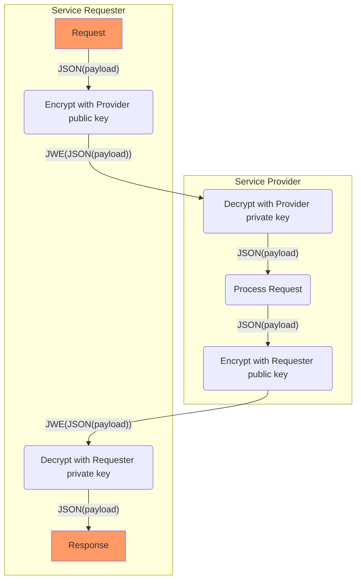
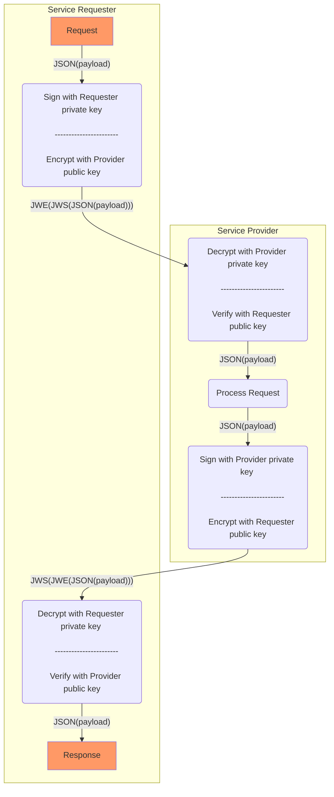

# ADR-HTTP Payload encryption

<aside class="note" title="Status">
        <p>This module is under development</p>
</aside>


## Introduction

This module specifies the use of JWE for HTTP payload encryption.

## Notational Conventions

   The key words "MUST", "MUST NOT", "REQUIRED", "SHALL", "SHALL NOT",
   "SHOULD", "SHOULD NOT", "RECOMMENDED", "NOT RECOMMENDED", "MAY", and
   "OPTIONAL" in this document are to be interpreted as described in
   "Key words for use in RFCs to Indicate Requirement Levels" [RFC2119].
   The interpretation should only be applied when the terms appear in
   all capital letters.


## JWE encryption

 For encryption [JSON Web Encryption (JWE)](https://datatracker.ietf.org/doc/html/rfc7516) is used as defined in [[RFC7516]];

### Basic JWE proces flow

The basic flow for encryption using JWE is :



<figure><figcaption>Encryption</figcaption></figure>


* 1 Service Requester encrypts payload using Service Provider public encryption key:

* 2 Service Provider decrypts the request using the corresponding Service Provider private encryption key.

* 3 Service Provider performs the request and then generates an encrypted response;

* 4 Service Requester decrypts response using Requester private key

### Parameters and requirements

The following specific requirements MUST be met:

* The request is sent to Service Provider with the content-type: application/jose+json.

* An encrypted request needs to pass application/jose+json as the value for the Content-Type and Accept headers:
```
Content-Type: application/jose+json
Accept: application/jose+json
```

* When the encrypted request uses an unsupported algorithm, the Service Provider rejects the request with a 400 HTTP response.

* Use for encryption the public key from the X.509 certificate of the other party
* Use the following parameters in the JWE protected header:
```
alg : "RSA-OAEP", 
enc : "A256GCM",
typ : "JWE"
```

* JWE compact serialization format is used

## Cryptographic Algorithms

The following algorithms are used
* Key Management : [RSA-OAEP](https://datatracker.ietf.org/doc/html/rfc7518#section-4.3)
* Content encryption : [A256GCM](https://datatracker.ietf.org/doc/html/rfc7518#section-5.3)

As defined in [[rfc7518]] 


# Encryption in combination with signing

The following diagram shows the order in which encryption & signing must be applied when encryption is used in combination with signing



<figure><figcaption>Signing & Encryption</figcaption></figure>
