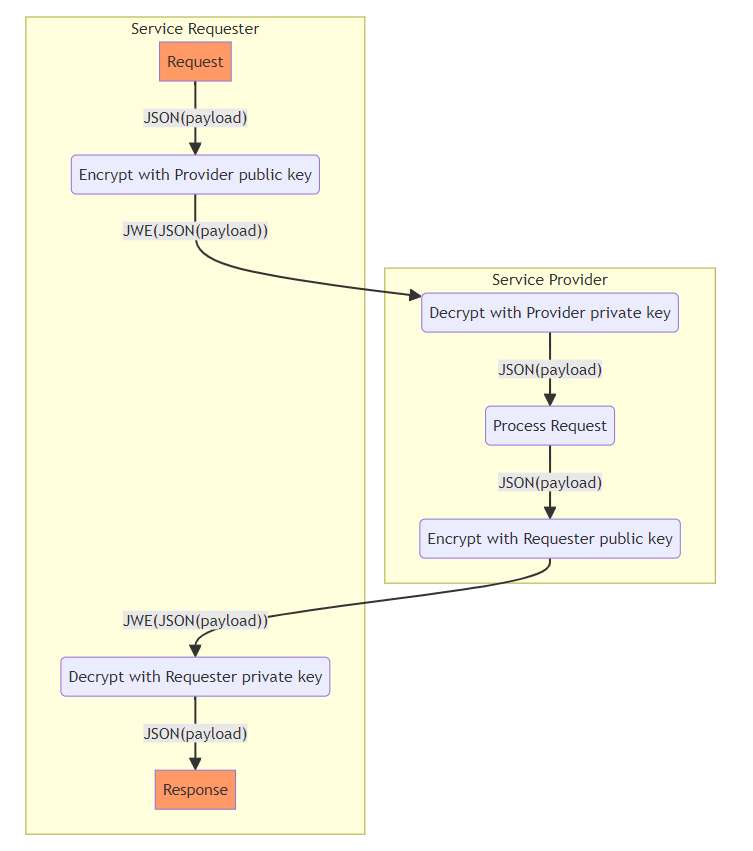
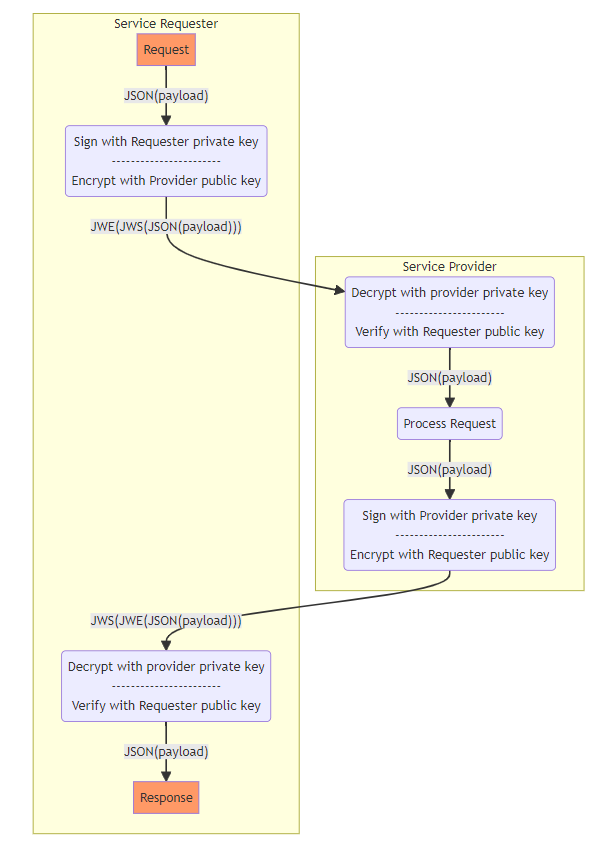

# ADR-HTTP Payload encryption

<aside class="note" title="Status">
        <p>This module is under development</p>
</aside>


## Introduction

This module specifies the use of JWE for HTTP message and payload encryption.

## JWE encryption

 For encryption [JSON Web Encryption (JWE)](https://datatracker.ietf.org/doc/html/rfc7516) is used as defined in RFC7516;

### Basic JWE proces flow

The basic flow for encryption using JWE is :




* 1 Service Requester encrypts payload using Service Provider public encryption key:

* 2 Service Provider decrypts the request using the corresponding Service Provider private encryption key.

* 3 Service Provider performs the request and then generates an encrypted response;

* 4 Service Requester decrypts response using providers public key

### Parameters and requirements

The following specific requirements must be met:

* The request is sent to Service Provider with the content-type: application/jose+json.

* An encrypted request needs to pass application/jose+json as the value for the Content-Type and Accept headers:
```
Content-Type: application/jose+json
Accept: application/jose+json
```

* When the encrypted request uses an unsupported algorithm, the Payload Encryption endpoint rejects the request with a 400 HTTP response.

* Use for encryption the public key from the X.509 certificate of the other party
* Use the following parameters in the JWE protected header:
```
alg : "RSA-OAEP", 
enc : "A256GCM",
typ : "JWE"
```

* JWE compact serialization format is used

## Cryptographic Algorithms

The following algorithms are used
* Key Management : [RSA-OAEP](https://datatracker.ietf.org/doc/html/rfc7518#section-4.3)
* Content encryption : [A256GCM](https://datatracker.ietf.org/doc/html/rfc7518#section-5.3)


# Encryption in combination with signing



