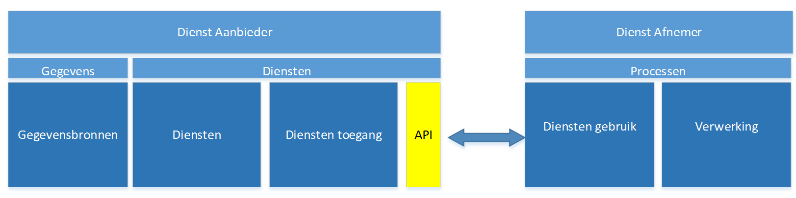

# Inleiding

Doel van dit hoofdstuk is om een hoog niveau overzicht te geven van relevante onderdelen en concepten en hun samenhang in een op (REST) API gebaseerde architectuur waarbij gebruik gemaakt wordt van (REST) API�s als interface voor de aangeboden (gegevens)diensten. Specifiek voor REST API�s is dat deze �Resource� gericht zijn en een uniforme manier bieden om resources te lezen, wijzigen, toevoegen of verwijderen.

Figuur 1: De plaats van API�s bij aanbod en gebruik van (gegevens)diensten;

Figuur 1 toont de plaats van API�s in de gegevensuitwisseling en relevante onderwerpen in deze context. Bij de Dienst afnemer speelt het gebruik van API�s,  bij de Dienst aanbieder speelt het aanbieden van API�s�.

In dit hoofdstuk wordt specifiek ingegaan op de �aanbod kant�: het onderdeel �Diensten toegang� in het schema.

# Diensten toegang & API management

Een diensten aanbieder ontsluit zijn diensten middels API�s aan een diensten afnemer; om deze API�s gecontroleerd aan te bieden is management en beheer van de API�s van de organisatie noodzakelijk.

Een organisatie heeft verschillende soorten API�s:

_Open API�s_: voor ontsluiten van diensten zonder toegangsbeperking bv open data.

_Gesloten API�s:_ voor ontsluiten van diensten met toegangsbeperking bv persoonsgegevens en vertrouwelijke gegevens of diensten voor specifieke partijen.

  
In Figuur 2 beschrijft vanuit het perspectief van een overheidsorganisatie als dienstaanbieder de onderwerpen die aandacht vragen in een op API�s gebaseerde architectuur. Hieronder worden deze onderwerpen uitgebreider toegelicht.

Figuur 2: Onderdelen van een API architectuur � Algemeen overzicht

**API-Gateway**

Dit is het runtime onderdeel dat op de organisatiegrens van de diensten aanbieder de API-aanroepen ontvangt.

_Throttling_  
Het beschermen van de dienst tegen overbelasting door de hoeveelheid aanvragen te beperken. Een aandachtspunt hierbij is de SLA afspraak die mogelijk hierbij van toepassing is en dat kritische bedrijfsprocessen de vereiste beschikbaarheid verkrijgen of behouden;

_Authenticatie_  
Het vaststellen van de identiteit van de afnemer van de API;  
(Zie ook : [https://www.noraonline.nl/wiki/Identity_%26_Access_Management](https://www.noraonline.nl/wiki/Identity_%26_Access_Management))

_Autorisatie_  
Het bepalen of de afnemer recht heeft tot gebruik van de API;

_Routering_  
Dit betreft het routeren van de API-aanroep naar de juiste achterliggende applicatie;

_Logging_  
Dit betreft het loggen van API aanroepen van diensten afnemers;

**API Management**

Dit onderdeel betreft het beheren van de API�s van de dienstenaanbieders. Op basis van de registratie van API�s kan de life-cycle van de API beheerd worden, de runtime omgeving worden ingericht en partners en developers worden voorzien van informatie over het gebruik van de API�s;

_Toegang_
De dienstaanbieder administreert wie toegang heeft tot welke API. De runtime omgeving (API-gateway) wordt geconfigureerd volgens de gewenste toegangsregels om de toegang te bewaken;

_API Meta Data_
De dienstaanbieder administreert welke API�s door de onderneming aangeboden worden. Dit betreft zowel open API�s als gesloten API�s;

_API Life Cycle_
De dienstaanbieder beheert de levenscyclus van de API�s (design, test, productie, afvoer);

_Monitoring_
De dienstaanbieder monitort beschikbaarheid en gebruik van de API�s;

**Developer Portal**

Het Developer portal ondersteunt de ontwikkelaar bij het gebruik van API�s. Bijvoorbeeld door middel van documentatie, voorbeelden, API-register (overzicht van alle beschikbare API�s), sandbox voor experimenten en ook �onboarding� / aanmelden voor toegang en developer account beheer.

**Applicaties Afnemer & Applicaties Aanbieder**

De applicaties van de afnemer maken gebruik van de diensten van de dienstenaanbieder door het aanroepen van API�s. De applicaties van de aanbieder leveren de diensten door het aanbieden van API�s.

**Identity Management**

In gevallen waar de identiteit van de dienstenaanvrager van belang is en onderdeel van de toegangs controle en gebruiksmonitoring, is de relatie met het identity management systeem van de organisatie relevant.  
(Zie ook : [https://www.noraonline.nl/wiki/Begrippen_IAM](https://www.noraonline.nl/wiki/Begrippen_IAM))

Punten voor verdere uitwerking in vervolgtrajecten:
-Certificering van (mobile) apps / afnemer applicaties
-Afspraken / standaarden �Overheid 2 Overheid� (gesloten) API�s
-Centrale voorzieningen in de GDI mbt API�s bv API-register 

