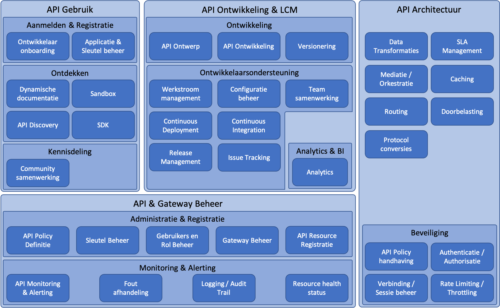

## API Capability Model
Om als organisatie API's aan te bieden aan andere partijen op een gecontroleerde en beheersbare manier moet je bepaalde functionaliteit bieden, processen inregelen en ondersteuning aanbieden.

Het onderstaande API Capability model geeft weer aan welke onderwerpen men aandacht moet schenken bij het inrichten van API gedreven dienstverlening. De onderwerpen zijn gegroepeerd in de categorieën *Registratie & gebruik*, *Realisatie & beheer* en *Verkeersstroom beheer*.

### Registratie & Gebruik
Deze categorie bevat capabilities voor het ondersteunen van ontwikkelaars die gebruik willen maken van de aangeboden API's. De capabilities binnen deze categorie zijn onderverdeeld in de volgende sub-categorieën:

- *Aanmelden & Registratie*: functionaliteiten waarmee nieuwe gebruikers zichzelf en hun applicaties kunnen registreren om gebruik te maken van aangeboden API's;
- *Ontdekken*: functionaliteiten waarmee gebruikers kennis over aangeboden API's op kunnen doen en delen.

Over het algemeen biedt een API leverancier capabilities ten behoeve van API gebruik in een ontwikkelaarsportaal.

#### Ontwikkelaar onboarding
Voordat een ontwikkelaar applicaties kan ontwikkelen die gebruik maken van aangeboden API's, moet deze ontwikkelaar zich registreren bij de API aanbieder. Hierbij is het belangrijk dat een goede balans wordt gezocht tussen het bieden van een zo eenvoudig en snel mogelijk onboarding proces (bij voorkeur self-service) en het borgen van afspraken voor het gebruik van de API's door de ontwikkelaar, bijvoorbeeld door het ondertekenen van gebruikersvoorwaarden en het valideren van de rechtmatigheid van de ontwikkelaar.

Bij ontwikkelaar onboarding moet ook worden gedacht aan het zich kunnen afmelden van ontwikkelaars, of het afsluiten van ontwikkelaars in het geval gebruikersvoorwaarden worden overschreden.

#### Applicatie registratie
Applicaties die als client gebruik willen maken van API's moeten eerst worden aangemeld bij de API aanbieder. Alleen aangemelde applicaties ontvangen credentials om de API's te bevragen.

Applicatie registratie omvat de processen rondom het registreren van applicaties en het kunnen beheren van geregistreerde applicaties, inclusief de nodige controles die hiervoor moeten worden uitgevoerd. Bij het kunnen beheren kan bijvoorbeeld worden gedacht aan het toekennen of afnemen van privileges door de API aanbieder of het kunnen inzien van informatie over de API Client. Voorbeelden van benodigde controles is het controleren dat de juiste toegang en grant types worden aangevraagd voor het doel van de applicatie en of een applicatie de benodigde tests heeft doorstaan voordat deze toegang kan krijgen tot productie data.

Ook de uitgifte van credentials voor applicaties is onderdeel van applicatie registratie.
#### API Discovery
Aangeboden API's moeten vindbaar zijn voor partijen die er gebruik van willen maken. API Discovery richt zich op deze vindbaarheid van API's.

API Discovery kan op verschillende manieren toegepast worden. Allereerst kan API Discovery worden toegepast door een API aan te bieden welke referenties biedt naar de verschillende API's of kan de lijst met aangeboden API's in developer documentatie worden opgenomen. De op de ‘Pas toe of leg uit-lijst’ van het Forum Standaardisatie opgenomen OpenAPI 3 (OAS 3) specificatie voorziet in deze beide manieren.

Ook bestaan er zoekmachines die aangeboden API's op een centrale locatie toegankelijk maken, waardoor de vindbaarheid van API's nog meer wordt vergroot. Een voorbeeld van een dergelijke zoekmachine die wordt gebruikt binnen de overheid is [developer.overheid.nl](https://developer.overheid.nl).

#### Specificatie & Documentatie
Traditioneel worden webservice endpoints beschreven middels statische documentatie welke (bijvoorbeeld als PDF document) beschikbaar wordt gesteld aan aansluitende partijen. Door de dynamische aard van API's en de mogelijkheden die door tools worden geboden, is het bij API's gebruikelijk documentatie dynamisch aan te bieden. Hierbij is het mogelijk om direct vanuit de documentatie API verzoeken op te stellen en uit te voeren.

API specificaties op basis van OpenAPI 3 bieden de mogelijkheid om dynamische documentatie te genereren. Hierbij moet wel de kanttekening worden gemaakt dat OpenAPI 3 specificaties zich primair richten op documentatie van API endpoints en de structuur daarvan. Mogelijke combinaties van inputs en outputs, use cases en overige documentatie die niet direct over de structuur van de API endpoints gaat wordt slechts beperkt ondersteund en dient buiten de OpenAPI specificatie te worden toegevoegd.

#### Proeftuin / Sandbox
Traditioneel worden webservice client implementaties op basis van documentatie en wsdl definities ontwikkeld, waarbij een volledig ontwikkelde client applicatie toegang krijgt tot een preproductie omgeving om de implementatie te toetsen.

Bij API Client ontwikkeling is het gebruikerlijk om, naast het gebruik van dynamische documentatie, een proeftuin aan te bieden in de vorm van sandbox API's. Dit zijn API's welke al vanaf de start van de app ontwikkeling (of zelfs daarvoor, vanuit de dynamische documentatie) natuurgetrouwe API verzoeken kunnen worden uitgevoerd. Hierdoor krijgen app ontwikkelaars direct feedback over hoe hun applicaties aansluiten op de geboden API's.

Bij het aanbieden van een proeftuin is het goed om na te gaan hoe natuurgetrouw deze moet zijn. Uitersten zijn enerzijds een stub met daarin een aantal basis Use Cases uitgewerkt en anderzijds een proefomgeving met een kleine subset aan productie-like geanonimiseerde data welke al dan niet per client gescheiden is en regelmatig wordt ververst indien data vanuit de sandbox aanpasbaar is.

#### Code voorbeelden & SDK
Naast het aanbieden van dynamische documentatie en een proeftuin, kunnen ontwikkelaars erg geholpen zijn wanneer de API aanbieder code voorbeelden, referentie implementaties of SDK's aanbiedt in verschillende programmeertalen. Het gebruik van de OpenAPI 3 specificatie voor API documentatie heeft als voordeel dat er al veel tooling bestaat om SDK's te genereren op basis van de API specificatie.

#### Kennisdeling & Ondersteuning
Naast het kunnen inzien van documentatie en het gebruik maken van sandbox API's, is het belangrijk dat ontwikkelaars van API Clients terecht kunnen met vragen of opmerkingen. Hierbij kan in het meest rudimentaire geval bijvoorbeeld worden gedacht aan een feedback formulier en een veelgestelde vragen pagina, maar ook aan een forum waarbij gebruikers elkaar kunnen helpen en de aanwezigheid van de API aanbieder op publieke fora (bijvoorbeeld Stack Overflow of Super User), social media (bijvoorbeeld Twitter) of invite-only discussie platformen (bijvoorbeeld Discord of Slack).

### Realisatie & Beheer
Realisatie & Beheer gaat over het (door)ontwikkelen van API's, het beheren van de API lifecycle van ideatie tot uitfasering en het beheren van het API ecosysteem. De capabilities binnen deze categorie zijn onderverdeeld in de volgende sub-categorieën:

- *Realisatie*: capabilities met betrekking tot het aanbieden van nieuwe API endpoints en de doorontwikkeling van bestaande;
- *API Governance*: standaarden, afspraken en richtlijnen rondom het aanbieden van API's en de processen om hieraan te voldoen;
- *API Lifecycle beheer*: capabilities met betrekking tot de sturing op een uniform API portfolio en lifecycle management van de API's;
- *Platform beheer*: functionaliteiten met betrekking tot het kunnen beheren van het platform of ecosysteem waarin de API's opereren.

#### Ontwerp
Waar traditioneel webservices technisch werden ingestoken en veelal werden gebaseerd op de technische inrichting van het achterliggende IT landschap, is het bieden van een uitmuntende developer experience (DX) één van de belangrijkste doelen bij het aanbieden van API's.

Goed API ontwerp ligt daarbij aan de grondslag. Net als User Experience (UX) ontwerp zich richt op het bieden van de ultieme gebruikerservaring bij websites, worden API's ontworpen met de gebruikers (ontwikkelaars) centraal, in plaats van gebaseerd op de inrichting van back-ends. De API's fungeren daarbij als façade en maskeren de complexiteit van het achterlandschap voor gebruikers van de API's, zonder in te hoeven boeten op functionaliteit.

Aangezien het ontwerp van API's net als bij web-ontwerp een creatief proces is en er veel mogelijkheden zijn om dezelfde uitdagingen het hoofd te bieden, is er een lijst met API Design Rules opgenomen op de ‘Pas toe of leg uit-lijst’ van het Forum Standaardisatie opgenomen, welke API ontwerpers helpt goede ontwerpbeslissingen te maken op basis van best-practices in API ontwerp.

#### Ontwikkeling
API ontwikkeling betreft het ontwikkelen van API endpoints op basis van API ontwerpen. Bij het inrichten van API ontwikkeling moeten een aantal keuzen worden gemaakt, waaronder waar API ontwikkeling plaatsvindt.

Een optie kan zijn dat API ontwikkeling in de API Gateway plaatsvindt; de meeste API Gateway producten bieden connectors om verschillende back-end systemen te ontsluiten, policies om protocollen te vertalen (bv SOAP <-> REST) en de mogelijkheid om API endpoints op basis van OAS 3 specificaties te genereren. Een nadeel van API ontwikkeling in de API Gateway is dat het vaak specifieke productkennis vergt en daardoor de afhankelijkheid van experts van de gekozen API Gateway vergroot.

Alternatieven zijn API ontwikkeling in microservices, waarbij microservices API's aanbieden waarvan een deel via de API Gateway as-is wordt ontsloten, of het gebruik van een middleware oplossing. Hierbij moet er rekening mee worden gehouden dat het gebruik van middleware dezelfde nadelen heeft met betrekking tot specifieke productkennis als het ontwikkelen van API's in de API Gateway, maar kan het zijn dat deze kennis reeds in de teams aanwezig is.

Wanneer bij het API Ontwerp gebruik gemaakt wordt van de OAS 3 standaard, bieden zowel API Gateway oplossingen en programmeertalen vaak goede ondersteuning voor het automatisch genereren van code op basis van de API specificatie, wat de snelheid van ontwikkeling vergroot en de foutgevoeligheid verkleint. Hierbij moet worden opgemerkt dat enkele OAS3 constructies (nog) niet kunnen worden gebruikt, omdat deze fouten geven bij code generatie.

#### Test
Dit betreft het testen van API endpoints tegen de specificatie. Waar mogelijk gebeurt dit geautomatiseerd. Op het gebied van *syntactische* tests biedt veel test tooling ondersteuning voor het importeren van OpenAPI 3 specificaties; voor het uitvoeren van *semantische* tests is het vaak noodzakelijk dat testdata wordt geprepareerd en use cases worden uitgewerkt in test cases.
#### Policy Definitie
Dit betreft het definieren van generieke API policies, welke worden toegepast op alle API's of door een aantal API's kunnen worden uitgevoerd. Voorbeelden van API policies zijn:
- Validatie van API verzoeken tegen een API specificatie;
- het vertalen van JSON berichten naar een ander berichtformaat op basis van content negotiation;
- het vertalen van (delen van) berichten;
- het filteren van headers in response berichten;
- het 'throttlen' van inkomende API verzoeken om back-ends te ontlasten;
- het afdwingen van gautoriseerde API verzoeken;
- etc.

#### Afspraken, Standaarden en Richtlijnen
Een set van afspraken, standaarden en richtlijnen om ervoor te zorgen dat een uniforme set van API's wordt aangeboden, dat aansluit bij de API strategie van de API aanbiedende organisatie (en breder, in het geval van organisatie-overstijgende API's). Hieronder vallen ook processen om ervoor te zorgen dat aan deze afspraken, standaarden en richtlijnen wordt voldaan en om organisaties de mogelijkheid te bieden gecreëerde afspraken en richtlijnen te verheffen naar landelijk niveau.

#### Governance policy handhaving
Dit betreffen policies die waarborgen dat de juiste stakeholders bij business transacties betrokken worden. Voorbeelden van business transacties zijn:

Het wijzigen van een policy voor een bestaande API-versie;
Het updaten van documentatie van een API;
Het veranderen van de status in de levenscyclus van een API-versie;
Het abonneren op een API.

#### API Lifecycle beheer
Dit omvat functionaliteiten rondom het beschikbaar maken van nieuwe API endpoints, bijvoorbeeld door ze in een API Gateway te registreren, het maken van non-breaking changes en het uiteindelijk uitfaseren van API endpoints omdat deze niet meer nodig zijn of door een nieuwere API versie worden vervangen.

Het is belangrijk gebruikers van API's duidelijk inzicht te geven in de processen en tijdslijnen rondom lifecycle management, zodat zij zich goed op eventuele wijzigingen voor kunnen bereiden. Voorbeelden van transparante communicatie hierover zijn het al bij beschikbaarstelling van API endpoints definieren en communiceren van deprecation en sunset datums. Deze kunnen bijvoorbeeld in de API documentatie en/of API headers worden gecommuniceerd. In de periode tussen deprecation van een API worden veelal alleen essentiele updates doorgevoerd en worden nieuwe functionaliteiten alleen toegevoegd op nieuwe API versies.
#### Versionering
Versionering van API's zorgt ervoor dat het voor afnemers van API's duidelijk is op welke API wordt aangesloten en welke eigenschappen daarbij horen. Voor aanbieders van API's zorgt het ervoor dat ze wendbaar kunnen zijn door nieuwe API versies te introduceren, zonder dat dit direct impact heeft op API clients.

Bij het toepassen van API versionering hoort ook het duidelijk inzichtelijk maken van hoe lang een specifieke API versie ondersteund wordt, wanneer een nieuwe versie wordt geintroduceerd en hoe de overgangsfase eruit ziet.

De tendens bij API's op het gebied van versionering is om zeer terughoudend te zijn met het introduceren van nieuwe major versies door, welke nodig zijn bij het maken van braking changes. Om toch wendbaar te kunnen zijn, wordt veelal semantic versioning (semver) toegepast en worden API's aangepast middels niet-breaking minor changes en patches, totdat er een noodzaak is om breaking changes, en daarmee een major versie upgrade, uit te voeren.

#### Toegangsbeheer
Het registreren en beheren van API endpoints gebeurt zo veel mogelijk op basis van self-service door teams die API's ontwikkelen. Daarnaast worden centrale policies en API Gateway configuratie vaak centraal uitgevoerd.

Hiervoor is het belangrijk dat het API & Gateway beheer op basis van gebruikers en een autorisatie matrix verloopt.

#### Gateway beheer
Hieronder vallen alle werkzaamheden met betrekking tot het beheren van de API Gateway zelf. Hierbij kan worden gedacht aan de technische inrichting van het platform, het uitvoeren van upgrades, het beheren van gebruikers, rollen en autorisaties en het oplossen van problemen die volgen uit monitoring en alerting.

#### Sleutelbeheer
Voor een veilige uitwisseling van gegevens tussen API Gateway en client (en eventuele externe Authorisatie Servers) spelen ondertekening en versleuteling van berichten een belangrijke rol. Hiervoor is het belangrijk dat de API aanbieder het sleutelmateriaal dat hiervoor wordt gebruikt op een veilige manier kan opslaan en waar nodig kan distribueren naar aansluitende API clients.

### Verkeersstroom beheer
Verkeersstroom beheer gaat over de functionaliteiten die te maken hebben met verwerken van daadwerkelijk verkeer tussen de API client en aanbieder en het verwerken daarvan binnen het API landschap.

De capabilities binnen deze categorie zijn onderverdeeld in de volgende sub-categorieën:

- *Mediatie & Orkestratie*: het verwerken, valideren, routeren en  bewerken van API verzoeken en antwoorden om een gebruiksvriendelijke en uniforme beleving aan API clients te kunnen bieden;
- *Telemetrie & Inzicht*: het meten en inzichtelijk maken van API verzoeken en antwoorden om inzicht te krijgen in het gebruik van API's en de gezondheid van het platform;
- *Servicelevel Beheer*: het definieren en afdwingen van afspraken rondom beschikbaarheid en de toegestane hoeveelheid API verzoeken dat een API client mag doen, eventueel gebaseerd op staffels voor doorbelasting;
- *Beveiliging*: functionaliteiten rondom de beveiliging van API endpoints en de data en processen die hiermee ontsloten worden.

#### Mediatie & Orkestratie
In het geval back-end systemen niet de mogelijkheden hebben te communiceren volgens de gespecificeerde API contracten of als een API betrekking heeft op meerdere back-end systemen, kan het noodzakelijk zijn data transformaties toe te passen om toch de gebruiksvriendelijke API's aan afnemers te kunnen bieden. In dit geval wordt API Mediatie, ook wel data transformatie of orkestratie, toegepast met als doel de API's die aan API Clients geboden worden zo gebruiksvriendelijk mogelijk te laten zijn, zonder afhankelijk te zijn van implementatiedetails en technologische beperkingen van back-end systemen. API Mediatie kan plaatsvinden in microservices, een integratielaag in de back-end of in de API Gateway.

#### Routering
In het geval de back-end functionaliteit wordt ingevuld door meerdere back-end systemen of microservices, dienen inkomende API verzoeken te worden gerouteerd naar de juiste systemen. In het eenvoudigste geval kan dit betekenen dat verzoeken voor verschillende API endpoints naar verschillende back-end systemen worden gerouteerd, maar in ingewikkeldere situaties kan het ook noodzakelijk zijn te routeren op basis van informatie uit het verzoek, zoals bijvoorbeeld afzender of inhoud.

#### Data Transformaties
Dit betreft functionaliteiten rondom het vertalen van API endpoints naar het achterliggende datamodel. Dit kan plaatsvinden in de API Gateway, integratietoepassingen in de back-end of in back-end (micro)services, waarabij de laatste optie over het algemeen de voorkeur heeft.

#### Foutafhandeling
In het geval dat er fouten optreden in de API's, bijvoorbeeld door niet-functionerende back-end systemen, moeten API Clients worden voorzien van duidelijke foutmeldingen en moeten etrokkenen bij de API aanbieder voorzien worden van voldoende informatie om de oorzaak van de fouten op te kunnen lossen en te verhelpen, indien nodig.

#### Caching
Een belangrijk onderdeel van developer experience bij API's is de performance ervan. Caching zorgt ervoor dat niet voor elke aanroep het achterlandschap geraadpleegd hoeft te worden. RESTful API's lenen zich zeer goed voor het toepassen van caching door toepassing van het Proxy architectuur patroon, echter dient zorg te worden gedragen dat gewijzigde broninformatie leidt tot invalidatie van de informatie in de cache, zodat API Clients geen achterhaalde informatie ophalen.

#### Protocol conversie
Om operabiliteit te vergroten zodat meer API Clients aan kunnen sluiten, kan het nuttig zijn API's aan te bieden in andere protocollen en architectuurstijlen dan REST / JSON. Zonder specifieke code in back-end systemen kan bijvoorbeeld de API Gateway API's op basis van REST en JSON omvormen naar API's op basis van SOAP en XML. Hierdoor kunnen API Clients die geen JSON ondersteunen worden bediend, zonder dat dit leidt tot extra ontwikkel effort aan de back-end / microservices kant (het is overigens meestal wel benodigd de API Gateway van instructies te voorzien voor de conversie, bijvoorbeeld middels XSLT specificaties).

Ook kan protocol conversie nodig zijn om back-end systemen die gebruik maken van verouderde protocollen toch via API's aan te bieden.

#### Logging & Audit trail
Geeft inicht in de verkeersstromen tussen API Clients, API Gateway en het achterliggende applicatie landschap en zorgt ervoor dat alle handelingen herleidbaar zijn door inzicht te geven in historische verkeersstromen, ten behoeve van audit doeleinden (i.h.k.v. privacy, beveiliging en transparantie). 

Onder andere de volgende informatie kan inzichtelijk worden gemaakt:
- Wie heeft data geraadpleegd?
- Welke data is geraadpleegd?
- Waarom de data is geraadpleegd? Doelbinding wordt vastgelegd.
- Wanneer de data is geraadpleegd
- Hoe de data is geraadpleegd?

#### Monitoring & Alerting
API Monitoring & Alerting geeft inzicht in de technische staat van de API's en informeert (via RCS, SMS en/of e-mail) betrokken groepen of personen indien bepaalde gebeurtenissen optreden. Voorbeelden van gebeurtenissen zijn onbeschikbaarheid van bepaalde gegevensverbindingen of certificaten die op korte termijn zullen verlopen.

#### Analytics & Dashboarding
Naast onder andere productvisie en input van afnemers is API Analytics een belangrijke aandrijver bij het bepalen van de richting van API doorontwikkeling. Op basis van actueel API gebruik kan het resultaat van Key Performance Indicators (KPI's) worden vastgesteld. Dit kan leiden tot inzicht in welke API functionaliteiten succesvol zijn en welke minder succesvol, en zodoende kan leiden tot aanscherping of aanpassing van de productvisie.

#### Rate limiting / throttling
Rate limiting (throttling) biedt bescherming tegen een bovenmatig aantal verzoeken die worden afgevuurd op de omgeving van de API aanbieder, waardoor er storingen op de backend systemen kunnen optreden. Dit kan bij reguliere bedrijfsuren het 'spitsuur' zijn waardoor deze beveiliging moet worden ingeschakeld. Rate limiting is ook een manier om een SLA af te dwingen op basis van een contract.

Rate limiting kan worden ingesteld op verschillende tijdseenheden, bijvoorbeeld het aantal toegestane verzoeken per uur of per maand, en er kunnen verschillende profielen of plannen worden aangemaakt waarin deze quota worden geconfigureerd. Of het toekennen van voorrang op de afhandeling van bepaalde verzoeken (requests) is mogelijk, bijvoorbeeld door bulk-processen voor een korte periode voorrang te verlenen boven andere verzoeken. Hierdoor is gecontroleerd traffic management mogelijk, waardoor eventuele verstoringen op een later moment door piekbelasting juist kunnen worden voorkomen. Een profiel of plan is te koppelen aan een specifieke API.

#### Doorbelasting
In sommige gevallen kan er voor gekozen worden om API gebruik door te belasten. Dit is voor overheden interessant om zo eventuele kosten door te belasten op de afzonderlijke organisaties, maar ook richting ketenpartners.

Er bestaan verschillende doorbelastingsmodellen, welke vallen onder de volgende hoofdcategorieën:

- *Vrij:* de API is vrij te gebruiken zonder kosten.
- *Betaald:* gebruikers van de API moeten betalen voor het gebruik ervan. Onder deze categorie vallen verschillende subcategorieën, zoals Freemium, Tiered, Pay-as-you-go en doorbelasting op basis van een vaste prijs per tijdseenheid.
- *Indirect:* gebruikers van de API betalen niet direct voor het gebruik ervan, maar dragen indirect bij aan het business model van de API aanbieder, waardoor API gebruik geld oplevert voor de API aanbieder.
- *Affiliate:* vergelijkbaar met indirect, behalve dat de API aanbieder gebruikers van API's betaalt om het gebruik van de API's zoveel mogelijk te stimuleren.

#### Identificatie & Authenticatie
Hieronder vallen de identificatie en authenticatie van API Clients, eindgebruikers en organisaties. Identificatie en authenticatie van eindgebruikers is overigens niet altijd nodig, bijvoorbeeld bij back-office en batchprocessen die niet in de context van een eindgebruiker werken.

#### Autorisatie
Dit betreft de autorisatie van API toegang op basis van de geauthentiseerde API Client end eindgebruiker.

Bij autorisaties op basis van API's wordt vaak onderscheid gemaakt tussen grofmazige, role based, en fijnazig, domein-specifieke autorisatie. Hierbij worden grofmazige, role based, autorisaties vaak centraal ingeregeld, bijvoorbeeld middels de API Gateway. Dit geeft mede invulling aan de eisen die worden gesteld vanuit wet- en regelgeving, namelijk dat autorisatie is ingericht conform doelbinding.

Fijnmazige, domein specifieke, autorisatie wordt idealiter afgehandeld door de domein applicatie. Echter ondersteunen verschillende gebruikers niet de correcte manier van API's aanroepen en doelbindingsregisters ontbreken veelal nog (en soms bieden de bronhouders nog niet de benodigde API's). Ook is IAM in veel overheidsorganisaties niet in die mate op orde dat hierin volledig sturing aan gegeven kan worden. Fijnmazige autorisatie kan hierdoor eventueel nog niet door de backend worden afgehandeld. Een alternatief hiervoor is dat er per doelbinding een andere API wordt aangeboden vanuit de API Gateway of dat de integratielaag functionaliteit biedt om aan de fijnmazige autorisatie invulling te geven.

#### Policy handhaving
API Policy handhaving gaat over het toepassen van de ontwikkelde API policies op API endpoints. Hierbij kan onderscheid worden gemaakt tussen policies die altijd van toepassing zijn en policies die afhankelijk van de aangeroepen API of de afgesproken service levels worden toegepast. Voorbeelden van policies zijn syntactische en semantische validaties van inkomende en uitgaande API aanroepen, maar ook autorisatie en throttling worden veelal geïmplementeerd als verkeersstroom policies.

#### Anomalie detectie
Het detecteren van verdacht gebruik van API endpoints, bijvoorbeeld ten behoeve van het opsporen van fraude of malware.