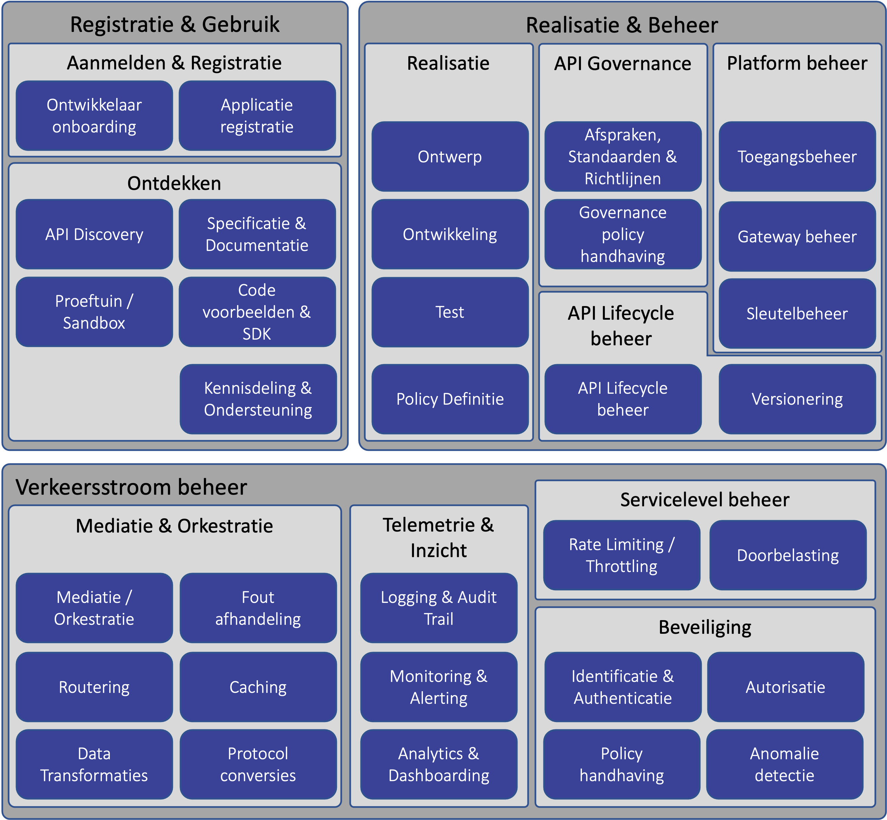

## API Capability Model
Om als organisatie API's aan te bieden aan andere partijen op een gecontroleerde beheersbare manier moet je bepaalde functionaliteit bieden, processen inregelen en ondersteuning aanbieden. Het onderstaande API Capability model geeft weer aan welke onderwerpen men aandacht moet schenken bij het inrichten van dienstverlening via API's

### API Gebruik
API gebruik gaat over het ondersteunen van ontwikkelaars in het gebruiken van de aangeboden API's, zodat zij eenvoudig aan de slag kunnen met het ontwikkelen van API Clients en kennis kunnen opdoen en uitwisselen bij het gebruik van de API's.

Over het algemeen biedt een API leverancier capabilities ten behoeve van API gebruik in een ontwikkelaarsportaal.

#### Ontwikkelaar onboarding
Voordat een ontwikkelaar applicaties kan ontwikkelen die gebruik maken van aangeboden API's, moet deze ontwikkelaar zich registreren bij de API aanbieder. Hierbij is het belangrijk dat een goede balans wordt gezocht tussen het bieden van een zo eenvoudig en snel mogelijk onboarding proces (bij voorkeur self-service) en het borgen van afspraken voor het gebruik van de API's door de ontwikkelaar, bijvoorbeeld door het ondertekenen van gebruikersvoorwaarden en het valideren van de rechtmatigheid van de ontwikkelaar.

Bij ontwikkelaar onboarding moet ook worden gedacht aan het zich kunnen afmelden van ontwikkelaars, of het afsluiten van ontwikkelaars in het geval gebruikersvoorwaarden worden overschreden.

#### Applicatie & Sleutel beheer
Clients/applicaties die gebruik maken van API's moeten over het algemeen worden geregistreerd bij de aanbieder van deze API's.

Applicatie & sleutel beheer houdt zich bezig met het kunnen beheren van geregistreerde API Clients en daarbij behorende credentials en sleutels. 

Hierbij kan worden gedacht aan het toekennen of afnemen van privileges door de API aanbieder en het kunnen inzien van informatie over de API Client, zoals bijvoorbeeld credentials of certificaten waarmee de API Client zich bij de API aanbieder kan authenticeren, door ontwikkelaars van de API Client.
#### API Discovery
Aangeboden API's moeten vindbaar zijn voor partijen die er gebruik van willen maken. API Discovery richt zich op deze vindbaarheid van API's.

API Discovery kan op verschillende manieren toegepast worden. Allereerst kan API Discovery worden toegepast door een API aan te bieden welke referenties biedt naar de verschillende API's of kan de lijst met aangeboden API's in developer documentatie worden opgenomen. De op de ‘Pas toe of leg uit-lijst’ van het Forum Standaardisatie opgenomen OpenAPI 3 (OAS 3) specificatie voorziet in deze beide manieren.

Ook bestaan er zoekmachines die aangeboden API's op een centrale locatie toegankelijk maken, waardoor de vindbaarheid van API's nog meer wordt vergroot. Een voorbeeld van een dergelijke zoekmachine die wordt gebruikt binnen de overheid is [developer.overheid.nl](https://developer.overheid.nl).

#### Dynamische documentatie
Traditioneel worden webservice endpoints beschreven middels statische documentatie welke (bijvoorbeeld als PDF document) beschikbaar wordt gesteld aan aansluitende partijen. Door de dynamische aard van API's en de mogelijkheden die door tools worden geboden, is het bij API's gebruikelijk documentatie dynamisch aan te bieden. Hierbij is het mogelijk om direct vanuit de documentatie API verzoeken op te stellen en uit te voeren.

API specificaties op basis van OpenAPI 3 bieden de mogelijkheid om dynamische documentatie te genereren.

#### Sandbox
Traditioneel worden webservice client implementaties op basis van documentatie en wsdl definities ontwikkeld, waarbij een volledig ontwikkelde client applicatie toegang krijgt tot een preproductie omgeving om de implementatie te toetsen.

Bij API Client ontwikkeling is het gebruikerlijk om, naast het gebruik van dynamische documentatie, gebruik te maken van sandbox API's. Dit zijn API's welke al vanaf de start van de app ontwikkeling (of zelfs daarvoor, vanuit de dynamische documentatie) natuurgetrouwe API verzoeken kunnen worden uitgevoerd. Hierdoor krijgen app ontwikkelaars direct feedback over hoe hun applicaties aansluiten op de geboden API's.

Bij het aanbieden van sandbox API's, is het goed om na te gaan hoe natuurgetrouw deze sandbox moet zijn. Uitersten zijn enerzijds een stub met daarin een aantal basis Use Cases uitgewerkt en anderzijds een proefomgeving met een kleine subset aan productie-like geanonimiseerde data welke al dan niet per client gescheiden is en regelmatig wordt ververst indien data vanuit de sandbox aanpasbaar is.

#### SDK
Naast het aanbieden van dynamische documentatie en sandbox API's, kunnen ontwikkelaars erg geholpen zijn wanneer de API aanbieder referentie implementaties of SDK's aanbiedt in verschillende programmeertalen. Het gebruik van de OpenAPI 3 specificatie voor API documentatie heeft als voordeel dat er al veel tooling bestaat om SDK's te genereren op basis van de API specificatie.

#### Community Samenwerking
Naast het kunnen inzien van documentatie en het gebruik maken van sandbox API's, is het belangrijk dat ontwikkelaars van API Clients terecht kunnen met vragen of opmerkingen. Hierbij kan in het meest rudimentaire geval bijvoorbeeld worden gedacht aan een feedback formulier en een veelgestelde vragen pagina, maar ook aan een forum waarbij gebruikers elkaar kunnen helpen en de aanwezigheid van de API aanbieder op publieke fora (bijvoorbeeld Stack Overflow of Super User), social media (bijvoorbeeld Twitter) of invite-only discussie platformen (bijvoorbeeld Discord of Slack).

### API Ontwikkeling & Lifecycle Management
API Ontwikkeling & Lifecycle Management gaat over het (door)ontwikkelen van API's en het beheren van de API lifecycle van ideatie tot uitfasering.

#### API Ontwerp
Waar traditioneel webservices technisch werden ingestoken en veelal werden gebaseerd op de technische inrichting van het achterliggende IT landschap, is het bieden van een uitmuntende developer experience (DX) één van de belangrijkste doelen bij het aanbieden van API's.

Goed API ontwerp ligt daarbij aan de grondslag. Net als User Experience (UX) ontwerp zich richt op het bieden van de ultieme gebruikerservaring bij websites, worden API's ontworpen met de gebruikers (ontwikkelaars) centraal, in plaats van gebaseerd op de inrichting van back-ends. De API's fungeren daarbij als façade en maskeren de complexiteit van het achterlandschap voor gebruikers van de API's, zonder in te hoeven boeten op functionaliteit.

Aangezien het ontwerp van API's net als bij web-ontwerp een creatief proces is en er veel mogelijkheden zijn om dezelfde uitdagingen het hoofd te bieden, is er een lijst met API Design Rules opgenomen op de ‘Pas toe of leg uit-lijst’ van het Forum Standaardisatie opgenomen, welke API ontwerpers helpt goede ontwerpbeslissingen te maken op basis van best-practices in API ontwerp.

#### API Ontwikkeling
API ontwikkeling betreft het ontwikkelen van API endpoints op basis van API ontwerpen. Bij het inrichten van API ontwikkeling moeten een aantal keuzen worden gemaakt, waaronder waar API ontwikkeling plaatsvindt.

Een optie kan zijn dat API ontwikkeling in de API Gateway plaatsvindt; de meeste API Gateway producten bieden connectors om verschillende back-end systemen te ontsluiten, policies om protocollen te vertalen (bv SOAP <-> REST) en de mogelijkheid om API endpoints op basis van OAS 3 specificaties te genereren. Een nadeel van API ontwikkeling in de API Gateway is dat het vaak specifieke productkennis vergt en daardoor de afhankelijkheid van experts van de gekozen API Gateway vergroot.

Alternatieven zijn API ontwikkeling in microservices, waarbij microservices API's aanbieden waarvan een deel via de API Gateway as-is wordt ontsloten, of het gebruik van een middleware oplossing. Hierbij moet rekening worden gehouden dat het gebruik van middleware dezelfde nadelen heeft met betrekking tot specifieke productkennis als het ontwikkelen van API's in de API Gateway, maar kan het zijn dat deze kennis reeds in de teams aanwezig is.

Wanneer bij het API Ontwerp gebruik gemaakt wordt van de OAS 3 standaard, bieden zowel API Gateway oplossingen en programmeertalen vaak goede ondersteuning voor het automatisch genereren van code op basis van de API specificatie, wat de snelheid van ontwikkeling vergroot en de foutgevoeligheid verkleint.

#### API Analytics
Naast onder andere productvisie en input van afnemers is API Analytics een belangrijke aandrijver bij het bepalen van de richting van API doorontwikkeling. Op basis van actueel API gebruik kan het resultaat van Key Performance Indicators (KPI's) worden vastgesteld. Dit kan leiden tot inzicht in welke API functionaliteiten succesvol zijn en welke minder succesvol, en zodoende kan leiden tot aanscherping of aanpassing van de productvisie.

#### Werkstroom Management

#### API Versionering
Versionering van API's zorgt ervoor dat het voor afnemers van API's duidelijk is op welke API wordt aangesloten en welke eigenschappen daarbij horen. Voor aanbieders van API's zorgt het ervoor dat ze wendbaar kunnen zijn door nieuwe API versies te introduceren, zonder dat dit direct impact heeft op API clients.

Bij het toepassen van API versionering hoort ook het duidelijk inzichtelijk maken van hoe lang een specifieke API versie ondersteund wordt, wanneer een nieuwe versie wordt geintroduceerd en hoe de overgangsfase eruit ziet.

Vaak bestaat dit inzichtelijk maken van tijdslijnen uit het vooraf definieren van een deprecation en sunset datum voor de API en het communiceren van deze datums in API documentatie en/of API headers. In de periode tussen deprecation van een API worden veelal alleen essentiele updates doorgevoerd en worden nieuwe functionaliteiten alleen toegevoegd op nieuwe API versies.

De tendens bij API's op het gebied van versionering is om zeer terughoudend te zijn met het introduceren van nieuwe major versies door, welke nodig zijn bij het maken van braking changes. Om toch wendbaar te kunnen zijn, wordt veelal semantic versioning (semver) toegepast en worden API's aangepast middels niet-breaking minor changes en patches, totdat er een noodzaak is om breaking changes, en daarmee een major versie upgrade, uit te voeren.

### API & Gateway beheer
API & Gateway beheer gaat over het beheren van functionaliteiten die generiek voor meerdere (of alle) API's gelden en het beheren van de API Gateway. Dit zijn zaken die niet horen bij de ontwikkeling van specifieke API's, maar wel invloed hebben op de werking daarvan.

#### API Policy definitie
Dit betreft het definieren van generieke API policies, welke worden toegepast op alle API's of door een aantal API's kunnen worden uitgevoerd. Voorbeelden van API policies zijn:
- Validatie van API verzoeken tegen een API specificatie;
- het vertalen van JSON berichten naar een ander berichtformaat op basis van content negotiation;
- het filteren van headers in response berichten;
- het 'throttlen' van inkomende API verzoeken om back-ends te ontlasten;
- het afdwingen van gautoriseerde API verzoeken;
- etc.

#### Sleutel beheer
Voor een veilige uitwisseling van gegevens tussen API Gateway en client (en eventuele externe Authorisatie Servers) spelen ondertekening en versleuteling van berichten een belangrijke rol. Hiervoor is het belangrijk dat de API aanbieder het sleutelmateriaal dat hiervoor wordt gebruikt op een veilige manier kan opslaan en waar nodig kan distribueren naar aansluitende API clients.

#### Gebruiker & Rol beheer
Het registreren en beheren van API endpoints gebeurt zo veel mogelijk op basis van self-service door teams die API's ontwikkelen. Daarnaast worden centrale policies en API Gateway configuratie vaak centraal uitgevoerd.

Hiervoor is het belangrijk dat het API & Gateway beheer op basis van gebruikers en een autorisatie matrix verloopt.

#### Gateway beheer
Hieronder vallen alle werkzaamheden met betrekking tot het beheren van de API Gateway zelf. Hierbij kan worden gedacht aan de technische inrichting van het platform, het uitvoeren van upgrades, het beheren van gebruikers, rollen en autorisaties en het oplossen van problemen die volgen uit monitoring en alerting.

#### API Resource Registratie
Wanneer API's aan de buitenwereld worden opengesteld, moeten deze in de API Gateway worden geregistreerd. Hierbij worden zij voorzien van een URL welke kan worden gebruikt om de API aan te roepen en wordt de API opgenomen in het API portfolio, welke de basis vormt van de API documentatie in de Developer Portal.

#### API Monitoring & Alerting

#### Fout afhandeling

#### Logging & Audit trail

#### Resource health status
Zorgt ervoor dat eenvoudig kan worden vastgesteld of een API op het huidige moment beschikbaar is. Dit kan bijvoorbeeld door middel van een dashboard of door middel van een API.

### API Architectuur
API Architectuur gaat over keuzen die te maken hebben met het inrichten van het complete API landschap. 

#### Data Transformaties

#### SLA Management
Bij elke API moeten Service Level Agreements (SLA) worden opgesteld, zodat afnemers weten waar zij aan toe zijn bij het gebruiken van API's. 

#### Mediatie / Orkestratie

#### Caching

- API Beveiliging

- Analytics

- ProtocolConversies

- Logging / Audit

- Trail

- Policyenforcement

- Back-endAdapters

- Authenticatie /Authorisatie

- Verbinding /Sessie beheer

- Rate Limiting /Throttling

- SLA Management

- Routing

### API Management

- API PolicyDefinitie

- GatewayBeheer

- SleutelManagement

- API Monitoring& Alerting

- Beheer API

- Foutafhandeling

- Gebruikers en Rol Beheer

>Opmerking: Zie ook huidige vulling op : https://geonovum.github.io/KP-APIs/API-strategie-algemeen/#diensten-toegang-api-management 
(De capabilities kunnen mogelijk gebruikt worden om dit model uit te breiden)

