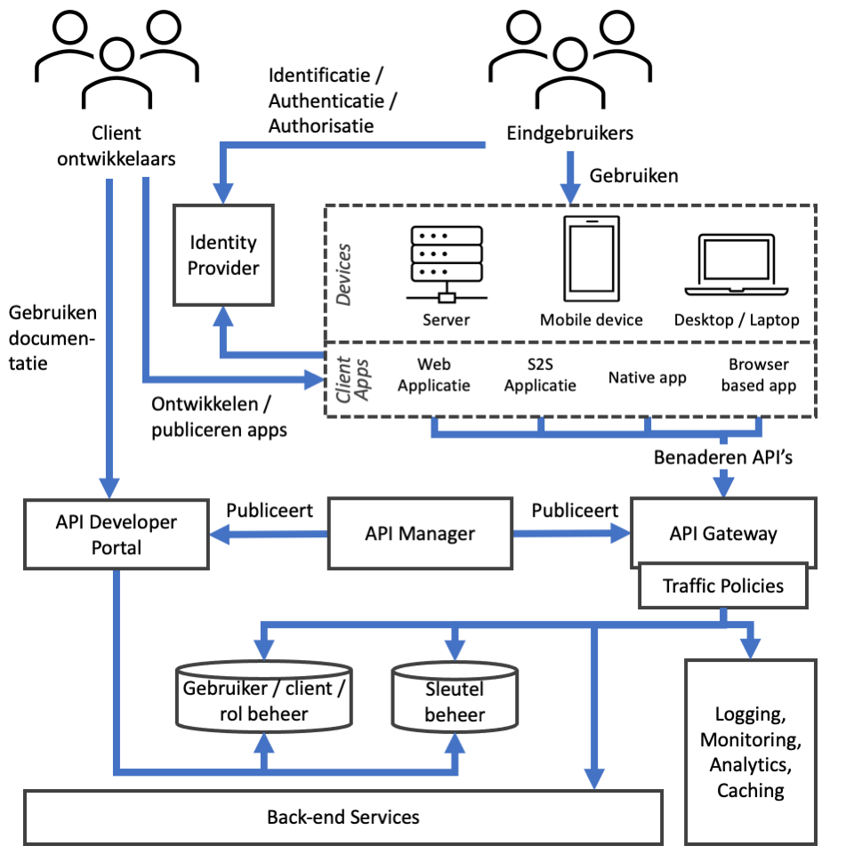

## API Security Architectuur

ICT beveiliging is over het algemeen gebaseerd op de aspecten *beschikbaarheid*, *integriteit* en *vertrouwelijkheid*. Dit hoofdstuk gaat allereerst in op deze drie aspecten en hun relaties met API beveiliging, waarna een aantal aan API beveiliging gerelateerde architectuurprincipes en architectuurpatronen zullen worden beschreven.

### Beschikbaarheid
Beschikbaarheid gaat erover om te allen tijde bij informatie en informatiebronnen te kunnen en dat de beschikbaarheid van diensten voldoen aan gemaakte continuïteitsafspraken. Beschikbaarheid van gegevens en systeemfuncties wordt over het algemeen gegarandeerd door vermeerdering van systeemfuncties, door herstelbaarheid en beheersing van verwerkingen, door voorspelling van discontinuïteit en handhaving van de functionaliteit. Binnen de NORA is beschikbaarheid opgenomen als afgeleid principe [AP41](https://www.noraonline.nl/wiki/Beschikbaarheid).

In de context van API's gaat beschikbaarheid erover dat consumenten van aangeboden API's juist worden geinformeerd over de afspraken omtrent (on)beschikbaarheid van de API's, dat de beschikbare capaciteit wordt verdeeld over de aangesloten API Clients en dat onvoorziene onbeschikbaarheid voor zowel aanbieders als consumenten van API's inzichtelijk wordt gemaakt, zodat daar juist op ingespeeld kan worden.

Aan beschikbaarheid gerelateerde API capabilities zijn *Caching*, *Rate limiting / Throttling*, *SLA Management*, *API Monitoring / Alerting* en *Foutafhandeling*. De onderstaande sectie *Componenten* beschrijft deze in meer detail en geeft aan waar deze worden toegepast in een API architectuur.

### Integriteit
Integriteit gaat over het waarborgen van de integriteit van gegevens en systeemfuncties. Dit wordt over het algemeen bereikt door validatie en beheersing van gegevensverwerking en geautoriseerde toegang tot gegevens en systeemfuncties, door scheiding van systeemfuncties, door controle op communicatiegedrag en gegevensuitwisseling en door beperking van functionaliteit. Binnen de NORA is integriteit opgenomen als afgeleid principe [AP42](https://www.noraonline.nl/wiki/Integriteit).

In de context van API's gaat integriteit over het versleutelen en ondertekenen van berichten en gegevens, het valideren van API verzoeken en de vastlegging van de gegevensuitwisseling tussen API aanbieders en consumenten.

Aan integriteit gerelateerde API capabilities zijn *Logging / Audit Trail*, *Policy Enforcement*, *Identificatie / Authenticatie / Autorisatie* en *Sleutelbeheer*. De onderstaande sectie *Componenten* beschrijft deze in meer detail en geeft aan waar deze worden toegepast in een API architectuur.

### Vertrouwelijkheid
Vertrouwelijkheid gaat over het geheimhouden van gegevens en gegevensbronnen. Dit wordt gegarandeerd door scheiding van systeemfuncties, door controle op communicatiegedrag en gegevensuitwisseling, door validatie op toegang tot gegevens en systeemfuncties en door versleuteling van gegevens. Binnen de NORA is vertrouwelijkheid opgenomen als afgeleid principe [AP43](https://www.noraonline.nl/wiki/Vertrouwelijkheid_%28principe%29).

In de context van API's gaat vertrouwelijkheid over het ervoor te zorgen dat tussen API aanbieder en consument uitgewisselde gegevens niet door onbevoegden kunnen worden ingezien en misbruikt.

Aan vertrouwelijkheid gerelateerde API capabilities zijn *Caching*, *Analytics*, *Logging / Audit Trail*, *Identificatie / Authenticatie / Autorisatie*, *Sleutelbeheer* en *Gebruiker / Rol beheer*. De onderstaande sectie *Componenten* beschrijft deze in meer detail en geeft aan waar deze worden toegepast in een API architectuur.

### Componenten
Onderstaande afbeelding geeft een overzicht van standaard componenten in een API architectuur. Deze sectie beschrijft de aan API beveiliging gerelateerde componenten in dit diagram.

#### Actors en Clients
Onderstaand overzicht beschrijft de actoren en API Clients welke een rol spelen bij API beveiliging uit bovenstaand diagram. 

- **Eindgebruikers:** Eindgebruikers welke door middel van devices en client apps gebruik maken van API's.
- **Client ontwikkelaars:** Ontwikkelaars van client API gebruikende client apps voor verschillende devices.
- **Web Applicatie:** een API client die op een server draait, welke door eindgebruikers wordt gebruikt middels een web interface.
- **System-to-System (S2S) Applicatie:** een API client die op een server draait, welke namens zichzelf (in plaats van namens een eindgebruiker) API's benadert middels een system-to-system koppeling, in plaats van namens een eindgebruiker.
- **Native App:** een API client die als native applicatie op het device van de eindgebruiker draait en zelfstandig API's benadert.
- **Browser-based App:** een API client die volledig in de browser draait en zelfstandig API's benadert, bijvoorbeeld op basis van JavaScript.

#### Componenten
Onderstaand overzicht beschrijft de componenten welke een rol spelen bij API beveiliging uit bovenstaand diagram.

- **Identity Provider:** Biedt de mogelijkheid aan eindgebruikers en Client applicaties om zichzelf te identificeren en Authentiseert deze. Geeft een authenticatie token af aan de Client applicatie waarmee deze API endpoints kan benaderen.
- **API Gateway:** De toegangspoort tot het achterliggende applicatie landschap. Alle API interactie verloopt via de API Gateway, waardoor de API Gateway een centrale rol heeft in de API beveiliging. Over het algemeen bevat de API Gateway een aantal traffic policies (zie volgend punt) welke bij elk API verzoek worden gevalideerd en voert de API Gateway initiële autorisatie van API verzoeken uit. Deze autorisatie omvat minimaal een controle of de ontvangen verzoeken van correcte Access Tokens zijn voorzien en kan eventueel role-based autorisaties toepassen. De API Gateway kan een verbinding met de Identity Provider hebben voor het geval door de Identity Provider afgegeven tokens onvoldoende informatie bevatten om autorisaties toe te passen.
- **Traffic Policies:** Een verzameling policies welke worden toegepast op al het API verkeer, of een specifiek deel daarvan. Voorbeelden zijn *Rate Limiting / Throttling*, *SLA Management* en *Input validatie*. Over het algemeen bieden API Gateways de mogelijkheden om traffic policies direct in te bouwen.
- **Gebruiker / client / rol beheer:** Het beheren van gebruikers van de API tooling, zoals beheerders, API developers en client developers, geregistreerde Client applicaties en een mapping van eindgebruikers identiteiten en rollen naar specifieke autorisaties. Dit is *niet* de identity store welke credentials van eindgebruikers bevat; dat gedeelte is de verantwoordelijkheid van de Identity Provider.
- **Sleutel beheer:** Beheert het sleutelmateriaal dat wordt gebruikt voor versleuteling en ondertekening van berichten welke worden uitgewisseld tussen API Gateway, Identity Provider en Client applicaties.
- **Logging, Monitoring, Analytics, Caching:** Cross-cutting functionaliteiten welke op verschillende en/of meerdere plekken in het landschap geïmplementeerd kunnen worden. Voor al deze functionaliteiten is het van belang dat deze in lijn met AVG richtlijnen worden opgezet. Bij caching is het daarnaast belangrijk cache invalidaties te implementeren om te voorkomen dat verouderde cache data kan worden teruggehaald, zeker als daar privacy gevoelige informatie in kan staan.
- **Back-end Services:** Applicaties die de daadwerkelijke resources implementeren. 

### Principes
De volgende basisprincipes voor API beveiliging moeten worden toegepast bij het aanbieden van API dienstverlening:
- Beschouw elke API alsof deze potentieel als externe API aangeboden wordt, zelfs als daar momenteel nog geen plannen voor zijn.
- Zero-trust networking: elk applicatie-component gedraagt zich alsof deze aan het publieke netwerk zit.
- Gebruik generieke methoden voor authenticatie en authorisatie over alle API's, bij voorkeur op basis van bestaande componenten. Voorkom specifieke oplossingen voor individuele API's.
- Versleutel alle data in opslag (at rest) en in uitwisseling (in transit).
- Least privilege: API clients krijgen alleen de toegang die zij minimaal nodig hebben om hun functie uit te oefenen.

Verder moeten de aanbevelingen in de volgende externe documenten worden overwogen bij API ontwikkeling:
- [OWASP Top Ten Cheat Sheet](https://www.owasp.org/index.php/OWASP_Top_Ten_Cheat_Sheet)
- [OWASP REST Security Cheat Sheet](https://www.owasp.org/index.php/REST_Security_Cheat_Sheet)
- [OWASP API Security Project](https://www.owasp.org/index.php/OWASP_API_Security_Project)

### Architectuurpatronen

#### Gedelegeerde Identificatie en Authenticatie
Authenticatie beschrijft het met een bepaalde zekerheid vaststellen of een persoon of systeem echt degene is die deze zegt te zijn. 

In de context van API's is authenticatie van toepassing op de API Client, oftewel de applicatie die de API resources benadert, en de eindgebruiker, oftewel de persoon namens wie de API Client de API resources benadert.

Waar authenticatie van de API Client bij de API resources plaats kan vinden, bijvoorbeeld door middel van asymmetrische versleuteling of gedeelde geheimen, wordt authenticatie van eindgebruikers over het algemeen gedelegeerd aan een externe Identity Provider, bijvoorbeeld door middel van OAuth2 of OpenID Connect.

Bij gedelegeerde Authenticatie identificeren de API Client en eindgebruiker zichzelf en ontvangt de API Client, na succesvolle authenticatie, een token waarmee de API resources kunnen worden bevraagd.

#### Token-based Autorisatie
Autorisatie beschrijft het vaststellen wat een geauthenticeerd persoon of systeem mag, of juist niet mag.

Door de toepassing van gedelegeerde identificatie en authenticatie in combinatie met tokens, wordt het ingewikkelder om applicatie-specifieke autorisatie toe te passen. De API aanbieder moet bijvoorbeeld autorisatie beslissingen nemen op basis van de beperkte set aan data in het ontvangen token.

Voor gevallen dat het token onvoldoende informatie biedt om een autorisatie beslissing op te baseren, kan het benodigd zijn om token introspection toe te passen. In dit geval vraagt de API aanbieder op basis van het ontvangen token meer informatie over de geauthenticeerde gebruiker bij de Identity Provider.

Een belangrijk component bij autorisaties in de context van API's is de API Gateway. Op basis van een door de Identity Provider afgegeven access token kan de API Gateway beslissen of API aanroepen zijn toegestaan of niet. Hierbij kan de API Gateway *role-based access control (RBAC)* toepassen; *domein-specifieke autorisaties* worden over het algemeen toegepast door de back-ends om implementatie van business logica in de API Gateway te voorkomen.

Voor de implementatie van *domein-specifieke autorisaties* in de back-ends kunnen tevens microgateways of een service mesh oplossing worden gekozen. Bijkomend voordeel van het gebruik van een service mesh is dat deze standaard werken op basis van zero-trust networking.

<!--
#### Multi-level Authentication

TBD: input van Eelco. -->

### Referenties
- [OWASP Top Ten Cheat Sheet](https://www.owasp.org/index.php/OWASP_Top_Ten_Cheat_Sheet)
- [OWASP REST Security Cheat Sheet](https://www.owasp.org/index.php/REST_Security_Cheat_Sheet)
- [OWASP - API Security Project](https://owasp.org/www-project-api-security)
- [NORA - Beschikbaarheid principe](https://www.noraonline.nl/wiki/Beschikbaarheid)
- [NORA - Integriteit principe](https://www.noraonline.nl/wiki/Integriteit)
- [NORA - Vertrouwelijkheid principe](https://www.noraonline.nl/wiki/Vertrouwelijkheid_%28principe%29)