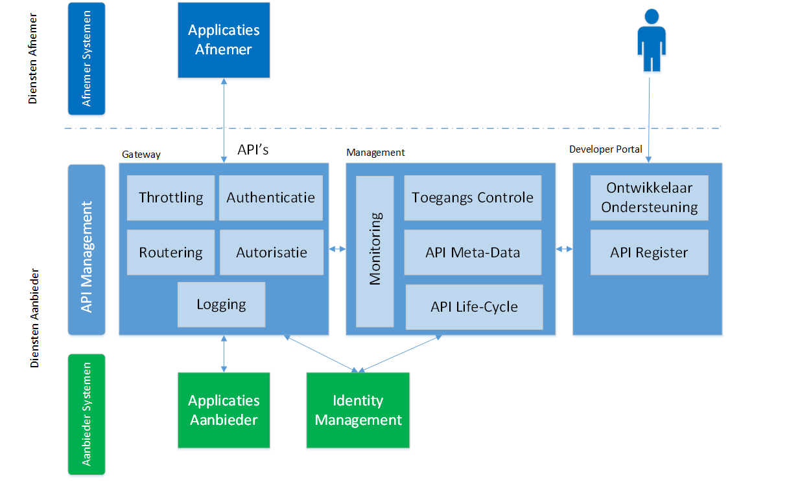

# Architectuur

>   *Dit hoofdstuk gaat in op de vraag: Hoe kan je je applicatie landschap
>   inrichten zodat je APIs kan aanbieden. Welke componenten zijn hiervoor
>   nodig. Hoe ga je om met opschalen, beschikbaarheid. Wat zijn afwegingen om
>   beveiliging al dan niet toe te passen.*

## Inleiding

Doel van dit hoofdstuk is om een hoog niveau overzicht te geven van relevante onderdelen en concepten en hun samenhang in een op
(REST) API gebaseerde architectuur waarbij gebruik gemaakt wordt van (REST) API's als interface voor de aangeboden (gegevens)diensten. 
Specifiek voor REST API's is dat deze 'Resource' gericht zijn en een uniforme manier bieden om resources te lezen, wijzigen, toevoegen
of verwijderen.

Figuur 1: De plaats van API's bij aanbod en gebruik van (gegevens)diensten;

Figuur 1 toont de plaats van API's in de gegevensuitwisseling en relevante onderwerpen in deze context. Bij de Dienst afnemer speelt 
het gebruik van API's,  bij de Dienst aanbieder speelt het aanbieden van API's.

In dit hoofdstuk wordt specifiek ingegaan op de 'aanbod kant': het onderdeel 'Diensten toegang' in het schema.

## Diensten toegang & API management

Een diensten aanbieder ontsluit zijn diensten middels API's aan een diensten afnemer; om deze API's gecontroleerd aan te bieden 
is management en beheer van de API's van de organisatie noodzakelijk.

Een organisatie heeft verschillende soorten API's:

_Open API's:_ voor ontsluiten van diensten zonder toegangsbeperking bv open data.

_Gesloten API's:_ voor ontsluiten van diensten met toegangsbeperking bv persoonsgegevens en vertrouwelijke gegevens of diensten voor specifieke partijen.

  
Figuur 2 beschrijft vanuit het perspectief van een overheidsorganisatie als dienstaanbieder de onderwerpen die aandacht vragen in een op API's gebaseerde architectuur. Hieronder worden deze onderwerpen uitgebreider toegelicht.

Figuur 2: Onderdelen van een API architectuur - Algemeen overzicht

### API-Gateway

Dit is het runtime onderdeel dat op de organisatiegrens van de diensten aanbieder de API-aanroepen ontvangt.

_Throttling_  
Het beschermen van de dienst tegen overbelasting door de hoeveelheid aanvragen te beperken. Een aandachtspunt hierbij is de SLA afspraak die mogelijk hierbij van toepassing is en dat kritische bedrijfsprocessen de vereiste beschikbaarheid verkrijgen of behouden;

_Authenticatie_  
Het vaststellen van de identiteit van de afnemer van de API;  
(Zie ook : [https://www.noraonline.nl/wiki/Identity_%26_Access_Management](https://www.noraonline.nl/wiki/Identity_%26_Access_Management))

_Autorisatie_  
Het bepalen of de afnemer recht heeft tot gebruik van de API;

_Routering_  
Dit betreft het routeren van de API-aanroep naar de juiste achterliggende applicatie;

_Logging_  
Dit betreft het loggen van API aanroepen van diensten afnemers;

### API Management

Dit onderdeel betreft het beheren van de API's van de dienstenaanbieders. Op basis van de registratie van API's kan de life-cycle van de API beheerd worden, de runtime omgeving worden ingericht en partners en developers worden voorzien van informatie over het gebruik van de API's;

_Toegang_
De dienstaanbieder administreert wie toegang heeft tot welke API. De runtime omgeving (API-gateway) wordt geconfigureerd volgens de gewenste toegangsregels om de toegang te bewaken;

_API Meta Data_
De dienstaanbieder administreert welke API's door de onderneming aangeboden worden. Dit betreft zowel open API's als gesloten API's;

_API Life Cycle_
De dienstaanbieder beheert de levenscyclus van de API's (design, test, productie, afvoer);

_Monitoring_
De dienstaanbieder monitort beschikbaarheid en gebruik van de API's;

### Developer Portal

Het Developer portal ondersteunt de ontwikkelaar bij het gebruik van API's. Bijvoorbeeld door middel van
documentatie, voorbeelden, API-register (overzicht van alle beschikbare API's), sandbox voor experimenten en ook 'onboarding' / aanmelden
voor toegang en developer account beheer.

### Applicaties Afnemer & Applicaties Aanbieder

De applicaties van de afnemer maken gebruik van de diensten van de dienstenaanbieder door het aanroepen 
van API's. De applicaties van de aanbieder leveren de diensten door het aanbieden van API's.

### Identity Management

In gevallen waar de identiteit van de dienstenaanvrager van belang is en onderdeel van de toegangs controle en gebruiksmonitoring, is de relatie met het identity management systeem van de organisatie relevant.  
(Zie ook : [https://www.noraonline.nl/wiki/Begrippen_IAM](https://www.noraonline.nl/wiki/Begrippen_IAM))

## <!-- 6.3.3 --> Patronen

Principes ondersteunen het proces om te komen tot nauwkeurige afbakening en definities van API’s van eenzelfde type. Daarnaast bevorderen zij over de verschillende bronnen heen het eenduidig gebruik van API’s voor overeenkomstige concepten.
In de visualisatie hieronder is de structuur van de principes zichtbaar. Het blauw gekleurde principe is overkoepelend. Verder passen de overige principes binnen verschillende architectuurpatronen van API’s die ook in onderstaand figuur wordt weergegeven (zie oranje gekleurde principes).  

<figure id='principes'>
	
	<figcaption>Structuur tussen de principes.</figcaption>
 </figure>
 
Bij wijziging van de principes geldt dat dit impact heeft op ontwikkelde API’s.
	
### Herbruikbaarheid
API-01: Gepubliceerde API’s zijn herbruikbaar
API’s die worden ontwikkeld moeten in lijn zijn met de opgestelde principes, hierdoor ontstaat er uniformiteit. Voorafgaand aan publicatie voor hergebruik toetst Forum Standaardisatie dit.
- Voor feitelijk hergebruik kan plaatsvinden moet een onpartijdig oordeel over de kwaliteit van de API uitgesproken worden. Forum Standaardisatie kan die onpartijdige toets uitvoeren op de gerealiseerde API's.
- Consumer wil bij hergebruik weten wat de kwaliteit is en de zekerheid hebben dat het werkt en beheerd wordt. 
- De provider van een API toont de kwaliteit van de API aan bij publicatie. 
- Door hergebruik van eenmalig ontwikkelde API's kan een softwareleverancier zich juist focussen op het bieden van toegevoegde waarde in de functionele ondersteuning van processen in taakgebieden. Het doel is om een situatie te bereiken waarin API's hergebruikt en gedeeld worden (generiek inzetbaar).
- Enkel API’s worden gemaakt waarvoor nog geen API aanwezig is, waardoor er niet méér API's gemaakt worden dan nodig zijn. 

### Patroon ‘Bijhouden’
Een levens- of systeemgebeurtenis (zoals een geboorte of het verstrijken van tijd) triggert een proces. Dit proces leidt (in veel gevallen) tot het bijwerken van de data in de registratie van de bronhouder. De volgende principes worden benoemd binnen dit patroon.
 
 
API-01: Een gebeurtenis zorgt voor een proces waarin een bijhoudingstaak zit voor de bronhouder
Bronhouders hebben de verantwoordelijkheid om hun bronregistratie actueel te houden. Gebeurtenissen die effect hebben op de data in de bronregistratie triggeren een bijhoudingstaak.
 
 
API-02: Een API van type ‘POST’ faciliteert het bijhouden van data in de bronregistratie.
Restful API’s op basis van JSON van het type ‘POST’ worden toegepast om data te actualiseren in een registratie. 

### Patroon ‘Afnemen’ 
Een systeemgebeurtenis (zoals een bijhouding van de bronhouder) triggert een proces. Dit proces leidt (in veel gevallen) tot het notificeren van gebeurtenissen richting (eventuele) afnemers. Afnemers bepalen zelf of zij op basis van ontvangen notificaties data op gaan halen. De volgende principes worden benoemd binnen dit patroon.
 
 
API-01: Een API in de categorie Notificeren faciliteert het melden van gebeurtenissen aan een afnemer.  
Een notificatie is een melding van een gebeurtenis die een procestrigger vormt. Een gebeurtenis kan een wijziging in de gegevens van de bronhouder tot gevolg hebben en daarom kan het zinvol zijn voor een afnemer hierover genotificeerd te worden. Gebeurtenissen worden te allen tijde door bronhouder gecommuniceerd richting een broker (bijvoorbeeld ESB/API-Gateway) zo kort mogelijk na het optreden van de gebeurtenis, ongeacht of er afnemers zijn. Dit is de verantwoordelijkheid van de bronhouder. Indien er een afnemer is brengt de notificatie de afnemer op de hoogte van de gebeurtenis. Dit triggert bij de afnemer een proces: De afnemer is aan zet om te oordelen wat de passende vervolgacties zijn bij het ontvangen van de notificatie. 
Een notificatie bevat geen content anders dan identificerende (functionele) gegevens.
Notificaties worden toegezonden aan afnemers die middels afnemerindicaties hebben aangegeven notificaties te willen ontvangen. 
 
 
API-02: Een API in de categorie Notificeren faciliteert het melden van gebeurtenissen aan een afnemer.  
Afnemers die via API Notificeren gegevens willen ontvangen nemen op het niveau van een resource (dus niet instelbaar op een specifiek data-object) in de breedte van het geografische verzorgingsgebied gebeurtenissen af.
Uitzondering:
Voor de BRP (en eventuele registraties of data waar privacy op rust) is hier gelet op de privacywetgeving een uitzondering op. Voor het afnemen van personen uit de BRP dient per persoon een specifieke afnemerindicatie geplaatst te zijn door de afnemer, in lijn met zijn doelbinding. Geadviseerd wordt afnemerindicaties te plaatsen door het uitwisselen van het 'BSN' en niet door het uitwisselen van een technische sleutel.
 
 
API-03: Notificaties zijn gebaseerd op de informatiebehoefte van bedrijfsprocessen.
Afhankelijk van de informatiebehoefte bij afnemers voor het triggeren van bedrijfsprocessen worden notificaties onderkend. 
In grote lijnen komt dit overeen met de gebeurtenissen die in de ontwerpdocumenten of berichtencatalogi van bronregistraties zijn onderkend.
 
 
API-04: Een API in de categorie Opvragen faciliteert het uitwisselen van gegevens op basis van een vraag-antwoord constructie.
De categorie Opvragen wordt gebruikt voor het op afroep verkrijgen van gegevens uit een bron, of diensten vanuit een dienstenaanbieder via synchrone calls. 
Naargelang de informatiebehoefte van de afnemer kunnen API’s in de categorie Opvragen worden ingericht voor het verstrekken van gegevens (voor zowel raadplegen, zoeken als massaal bevragen t.b.v. synchroniseren) of het aanroepen van een dienst. Het informatiemodel van de bronhouder is leidend bij het ophalen van gegevens.
 
 
API-05: Een vraag/antwoord API ondersteunt het opvragen van een concreet afgebakende set gegevens.
Elke response van de categorie Opvragen omvat maximaal (afhankelijk van autorisatie, zie design decision BRP API) de attributen, relaties en de identificerende gegevens van de gerelateerde, maar niet de gerelateerde resources in zijn geheel. Het verkrijgen van de gerelateerde resources vereist het stellen van een nieuwe vraag (nieuwe API-call uit categorie Opvragen).  
- De bronhouder is verantwoordelijk voor de autorisatie op organisatie-niveau.
- De provider bepaalt het maximum aantal responses en niet de consumer. De API geeft een foutmelding wanneer er teveel resultaten zijn op de vraag.
- De afnemer kent de doelbinding van het verzoek en stuurt de aanduiding van de doelbinding mee in de call.

### Patroon ‘Terugmelden’
Een systeemgebeurtenis (zoals het verwerken van een antwoord door de afnemer) triggert een proces. Dit proces kan leiden tot het verrichten van een terugmelding, aangezien de afnemer twijfelt aan de juistheid van de gegevens. De afnemer signaleert dit richting bronhouder.
 
 
API-01: Een afnemer verricht een terugmelding bij gerede twijfel aan de juistheid van de gegevens.
Gegevens in bronregistraties moeten actueel en betrouwbaar zijn. Terugmelden is één van de instrumenten om de kwaliteit van registraties te borgen. Iedere terugmelding draagt bij aan het verbeteren van een overheidsadministratie. 
Afnemers van de registraties hebben daarom de wettelijke plicht om mogelijk onjuiste gegevens te melden als het gaat om authentieke gegevens. Voor niet-authentieke gegevens geldt die verplichting niet. 
Het proces van terugmelden zorgt ervoor dat de fout in de registratie wordt gesignaleerd en na onderzoek door de bronhouder zo nodig wordt hersteld, waardoor alle afnemers vervolgens het juiste gegeven kunnen gebruiken.
Het proces van Terugmelden onderscheidt 3 fasen:
- De signalering van mogelijk onjuiste gegevens door de afnemer of de betrokkene (correctierecht).
- Het in onderzoek nemen van het gemelde gegeven door de bronhouder.
- De correctie en beschikbaarstelling van het gemelde gegeven aan de afnemer die het gegeven had gesignaleerd en afnemers die zijn geabonneerd op wijzigingen van de desbetreffende gegevens (dit behoort weer tot het patroon ‘Bijhouden’).

De verschillende patronen zijn aan elkaar gerelateerd en hebben een duidelijke afhankelijkheid. Dit is in onderstaand figuur afgebeeld. Per patroon is ook aangegeven hoe gebeurtenissen, processen en datastromen zich tot elkaar verhouden.
	
<figure id='patronen'>
	
	<figcaption>Visualisatie patronen (gelaagdheid tussen real life, proces en data).</figcaption>
 </figure>
 

## Architectuur bijlagen

Bijgevoegd document:

[Werkgroep Architectuur\\Werkgroep_API_Architectuur Draft D[29148].pdf](Werkgroep%20Architectuur/Werkgroep_API_Architectuur%20Draft%20D%5b29148%5d.pdf)
