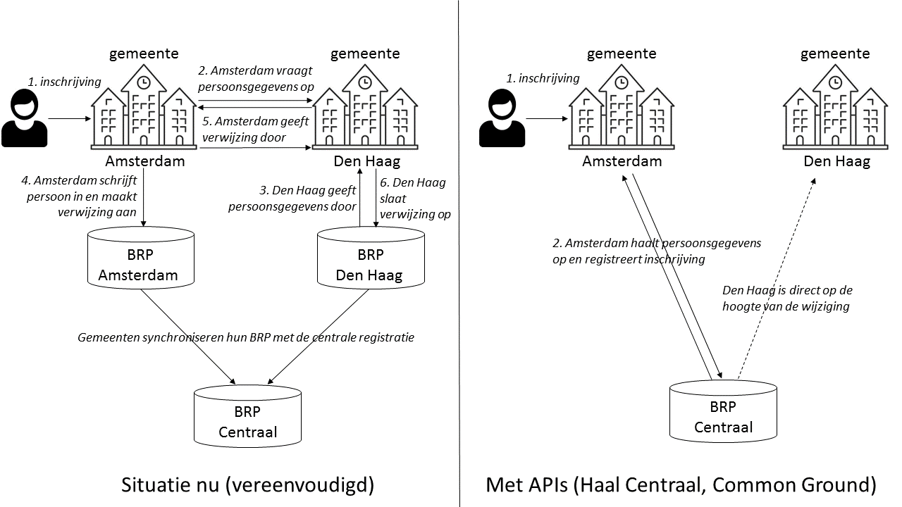
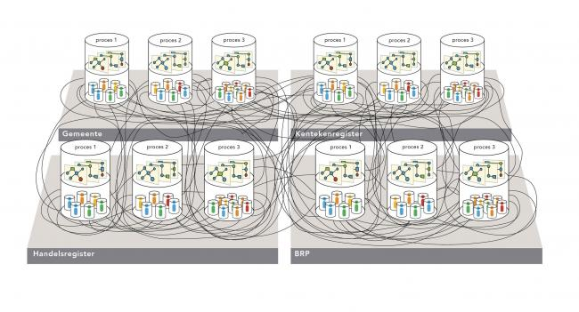

## Communicatie en beleid
> *Dit hoofdstuk geeft een niet-technische inleiding voor bestuurders en managers. In dit hoofdstuk bekijken we:*  
> *- welk probleem willen we oplossen?*  
> *- wat zijn APIs en hoe helpen ze bij dit probleem?*  
> *- wanneer zijn APIs relevant voor mijn organisatie?*
> *- voorbeelden van het gebruik van APIs in Nederland*

Larissa gaat verhuizen van Den Haag naar Amsterdam. Ze gaat naar het gemeentehuis in Amsterdam om zich in te schrijven. Achter de schermen komt er een ingewikkelde gegevensstroom op gang.

Amsterdam en Den Haag houden elk hun eigen registratie van personen bij. De ICT systemen van Amsterdam moeten daarom de persoonsgegevens van Larissa opvragen bij de ICT systemen van Den Haag. Daarna kan Amsterdam Larissa in z’n eigen basisregistratie personen registreren. De gemeente Den Haag moet weten dat Larissa nu in Amsterdam staat ingeschreven. Dus stuurt  Amsterdam verwijsgegevens voor Larissa naar Den Haag. Den Haag verwerkt de verwijsgegevens voor Larissa in z’n lokale basisregistratie personen. Zowel Amsterdam als Den Haag moeten de mutaties van hun lokale basisregistratie personen ook nog doorgeven aan de [centrale basisregistratie personen van de Autoriteit Persoonsgegevens](https://www.autoriteitpersoonsgegevens.nl/nl/onderwerpen/gemeente/basisregistratie-personen-brp?qa=brp). Zo kan het drie werkdagen kosten om een eenvoudige verhuizing volledig te registreren.

Is het niet efficiënter om één basisregistratie personen bij te houden, in plaats van gegevens heen en weer te schuiven van de ene lokale registratie naar de andere?

### De digitale overheid heeft een probleem
Bij veel ICT systemen van de overheid zitten de gegevens (de data) helemaal verweven in de applicatie. Ieder systeem heeft z'n eigen database en kopieert data van en naar andere systemen. Zo werken veel systemen bij gemeenten met kopieën van de landelijke basisregistraties. Met de jaren ontstaat daardoor een wirwar aan koppelingen tussen systemen.

 Bron: VNG Realisatie.

De huidige situatie brengt een aantal problemen met zich mee:
1. De kans op fouten en datalekken neemt toe bij het veelvuldig kopiëren en gedupliceerd opslaan van gegevens.
2. Het kopiëren en synchroniseren van gegevens tussen systemen kost tijd, resources en geld.
3. Personen of bedrijven hebben geen regie over hun gegevens als deze overal verspreid staan.
4. Veel van de systemen en koppelingen werken afhankelijkheid van leveranciers in de hand.

We kunnen de digitale overheid veiliger, efficiënter en beter beheersbaar maken door applicaties beter te scheiden van de gegevens en de gegevens alleen bij de bron te bewaren. Door de gegevens alleen door de bronhouder te laten beheren, hoeven ze niet meer op grote schaal gekopieerd, gedupliceerd en gesynchroniseerd te worden. Dit idee zit achter het [nieuwe gegevenslandschap](https://www.gemmaonline.nl/images/gemmaonline/8/8b/Gemeentelijk_Gegevenslandschap_-_Beschrijving_informatiearchitectuur_v0_6.pdf) met als onderdelen [Haal Centraal](https://github.com/VNG-Realisatie/Haal-Centraal-BRP-bevragen) en [Common Ground](https://vng.nl/samen-organiseren/common-ground).

Dit vraagt om technologie waarmee je gegevens op een betrouwbare en schaalbare manier kan ontsluiten bij de bron. Dat kan met APIs.

### Wat is een API?
Een [_application programming interface_ (API)](https://www.ensie.nl/dimitri-van-hees/api) is een gestructureerd en gedocumenteerd koppelvlak voor communicatie tussen applicaties. Je kan een API zien als een digitale stekkerdoos die applicaties met elkaar verbindt. APIs bestaan al zo lang er computers zijn.

Hier hebben wij het in het bijzonder over APIs waarmee je applicaties over het Internet kan koppelen. Zogenaamde [REST](../Werkgroep%20API%20strategie/Designrules.md#restful-principes) APIs doen voor applicaties wat websites voor mensen doen. Websites presenteren informatie aan mensen, REST APIs maken applicaties en gegevens over het Internet beschikbaar voor andere applicaties. De technologie achter websites en REST APIs heeft daarom veel gemeen.

De meeste applicaties gebruiken APIs onder de motorkap zonder dat de eindgebruiker dat ziet. Als je een app opent voor het weer, dan merk je niet dat deze app gegevens ophaalt bij het [KNMI via een API](https://meteoserver.nl/real-time-KNMI-weer-API.php). Degene die het meest direct met een API te maken krijgt is de ontwikkelaar van de applicatie die de API gebruikt. Zij moet begrijpen hoe de API werkt en hoe je deze vanuit de applicatie moet bevragen.

Hier verschillen APIs dus van websites. Een website bouw je voor de eindgebruiker die hem bezoekt. Een API maak je voor programmeurs die er applicaties mee bouwen. Daarom is het gewoonte om APIs aan te bieden op het *developer* subdomein van een website, zoals [developer.overheid.nl](https://developer.overheid.nl/) voor APIs van de overheid.

### Wat betekenen APIs voor mijn organisatie?
APIs zijn een middel, geen doel. De missie van een organisatie bepaalt of APIs toegevoegde waarde hebben in de ICT processen. Dat kan het geval zijn als de organisatie een dienstverlenende taak heeft en gegevens beheert die andere organisaties gebruiken. Of als de organisatie deel uit maakt van een of meer ketens.

Een aantal zaken om te overwegen:
1. **Gegevens bij de bron beheren.** Voorkom het dupliceren en lokaal bewerken van centrale gegevensverzamelingen. Dit maakt processen efficiënter en voorkomt dat kopieën van gegevensverzamelingen uit de pas lopen.
2. **Processen en gegevens losser koppelen.** Vaste ketens maken steeds vaker plaats voor lossere koppelingen met een kortere levensduur, zoals in de visie van [Common Ground](https://vng.nl/samen-organiseren/common-ground). Of in [*smart cities*](https://ec.europa.eu/digital-single-market/en/smart-cities) als  [Amsterdam](https://amsterdamsmartcity.com/projects/dataamsterdamnl) waar een wisselende groep publieke en private organisaties dynamisch gegevens uitwisselt.
3. **Specifieke vragen bedienen.** Afnemers hebben meestal niet alle gegevens uit je gegevensverzameling nodig. Voorbeeld: een applicatie die in de [Basisregistratie Adressen en Gebouwen](https://bag.basisregistraties.overheid.nl/) het adres opzoekt dat hoort bij een postcode en huisnummer hoeft niet het bouwjaar, oppervlakte en gebruiksdoel van het pand te krijgen.
4. **ICT projecten 'Agile' uitvoeren.** Steeds meer organisaties zoals [Logius](https://logius.nl/onze-organisatie/safe-bij-logius) ontwikkelen systemen volgens [Agile principes](https://www.agilealliance.org/agile101/). Dit betekent dat je snel in moet kunnen spelen op veranderende vragen van de gebruikers aan je gegevensbronnen. 
5. **Afhankelijkheid van leveranciers verminderen.** Voorkom dat koppelingen maatwerk vereisen of afhankelijk zijn van producten of kennis van een specifieke leverancier. Gebruik waar mogelijk [open standaarden](https://www.forumstandaardisatie.nl/thema/open-standaarden).
6. **Innovatie stimuleren.** Door gegevens openbaar aan te bieden kunnen zowel publieke als private ondernemingen ermee aan de slag. Zij gebruiken de gegevens soms op verrassende manieren die nieuwe kansen creëren.

Inventariseer welke gegevens je organisatie voortbrengt en welke gegevens je gebruikt van andere organisaties. Bekijk hoe de bestaande ICT koppelingen ingericht zijn. Is je organisatie daarbij afhankelijk van bepaalde producten of leveranciers? Kan het  efficiënter, flexibeler, veiliger en meer open met APIs?

Deze [API strategie](https://docs.geostandaarden.nl/api/API-Strategie/)  beschrijft de standaarden, ontwerpprincipes en veiligheidsmaatregelen die ervoor zorgen dat alle overheden hun APIs op een inzichtelijke, gebruikersvriendelijke, veilige en geharmoniseerde manier aanbieden. Door deel te nemen in het [Kennisplatform APIs](https://www.geonovum.nl/themas/kennisplatform-apis) krijgt je organisatie meer inzicht in de toegevoegde waarde die APIs voor jouw toepassing al dan niet kunnen bieden.

### Nederland heeft al schitterende voorbeelden
Veel publieke organisaties in Nederland bieden hun gegevens met APIs aan. De [Nederlandse Spoorwegen](https://www.ns.nl/reisinformatie/ns-api) bijvoorbeeld, die met APIs actuele vertrektijden, prijzen, storingen en reisadviezen publiceren om in apps te gebruiken. En de Rijksdienst voor het Wegverkeer die de [kentekenregistratie voor voertuigen](https://opendata.rdw.nl/resource/m9d7-ebf2.json) met een API aanbiedt.

In februari 2019 won de [Basisregistratie Adressen en Gebouwen (BAG) API](https://zakelijk.kadaster.nl/-/bag-api) van Kadaster de [Gouden API](https://www.geonovum.nl/over-geonovum/actueel/kadaster-wint-prijs-beste-api-van-de-overheid) die het [Kennisplatform APIs](https://www.geonovum.nl/themas/kennisplatform-apis) uitloofde voor de beste API van de overheid. De [BAG](https://zakelijk.kadaster.nl/bag) registreert voor elk adres in Nederland gegevens als de geografische coördinaten, het bouwjaar van het pand, de oppervlakte en het vergunde gebruiksdoel. Verzekeraars, hypotheekverstrekkers, hulpdiensten, milieudiensten en vele anderen gebruiken informatie uit de BAG. Dat de BAG API voldoet aan een behoefte blijkt wel uit de 300 miljoen consultaties die de BAG API in 2018 verwerkte.

De APIs van [Luchtmeetnet](https://api-docs.luchtmeetnet.nl/) en van de [Kamer van Koophandel](https://www.kvk.nl/producten-bestellen/koppeling-handelsregister/kvk-api/?msclkid=ec7b5b3fe30a10cb537907f53d6cd07f&utm_source=bing&utm_medium=cpc&utm_campaign=0.%20Brand%20-%20Combinaties&utm_term=%2bkvk%20%2bapi&utm_content=KVK%20-%20API%20%28bmm%29) kregen bij de [Gouden API](https://www.geonovum.nl/over-geonovum/actueel/kadaster-wint-prijs-beste-api-van-de-overheid) eervolle vermeldingen vanwege hun relevantie en gebruiksgemak. De API van de Kamer van Koophandel geeft applicaties  toegang tot de gegevens van het handelsregister. Hiermee kunnen bijvoorbeeld bedrijven en gemeenten CRM systemen, zaaksystemen en factureringssystemen aan het handelsregister koppelen. De API van Luchtmeetnet geeft bijvoorbeeld [weer-apps](https://www.buienradar.nl/nederland/gezondheid/luchtkwaliteit/index) de mogelijkheid om ook informatie over luchtkwaliteit voor astmatici te geven.

Het portal developer.overheid.nl geeft een overzicht van APIs die Nederlandse overheidsorganisaties aanbieden. Heeft jouw organisatie gegevens waar bedrijven, burgers of andere overheden iets mee kunnen?
