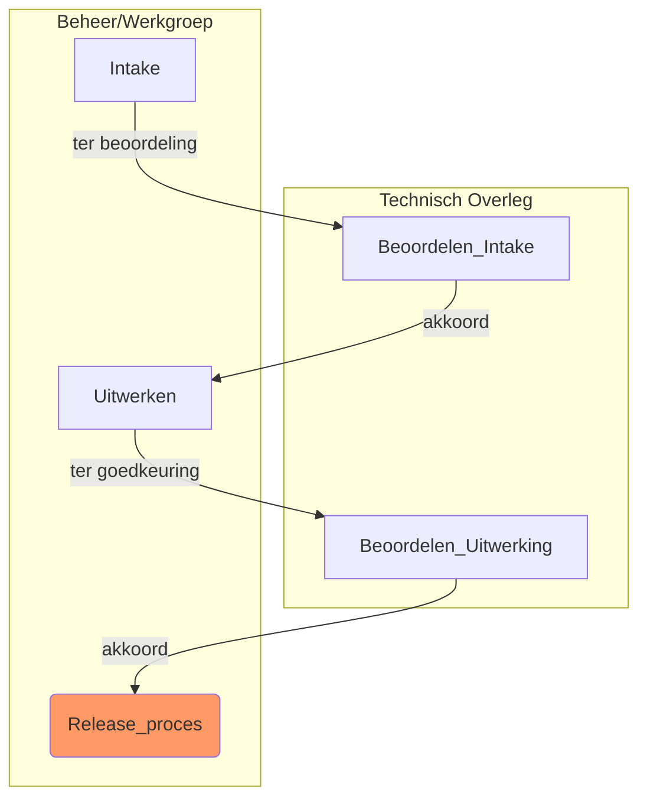
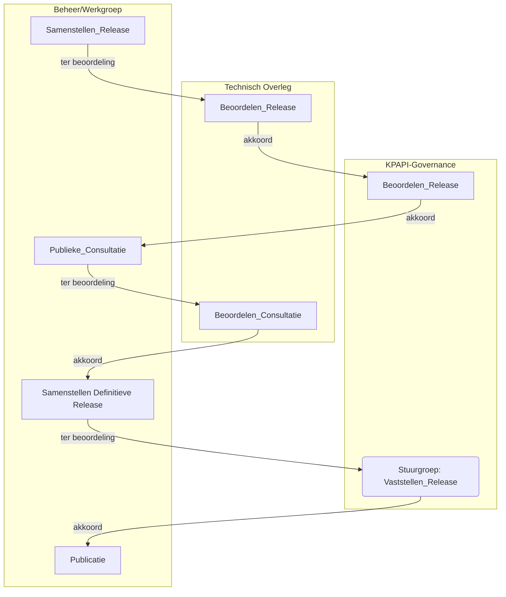

Status : Concept

# RFC & Release proces voor KPAPI ADR Modules

RFC & Release proces voor KPAPI ADR Modules. In de volgende hoofstukken wordt het wijzigings en release proces voor __niet normatieve__ (Aanvullende) ADR Modules beschreven.
(wijzigingen in normatieve modules lopen via de NLGOV ADR MIDO Governance)

## Module Life cycle

- Werkgroep ADR/Beveiliging of stuurgroep : Voorstel voor nieuwe ADR module

- Stuurgroep : Goedkeuren Voorstel voor nieuwe ADR module

- Werkgroep : Uitwerken module (via RFC proces)

- Stuurgroep : Goedkeuren module (via Release proces)

### Soorten modules:

#### Normatieve module
Wanneer vanuit de ADR verwezen wordt naar een module , is de module normatief dit wil zeggen dat, conform de beschrijving in de ADR, de module verplicht is om toe te passen. Normatieve modules volgen de MIDO governance voor de ADR. Alleen stabiele modules (*) kunnen worden opgenomen in de ADR;

#### Aanvullende module
Aanvullende modules zijn modules die optioneel zijn te gebruiken in combinatie met de ADR.  

(*) Module status stabiel geeft aan dat de module door de stuurgroep is goedgekeurd en gereed voor gebruik.

## RFC Proces

|Activiteit | Verantwoordelijk | Toelichting | RFC status| 
|----|----|----|---|
|Intake|Beheer|Beheer legt issue voor aan TO |ter Beoordeling|
|Beoordelen_Intake|TO|Het TO beoordeelt het issue en geeft aan of dit moet worden uitgewerkt|ter Beoordeling -> in Bewerking
|Uitwerken|Beheer| Uitwerking RFC  |in Bewerking -> in Review/ter Goedkeuring|
|Beoordelen_Uitwerking|TO| Het TO beoordeelt de uitwerking en geeft aan of de rfc moet worden doorgevoerd |ter Goedkeuring->Gereed|

 > NB TO (Technisch Overleg) is hierbij een rol vervuld door de betrokken KPAPI werkgroep en is bedoeld om formeel onderdelen die door deelnemers of sub-werkgroepen zijn uitgewerkt te beoordelen  

## Release Proces

|Activiteit | Verantwoordelijk | Toelichting | Release status| 
|----|----|----|---|
|Samenstellen_Release|Beheer | Goedgekeurde RFC's worden gebundeld in een nieuwe release van de standaard |ter Beoordeling|
|Beoordelen_Release|TO|Het TO beoordeelt de release en geeft aan of deze kan worden geconsulteerd|ter Beoordeling -> in Consultatie/  (TO Akkoord) |
|Beoordelen_Release|Stuurgroep |De stuurgroep beoordeelt de release en geeft aan of deze kan worden geconsulteerd|in Consultatie/ (TO Akkoord) -> in Consultatie |
|Publieke_Consultatie|Beheer| De Release wordt publiek geconsulteerd en reakties worden verzameld en voorgelegd aan TO |in Consultatie -> ter Goedkeuring|
|Beoordelen_Consultatie|TO| Het TO beoordeelt de resultaten van de consultatie en geeft aan welke eventuele aanpassingen nodig zijn |ter Goedkeuring-> Release Akkoord|
|Samenstellen_Definitieve_Release | Beheer | Samenstellen definitieve release | Release Akkoord-> ter Vaststelling|
|Vaststellen_Release | Stuurgroep | Vaststellen release | ter Vaststelling -> Vastgesteld |
|Publicatie | Beheer | Publiceren van de release en release notes | Vastgesteld | 
