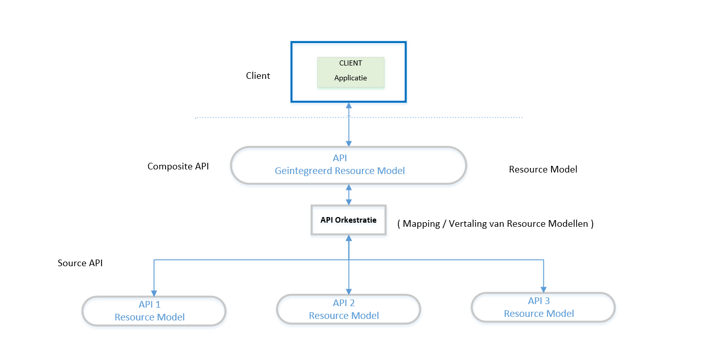

_Concept_ 

API 

## Definities

**Composite API** : Een composite API verwerkt een request van clients door meerdere andere API's te bevragen en de resultaten hiervan te combineren.

De Composite API biedt een resource aan waarin de data afkomstig van de verschillende (bron) API's is gecombineerd.
(De composite API biedt dus een resource model aan dat gebaseerd is op transformaties van de resource modellen van de bevraagde (bron) API's. 

**API Orkestratie** : is een proces waarbij meerdere (bron) API's worden aangeroepen om een bepaalde dienst voor de client van de API te realiseren.

In de context van data diensten (dwz als het alleen gaat om lezen/manipuleren van data resources conform het REST patroon) wordt een *Composite API* dus gerealiseerd door middel van *API Orkestratie*. API Orkestratie is het proces, de Composite API het resultaat.  

Zie bv [api-composition-pattern](https://crishantha.medium.com/microservices-patterns-api-composition-pattern-27040cae5bd3)

## Architectuur

