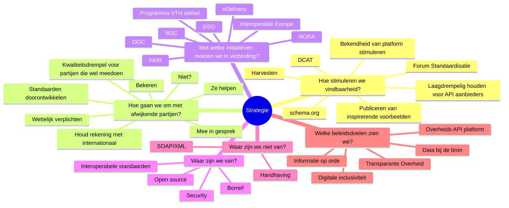

Mindmap met resultaten van haalsessie 11 mei

```mermaid
mindmap
  root((Strategie))
    Hoe stimuleren we vindbaarheid?
      Bekendheid van platform stimuleren
      DCAT
      Forum Standaardisatie
      Harvesten
      Laagdrempelig houden voor API aanbieders
      Publiceren van inspirerende voorbeelden
      schema.org
    Hoe gaan we om met afwijkende partijen?
      Bekeren
      Houd rekening met internationaal
      Kwaliteitsdrempel voor partijen die wel meedoen
      Mee in gesprek
      Niet?
      Standaarden doorontwikkelen
      Wettelijk verplichten
      Ze helpen
    Met welke initiatieven moeten we in verbinding?
      DSO
      eDelivery
      FAIR
      Interoperable Europe
      NORA
      OGC
      Programma VTH stelsel
      W3C
    Waar zijn we van?
      Borrel!
      Interoperabele standaarden
      Open source
      Security
    Waar zijn we *niet* van?
      SOAP/XML
      Handhaving
    Welke beleidsdoelen zien we?
      Data bij de bron
      Digitale inclusiviteit
      Informatie op orde
      Overheids API platform
      Transparante Overheid
```
